# Глава 1. Първи стъпки в програмирането

В тази глава ще разберем **какво е програмирането** в неговата същина. Ще се запознаем с идеята за **програмни езици** и ще разгледаме **средите за разработка на софтуер** (Integrated Development Environment - накратко IDE) и как да работим с тях, в частност с **Visual Studio Code**. Ще напишем и изпълним **първата си програма** на програмния език **JavaScript**, а след това ще се упражним с няколко задачи: ще създадем конзолна програма и уеб приложение. Ще се научим как да проверяваме за коректност решенията на задачите от тази книга в **Judge системата на СофтУни** и накрая ще се запознаем с типичните грешки, които често се допускат при писането на код и как да се предпазим от тях.

## Видео

<div class="video-player">
  Гледайте видеоурок по тази глава тук: <a target="_blank"
  href="https://www.youtube.com/watch?v=0YkrJsKwHdM">
  https://www.youtube.com/watch?v=0YkrJsKwHdM</a>.
</div>


## Какво означава "да програмираме"?

**Да програмираме** означава да даваме команди на компютъра какво да прави, например "*да изсвири някакъв звук*", "*да отпечата нещо на екрана*" или "*да умножи две числа*". Когато командите са няколко една след друга, те се наричат **компютърна програма**. Текстът на компютърните програми се нарича **програмен код** (или **сорс код** или за по-кратко **код**).

### Компютърни програми

**Компютърните програми** представляват **поредица от команди**, които се изписват на предварително избран **език за програмиране**, например JavaScript, Python, C#, Java, PHP, Ruby, C, C++, Swift, Go или друг. За да пишем команди, трябва да знаем **синтаксиса и семантиката на езика**, с който ще работим, в нашия случай **JavaScript**. Затова в настоящата книга, ще се запознаем със синтаксиса и семантиката на езика **JavaScript** и с програмирането като цяло, изучавайки стъпка по стъпка писането на код, от по-простите към по-сложните програмни конструкции.

### Алгоритми

Компютърните програми обикновено изпълняват някакъв алгоритъм. **Алгоритмите** са последователност от стъпки, необходими за да се свърши определена работа и да се постигне някакъв очакван резултат, нещо като "рецепта". Например, ако пържим яйца, ние изпълняваме някаква рецепта (алгоритъм): загряваме мазнина в някакъв съд, чупим яйцата, изчакваме докато се изпържат, отместваме от огъня. Аналогично, в програмирането **компютърните програми изпълняват алгоритми** - поредица от команди, необходими, за да се свърши определена работа. Например, за да се подредят поредица от числа в нарастващ ред, е необходим алгоритъм, примерно да се намери най-малкото число и да се отпечата, от останалите числа да се намери отново най-малкото число и да се отпечата и това се повтаря докато числата свършат.

За удобство при създаването на програми, за писане на програмен код (команди), за изпълнение на програмите и за други операции, свързани с програмирането, ни е необходима и **среда за разработка**, например Visual Studio Code.

### Езици за програмиране, компилатори, интерпретатори и среди за разработка

**Езикът за програмиране** е изкуствен език (синтаксис за изразяване), предназначен за **задаване на команди**, които искаме компютърът да прочете, обработи и изпълни. Чрез езиците за програмиране пишем поредици от команди (**програми**), които **задават какво да прави компютъра**. Изпълнението на компютърните програми може да се реализира с **компилатор** или с **интерпретатор**.

**Компилаторът** превежда кода от програмен език на **машинен код**, като за всяка от конструкциите (командите) в кода избира подходящ, предварително подготвен фрагмент от машинен код и междувременно **проверява за грешки в текста на програмата**. Заедно компилираните фрагменти съставят програмата в машинен код, както я очаква микропроцесорът на компютъра. След като е компилирана програмата, тя може да бъде директно изпълнена от микропроцесора в кооперация с операционната система. При компилируемите езици за програмиране **компилирането на програмата** се извършва задължително преди нейното изпълнение и по време на компилация се откриват синтактичните грешки (грешно зададени команди). С компилатор работят езици като C++, C#, Java, Swift и Go.

Някои езици за програмиране не използват компилатор, а се **интерпретират директно** от специализиран софтуер, наречен "интерпретатор". **Интерпретаторът** е "**програма за изпълняване на програми**", написани на някакъв програмен език. Той изпълнява командите на програмата една след друга, като разбира не само от единични команди и поредици от команди, но и от другите езикови конструкции (проверки, повторения, функции и т.н.). Езици като PHP, Python и **JavaScript** работят с интерпретатор и се изпълняват без да се компилират. Поради липса на предварителна компилация, при интерпретеруемите езици **грешките се откриват по време на изпълнение**, след като програмата започне да работи, а не предварително.

**Средата за програмиране** (Integrated Development Environment - **IDE**, интегрирана среда за разработка) е съвкупност от традиционни инструменти за разработване на софтуерни приложения. В средата за разработка пишем код, компилираме и изпълняваме програмите. Средите за разработка интегрират в себе си **текстов редактор** за писане на кода, **език за програмиране**, **компилатор или интерпретатор** и **среда за изпълнение** за изпълнение на програмите, **дебъгер** за проследяване на програмата и търсене на грешки, **инструменти за дизайн на потребителски интерфейс** и други инструменти и добавки.

**Средите за програмиране** са удобни, защото интегрират всичко необходимо за разработката на програмата, без да се напуска средата. Ако не ползваме среда за разработка, ще трябва да пишем кода в текстов редактор, да го компилираме с команда от конзолата, да го изпълняваме с друга команда от конзолата и да пишем още допълнителни команди, когато се налага, и това ще ни губи време. Затова повечето програмисти ползват IDE в ежедневната си работа.

За програмиране на **езика JavaScript** най-често се ползва средата за разработка **Visual Studio Code**, която се разработва и разпространява безплатно от Microsoft и може да се изтегли от: https://www.visualstudio.com/downloads/. Алтернативи на Visual Studio Code са **WebStorm** (https://www.jetbrains.com/webstorm/), **Atom** (https://atom.io/) и други. В настоящата книга ще използваме средата за разработка **Visual Studio Code**.

### Езици от ниско и високо ниво, среди за изпълнение (Runtime Environments)

Програмата в своята същност е **набор от инструкции**, които карат компютъра да свърши определена задача. Те се въвеждат от програмиста и се **изпълняват безусловно от машината**.

Съществуват различни видове **езици за програмиране**. С езиците от **най-ниско ниво** могат да бъдат написани **самите инструкции**, които **управляват процесора**, например с езика "**assembler**". С езици от малко по-високо ниво като **C** и **C++** могат да бъдат създадени операционна система, драйвери за управление на хардуера (например драйвер за видеокарта), уеб браузъри, компилатори, двигатели за графика и игри (game engines) и други системни компоненти и програми. С езици от още по-високо ниво като **JavaScript**, **Python** и **C#** се създават приложни програми, например програма за четене на поща или чат програма.

**Езиците от ниско ниво** управляват директно хардуера и изискват много усилия и огромен брой команди, за да свършат единица работа. **Езиците от по-високо ниво** изискват по-малко код за единица работа, но нямат директен достъп до хардуера. На тях се разработва приложен софтуер, например уеб приложения и мобилни приложения.

Болшинството софтуер, който използваме ежедневно, като музикален плеър, видеоплеър, GPS програма и т.н., се пише на **езици за приложно програмиране**, които са от високо ниво, като JavaScript, Python, C#, Java, C++, PHP и др.

**JavaScript е интерпретеруем език**, а това означава, че пишем команди, които се изпълняват директно след стартиране на програмата. Това означава, че ако сме допуснали грешка при писането на код, ще разберем едва след стартиране на програмата и достигането до грешната команда. Тук на помощ идват **IDE**-тата, като Visual Studio Code, които проверяват кода ни, още докато пишем и ни алармират за евентуални проблеми. Когато сме написали кода си и искаме да го тестваме, можем да го запаметим във файл с разширение **.js**. 

Повечето **езици за програмиране** са специализирани в разработването на конкретен вид приложения - Desktop - за Windows или Mac, мобилни приложения, сървърни приложения, приложения за управление на умни джаджи и т.н. **JavaScript** е един от малкото езици, които позволяват да създадете приложение във всяка една възможна област - от сайтове и мобилни приложения до сървърни и desktop приложения. 

Най - популярните **среди за интерпретация** на JavaScript са **уеб браузърите**, които използвате всеки ден - Chrome, Firefox, Internet Explorer и т.н. Когато зареждате любимият си уеб сайт е много вероятно той да съдържа **JavaScript файлове**, които ще се изпълнят при отварянето на сайта и ще направят изживяването при разглеждането на сайта по - приятно и динамично. Твърде вероятно е ако в сайта има падащи менюта, анимации, регистрация на потребител, дразнещи реклами, то те да са реализирани именно чрез използването на езика **JavaScript**. 

Често ще чувате че даден код се "**изпълнява на клиента**" - това ще рече, че **JavaScript** кодът, се изпълнява във вашият **browser**, който играе ролята на клиент, или приемник. За да има приемник, трябва да има и предавател. В технологичният свят тези предаватели се наричат сървъри. Можете да си представяте сървърите като едни много мощни компютри, до които имат достъп много хора. Всички сайтове стоят на подобни сървъри - т.е. файловете които помагат на сайта да изглежда такъв какъвто го виждате - **картинки, текстове, JavaScript файлове**, се намират на конкретен сървър. Вашият **browser** (клиент) се свързва към **сървъра**, на който се намира сайта, който посещавате и сървърът **изпраща** обратно необходимите файлове, за да се визуализира пред вас любимият сайт. Можете да си представите, че вашият browser е **радиото** в колата ви на което слушате любимата програма, а сървърът е сградата от където се излъчва това предаване, макар и комуникацията между двете да протича по различен начин.

Другият популярен **интерпретатор за JavaScript** e **NodeJS**. Можете да си го представите като приложение, което инсталирате на компютъра си и той започва да разбира от **JavaScript** по същият начин, по който и вашият browser разбира. По този начин можете да изпълнявате **JavaScript** код **директно на компютъра си**, без необходимостта от browser. Както казахме сървърите са просто по - мощни компютри. Те започват да разбират от **JavaScript** по същият начин по който и вашият компютър - просто им се инсталира **NodeJS**. Можете да си инсталирате **NodeJS** от официалния сайт [https://nodejs.org](https://nodejs.org) напълно безплатно, като следвате инструкциите.

### Компютърни програми - изпълнение

Както вече споменахме, програмата е **последователност от команди**, иначе казано тя описва поредица от пресмятания, проверки, повторения и всякакви подобни операции, които целят постигане на някакъв резултат.

Програмата се пише в текстов формат, а самият текст на програмата се нарича **сорс код** (source code). Той се запазва във файл с разширение **.js** (например **main.js**) след което може да се изпълни през вашият browser или през **конзолата** с помощта на **NodeJS**. След малко ще разгледаме и двата варианта.

### Компютърни програми – примери

Да започнем с много прост пример за кратка **JavaScript програма**, която ще изпълним директно в уеб браузъра (той поддръжа JS без да инсталираме нищо допълнително).

#### Пример: програма, която нотифицира потребителя

Нашата първа програма ще е единична **JavaScript команда**, която нотифицира потребителя, че е спечелил 1 000 000 долара, както често се случва, когато разглеждате някой сайт с много спам и реклами:

```javascript
alert("Congratulations!!! You have just won $1 000 000!");
```

Можем да изпълним програмата като използваме **JavaScript конзолата в нашия уеб браузър**. Например в **Chrome** натискаме [**F12**] и пишем кода в прозорчето [**Console**]:


Резултатът е нещо такова: **модално popup съобщение** в браузъра:


#### Пример: програма, която спами нотификации на потребителя

Можем да усложним предходната програма, като зададем за изпълнение повтарящи се многократно в поредица команди за нотифициране на потребителя, че е победител в томбола:

```javascript
for (i = 0; i < 10; i += 1) {
    alert("Congratulations!!! You have just won $1 000 000!");
}
```

В горният пример караме компютъра да изкарва нотификации една след друга докато нотификациите не станат 10 на брой. **Резултатът **е един доста раздразнен потребител:


Как работят повторенията (циклите) в програмирането ще научим в **главата "[Цикли](chapter-05-loops.md)"**, но засега приемете, че просто повтаряме някаква команда много пъти.

#### Пример: програма, която конвертира от лева в евро

Да разгледаме още една проста програма, която запитва потребителя за някаква сума в лева (цяло число), подсигурява се, че въведеното е число, конвертира я в евро (като я разделя на курса на еврото) и отпечатва получения резултат. Това е програма от 3 поредни команди:

```javascript
let myMoney = prompt("How much money do you want to convert:");

let leva = parseInt(myMoney);
let euro = leva / 1.95583;
console.log(euro);
```

Ако изпълним тази програма в JavaScript конзолата на браузъра, ще получим нещо такова:


Разгледахме **три примера за компютърни програми**: единична команда, серия команди в цикъл и поредица от 4 команди. Нека сега преминем към по-интересното: как можем да пишем собствени програми на **JavaScript** и как можем да ги изпълняваме извън браузъра?

## Как да напишем конзолна програма?

Нека преминем през **стъпките за създаване и изпълнение на компютърна програма**, която чете и пише своите данни от и на текстова конзола (прозорец за въвеждане и извеждане на текст). Такива програми се наричат "**конзолни**". Преди това, обаче, трябва първо да си **инсталираме и подготвим средата за разработка**, в която ще пишем и изпълняваме **JavaScript** програмите от тази книга и упражненията към нея.

## Среда за разработка (IDE)

Както вече стана дума, за да програмираме ни е нужна **среда за разработка** - **Integrated Development Environment** (IDE). Това е всъщност редактор за програми, в който пишем програмния код и можем да го компилираме и изпълняваме, да виждаме грешките, да ги поправяме и да стартираме програмата отново.
 - За програмиране на JavaScript използваме средата **Visual Studio Code**, която се поддържа за операционната система Windows, Linux и Mac OS X.
 - Ако програмираме на Java, подходящи са средите **IntelliJ IDEA**, **Eclipse** или **NetBeans**.
 - Ако ще пишем на Python, можем да използваме средата **PyCharm**.

### Инсталация на Visual Studio Code
Започваме с инсталацията на интегрираната среда **Microsoft Visual Studio Code** (версия 1.19, актуална към януари 2018 г.).

Visual Studio Code се разпространява безплатно от Microsoft и може да бъде изтеглено от: [https://code.visualstudio.com/ (https://code.visualstudio.com/). Инсталацията е типичната за Windows с [**Next**], [**Next**] и [**Finish**]. Не е необходимо да променяме останалите настройки за инсталация.

В следващите редове са описани подробно **стъпките за инсталация на Visual Studio Code** (версия 1.19.1). След като свалим инсталационния файл и го стартираме, се появява следният екран:

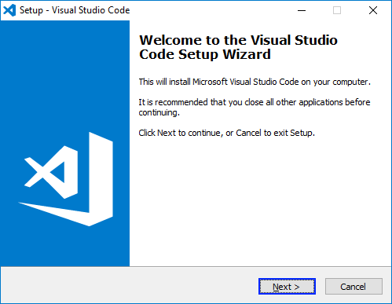

Натискаме бутона [**Next**], след което ще трябва да се съгласим с условията за ползване:

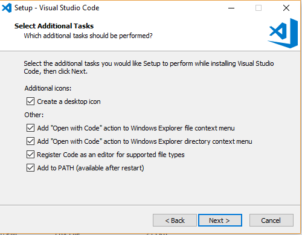

Зарежда се прозорец с инсталационния панел на **Visual Studio Code**, като в даден момент ще бъдем запитани за предпочитанията си към допълнителни настройки, които са си лично индивидуални. Общо взето това е всичко.

Започва инсталацията на Visual Studio Code и когато приключи сме почти готови за работи.

След **старта на VS Code** излиза екран като този по-долу:

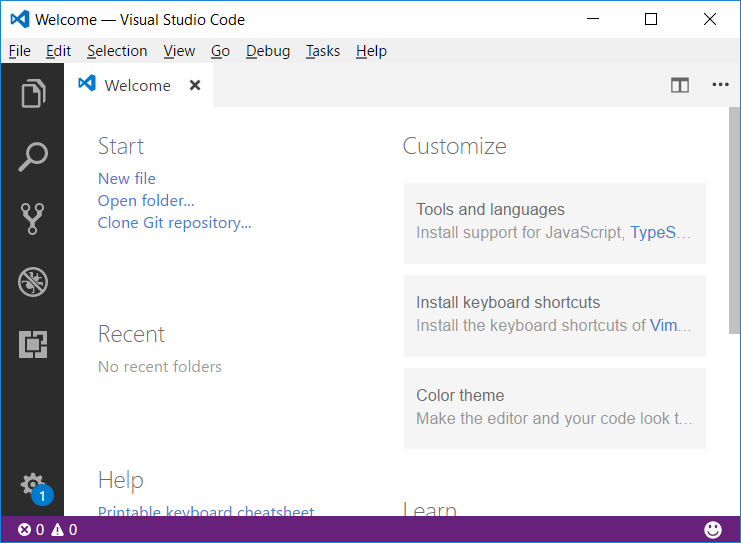

Сега е моментът да си направим средата възможно най-приятна за разработка. **Visual Studio Code** е едно от IDE-тата с най-големи възможности за персонализация. Най-често тази персонализация става под формата на **разширения** (extensions). Списък с всички разширения, можете да намерите на официалният сайт [https://marketplace.visualstudio.com/](https://marketplace.visualstudio.com/). Имайте предвид, че голяма част от тези разширения са строго специфични при работа с конкретен език за програмиран.

Препоръчваме ви като за начало да си инсталирате следните 2 разширения, които драстично ще подобрят работата ви при писане на **JavaScript** код: 

* **Beautify** - [https://marketplace.visualstudio.com/items?itemName=HookyQR.beautify](https://marketplace.visualstudio.com/items?itemName=HookyQR.beautify) - това е разширение, което ви помага да поддържате кода си чист и подреден.
* **JSHint** - [https://marketplace.visualstudio.com/items?itemName=dbaeumer.jshint](https://marketplace.visualstudio.com/items?itemName=dbaeumer.jshint) - както казахме, **JavaScript e интерпретеруем** език и грешките в кода биха се проявили едва след стартирането на изпълнението на програмата. Това разширение търси и съобщава за потенциални нередности по време на писането на кода, преди стартирането на програмата.

Инсталирането става или директно през посочените линкове, или следвайки следните стъпки във **Visual Studio Code**:

1. В най - левият панел, отваряме най-долният таб - Extensions.
2. В полето за търсене изписваме името на разширението, което желаем да инсталираме.
3. От получените резултати избираме този, който ни удовлетворява.
4. Натискаме [**Install**] бутона.
5. Рестартираме **Visual Studio Code**.

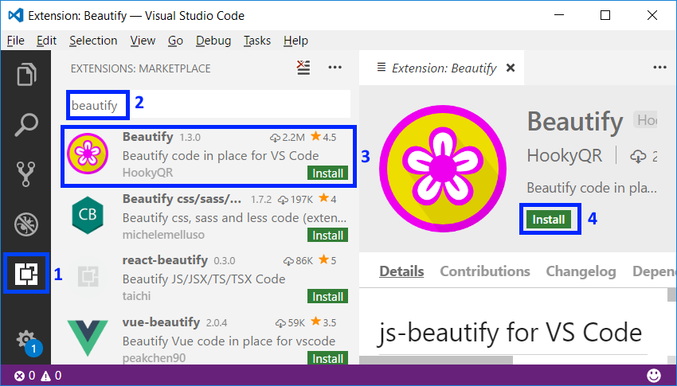

Това е всичко. Готови сме за работа с **Visual Studio Code** и **JavaScript**.

### Онлайн среди за разработка

Съществуват и **алтернативни среди за разработка онлайн**, директно във вашия уеб браузър. Тези среди не са много удобни, но ако нямате друга възможност, може да стартирате обучението си с тях и да си свалите **Visual Studio Code** по-късно. Такъв примерен сайт за онлайн JavaScript разработка в е **JSBin** - [https://jsbin.com/?js,console](https://jsbin.com/?js,console).


Алтернативно за бързо тестване можем да използваме и директно своят браузър с натискане на **[F12]**, но това генерално е опция, ако искате да изпробвате няколко реда код набързо. Ето пример:


## Пример: създаване на конзолна програма "Hello JavaScript"

Да се върнем на нашата конзолна програма. Вече имаме **Visual Studio Code** и можем да го стартираме. След това създаваме нов **JavaScript файл**: [**File**] &rarr; [**New File**]:

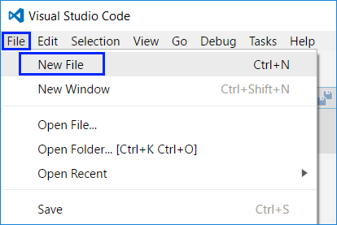

След това е важно да запаметим нашият файл от [**File**] &rarr; [**Save**], като задължително го записваме с разширение "**.js**". Също така му задаваме **смислено име**, например **helloJS**:


### Писане на програмен код

Писането на **JavaScript** код не изисква никаква допълнителна подготовка от това, което вече направихме - да си създадем файл с разширение **.js**. Затова директно пристъпваме към писането на първият си ред код. Изписваме следната команда:

```javascript
console.log("Hello JavaScript!");
```

Ето как трябва да изглежда нашата програма във **Visual Studio Code**:

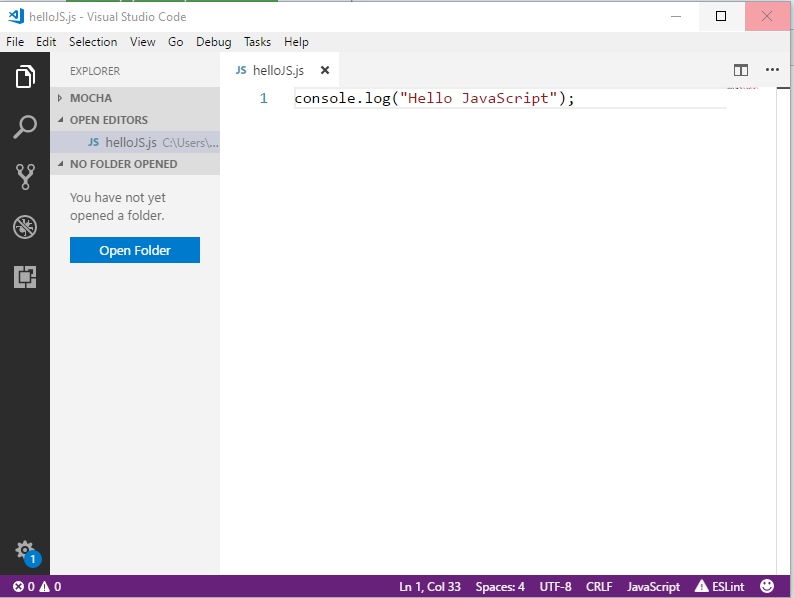

Командата **`console.log("Hello JavaScript!")`** означава да изпълним отпечатване (**`log(…)`**) върху конзолата (**`console`**) със съобщение **`Hello JavaScript!`**, което трябва да оградим с кавички, за да поясним, че това е текст. В края на всяка команда на езика **JavaScript** се слага символът **`;`** и той указва, че командата свършва на това място (т.е. не продължава на следващия ред). Макар и последното да не е задължително е прието като добра практика, за да се избегнат трудно откриваеми проблеми.

**Внимание**: използваните преди малко команди `alert(…)` и `prompt(…)` работят сам в уеб браузъра и не са налични при конзолните приложения във VS Code. Ако се опитате да ги ползвате, ще получите грешка.

Тази команда е много типична за програмирането: указваме да се намери даден **обект** (в случая конзолата) и върху него да се изпълни някакво **действие** (в случая печатане на нещо, което се задава в скоби). По-техническо обяснено, извикваме метода **`log(…)`** от класа **`console`** и му подаваме като параметър текстовия литерал **`"Hello JavaScript!"`**.

### Стартиране на програмата

За стартиране на програмата натискаме [**F5**] и програмата ще се стартира. Резултатът ще се изпише на конзолата, която за наше удобство ще се отвори директно в долната част на **Visual Studio Code**:

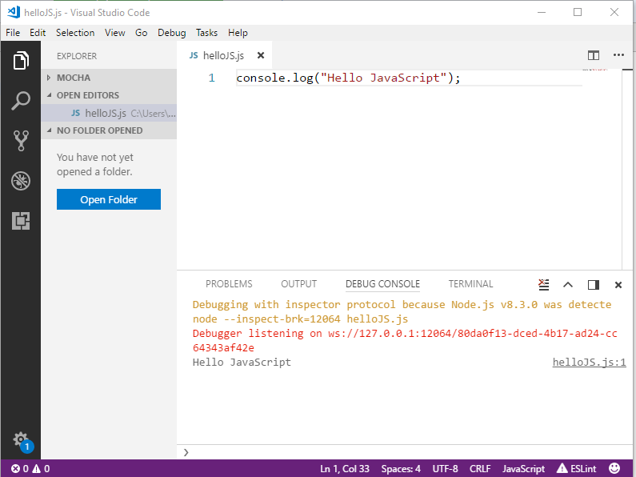

Забележете, че стартираме с **[F5]**, а не само **[Ctrl+F5]**. Ако ползваме **[Ctrl+F5]**, програмата ще се изпълни за кратко и веднага след това прозорецът ще изчезне и няма да видим резултата.

Всъщност, изходът от програмата е следното текстово съобщение:

```javascript
Hello JavaScript!
```

Съобщенията "**Debugging with inspector protocol . . .**" и  **Debugger listening on...** се изписва допълнително на най-горните редове на конзолата от **Visual Studio Code** след като програмата започне своето изпълнение, като това ни дава допълнителна информация за изпълнението, която за момента можем да игнорираме.

### Тестване на програмата в Judge системата

Тестването на задачите от тази книга е автоматизирано и се осъществява през Интернет, от сайта на **Judge системата на СофтУни**: [https://judge.softuni.bg](https://judge.softuni.bg). Оценяването на задачите се извършва в реално време от системата. Всяка задача минава поредица от тестове, като всеки успешно преминат тест дава предвидените за него точки. Тестовете, които се подават на задачите, са скрити.

Горната програма може да тестваме тук: [https://judge.softuni.bg/Contests/Practice/Index/926#0](https://judge.softuni.bg/Contests/Practice/Index/926#0). 

Всеки **JavaScript код**, който искаме да тестваме в **Judge системата** трябва да бъде ограден от следните редове допълнителен код:

````javascript
function solve() {
    // we place our code here
}
````

Т.е. ако искаме да тестваме програмата, която току що написахме в системата, тя ще изглежда така:

````javascript
function solve() {
    console.log("Hello JavaScript");
}
````

Поставяме целия сорс код на програмата в черното поле и избираме **JavaScript code**, както е показано тук:

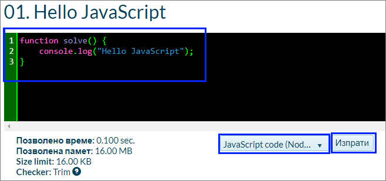

Изпращаме решението за оценяване с бутона [**Изпрати**]. Системата връща резултат след няколко секунди в таблицата с изпратени решения. При необходимост може да натиснем бутона за обновяване на резултатите **[Refresh]** в горната дясна част на таблицата с изпратени за проверка решения:

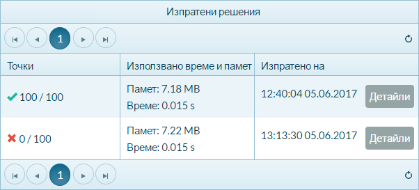

В таблицата с изпратените решения Judge системата ще покаже един от следните **възможни резултати**:
* **Брой точки** (между 0 и 100), когато предаденият код се компилира успешно (няма синтактични грешки) и може да бъде тестван.
  - При **вярно решение** всички тестове са маркирани в зелено и получаваме **100 точки**.
  - При **грешно решение** някои от тестовете са маркирани в червено и получаваме непълен брой точки или 0 точки.
* При грешна програма ще получим **съобщение за грешка** по време на компилация.

### Как да се регистрирам в SoftUni Judge?

Използваме идентификацията си (Username + Password) от сайта [softuni.bg](softuni.bg). Ако нямате СофтУни регистрация, направете си. Отнема само минутка - стандартна регистрация в Интернет сайт.

## Изпълняване на код в браузър чрез HTML + JS

До тук видяхме как можем да си направим и да изпълним конзолна програма. Нека сега видим как можем да напишем код, който да се изпълнява в нашия браузър. По подобен начин се правят и всички сайтове, които посещавате. 

Всъщност принципът е много подобен на това, което направихме току що. Разликата е, че когато си създаваме нов файл, не му даваме разширение **.js**, a **.html**. След това единственото, което трябва да направим е да оградим кодът си със **`<sciprt>`** отварящият се и **`</script>`**, затварящ се **html таг**. По подобен начин преди малко оградихме кодът си, за да може да бъде тестван в Judge системата. Ето така би изглеждал нашият код във **Visual Studio Code** сега:

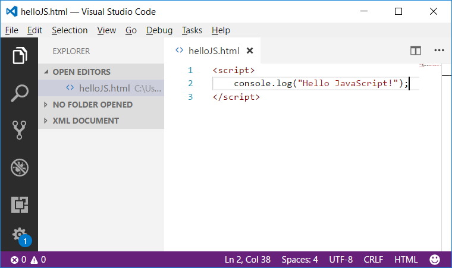

При този подход, сега остава единствено да намерим файла **helloJS.html**, на мястото, където сме го запаметили и да кликнем два пъти върху него. Той ще се зареди в браузъра, но за да видим резултатът от изпълнението му ще трябва да натиснем **F12**, което ще зареди конзолата на браузъра. Ние сме задали команда за печатане на конзолата, затова и трябва да я покажем:

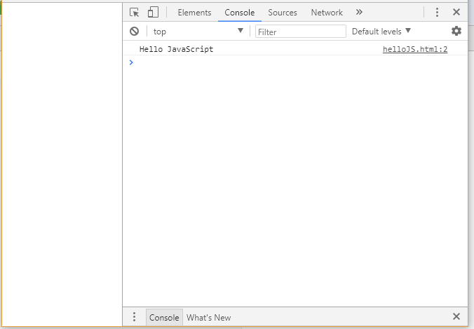

Сега, след като вече **знаете как да изпълнявате програми**, можете да тествате примерните програми по-горе, които показват нотификации на потребителя. Позабавлявайте се, пробвайте тези програми. Пробвайте да ги промените и да си поиграете с тях. Заменете командата **`console.log("Hello JavaScript");`** с команда **`console.error("Error occured");`** и стартирайте програмата. Забележете, че програмите с нотификации, могат да бъдат изпълнени само през нашия браузър, а когато опитаме да ги изпълним през конзолата, програмата ще ни даде грешка. Това е така, защото конзолата няма функционалност да нотифицира чрез визуални елементи, какъвто е **`alert`**.

## Типични грешки в JavaScript програмите

Една от срещаните грешки е бъркането на **главни и малки букви**, а те имат значение при извикване на командите и тяхното правилно функциониране. Ето пример за такава грешка:
```javascript
function solve() {
    Console.Log("Hello JavaScript");
}
```

В горния пример **`Console`** е изписано грешно и трябва да се поправи на **`console`**. Каква друга подобна грешка има допусната в програмата?

Липсваща **кавичка** или **липса на отваряща или затваряща скоба** също може да се окажат проблеми. Проблемът води до **неправилно функциониране на програмата** или въобще до нейното неизпълнение. Този пропуск трудно се забелязва при по-обемен код. Ето пример за грешна програма:

```javascript
function solve() {
    console.log("Hello JavaScript);
}
```

Тази програма ще даде **грешка след началото на изпълнение** и  даже още преди това кодът ще бъде подчертан от разширенията, които следят за това, за да се насочи вниманието на програмиста към грешката, която е допуснал (пропуснатата затваряща кавичка):

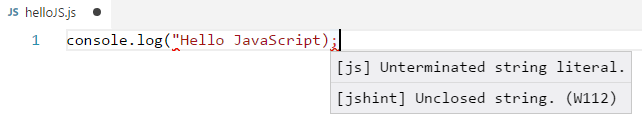


## Какво научихме от тази глава?

На първо място научихме **какво е програмирането** - **задаване на команди, изписани на компютърен език**, които машината разбира и може да изпълни. Разбрахме още какво е **компютърната програма** - тя представлява **поредица от команди**, подредени една след друга. Запознахме се с **езика за програмиране JavaScript** на базисно ниво и как **да създаваме прости конзолни програми и web програми** с Visual Studio Code. Видяхме как се печата на конзолата с командата **`console.log(…)`** и как да стартираме програмата си с [**F5**]. Научихме се да тестваме кода си в **SoftUni Judge**.

Добра работа! Да се захващаме с **упражненията**. Нали не сте забравили, че програмиране се учи с много писане на код и решаване на задачи? Да решим няколко задачи, за да затвърдим наученото.


## Упражнения: първи стъпки в коденето

Добре дошли в упражненията. Сега ще напишем няколко конзолни програми, с които ще направим още няколко първи стъпки в програмирането, след което ще покажем как можем да програмираме нещо по-сложно - програми с графичен и уеб потребителски интерфейс.

### Задача: конзолна програма “Expression”

Да се напише конзолна **JavaScript** програма, която **пресмята** и **отпечатва** стойността на следния числен израз:

<p align="center"> (3522 + 52353) * 23 - (2336 * 501 + 23432 - 6743) * 3 </p>

Забележка: **не е разрешено да се пресметне стойността предварително** (например с Windows Calculator).

#### Насоки и подсказки

Създаваме си **нов JavaScript файл** с име **expression.js**. След това трябва да **напишем кода**, който да изчисли горния числен израз и да отпечата на конзолата стойността му. Подаваме горния числен израз в скобите на командата **``console.log(…)``**:

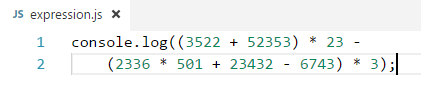

Стартираме програмата с [**F5**] и проверяваме дали резултатът е същия като на картинката:

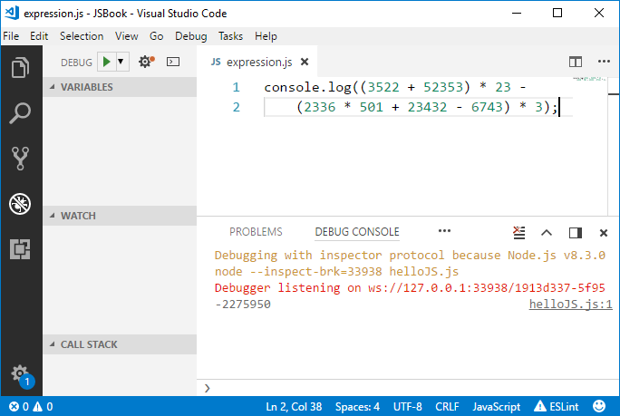

#### Тестване в Judge системата

Тествайте решението си тук: [https://judge.softuni.bg/Contests/Practice/Index/926#1](https://judge.softuni.bg/Contests/Practice/Index/926#1).

**Забележка**: Не забравяйте да оградите кодът си със **`solve()`** функцията:

````javascript
function solve() {
    // your code
}
````

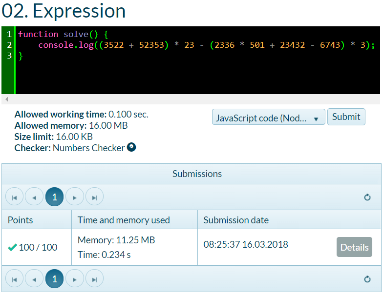

### Задача: числата от 1 до 20

Да се напише **JavaScript** конзолна програма, която **отпечатва числата от 1 до 20** на отделни редове на конзолата.

#### Насоки и подсказки

Създаваме нов **JavaScript файл** с име **nums1To20.js**. В него изписваме 20 команди **``console.log(…)``**, всяка на отделен ред, за да отпечатаме числата от 1 до 20 едно след друго. По-досетливите от вас, сигурно се питат дали няма по-умен начин. Спокойно, има, но за него по-късно.

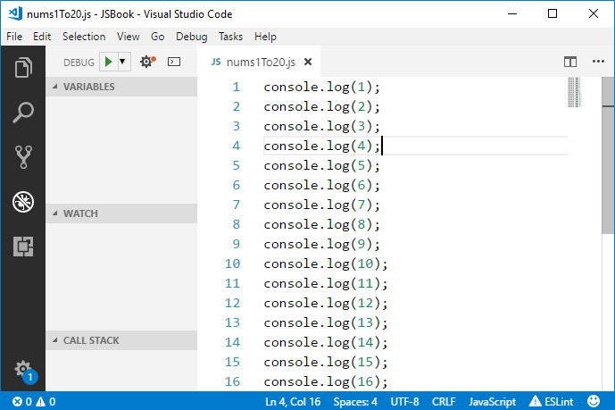

Сега **стартираме програмата** и поверяваме дали резултатът е какъвто се очаква да бъде:
```
1
2
…
20
```

#### Тестване в Judge системата

Тествайте решението си тук: [https://judge.softuni.bg/Contests/Practice/Index/926#2](https://judge.softuni.bg/Contests/Practice/Index/926#2).

Получихте ли 100 точки? Ако не сте помислете какво изпускате. А след това помислете дали може да напишем програмата по **по-умен начин**, така че да не повтаряме 20 пъти една и съща команда. Потърсете в Интернет информация за "**[for loop JavaScript](https://www.google.bg/search?q=for+loop+JavaScript)**".


### Задача: триъгълник от 55 звездички

Да се напише **JavaScript** конзолна програма, която **отпечатва триъгълник от 55 звездички**, разположени на 10 реда:

```
*
**
***
****
*****
******
*******
********
*********
**********
```

#### Насоки и подсказки

Създаваме **нов JavaScript файл** с име **triangleOf55Stars.js**. В него трябва да напишем код, който печата триъгълника от звездички, например чрез 10 команди, като посочените по-долу:

```javascript
console.log("*");
console.log("**");
…
```

#### Тестване в Judge системата

Тествайте решението си тук: [https://judge.softuni.bg/Contests/Practice/Index/926#3](https://judge.softuni.bg/Contests/Practice/Index/926#3).

Опитайте да **подобрите решението**, така че да няма много повтарящи се команди. Може ли това да стане с **`for`** цикъл? Успяхте ли да намерите умно решение (например с цикъл) на предната задача? При тази задача може да се ползва нещо подобно, но малко по-сложно (два цикъла един в друг). Ако не успеете, няма проблем, ще учим цикли след няколко глави и ще си спомните за тази задача тогава.


### Задача: лице на правоъгълник

Да се напише **JavaScript** програма, която **получава две числа a и b**, **пресмята** и **отпечатва** лицето на правоъгълник със страни **a** и **b**. 

#### Примерен вход и изход

| a | b | area |
| :---: | :---: | :---: |
| 2 | 7 |  14  |
| 7 | 8 |  56  |
| 12 | 5 |  60  |

#### Насоки и подсказки

Правим нов **JavaScript файл**. За момента този тип програми ще тестваме само в **Judge системата**, която има изграден механизъм за подаване на входни данни към програмата. За да **получим двете числа**, трябва да декларирам това свое желание, като променим ограждащият код (функцията **`solve()`**), който свикнахме да пишем:

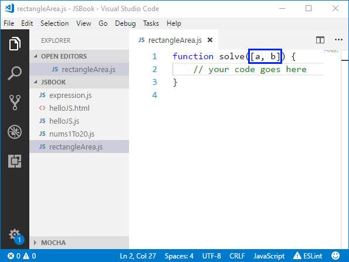

Забелязахте ли промяната? Между **`(`** и **`)`** поставихме допълнителни квадратни скоби **`[]`**, между които пък описахме какви данни очакваме да получим - в случая числата **`a`** и **`b`**, зададени като масив.

Остава да се допише програмата по-горе, за да пресмята лицето на правоъгълника и да го отпечата. Използвайте познатата ни вече команда **`console.log()`** и й подайте в скобите произведението на числата **a** и **b**. В програмирането умножението се извършва с оператора **`*`**.

#### Тестване в Judge системата

Тествайте решението си тук: [https://judge.softuni.bg/Contests/Practice/Index/926#4](https://judge.softuni.bg/Contests/Practice/Index/926#4).


### \* Задача: квадрат от звездички

Да се напише **JavaScript** конзолна програма, която **получава цяло положително число N** и **отпечатва** на конзолата **квадрат от N звездички**, като в примерите по-долу.

#### Примерен вход и изход

| Вход  |    Изход   	| Вход  |    Изход   	| Вход  |    Изход   	| 
|-----|-----------|-----|-----------|-----|----------|
|  3  	|<code>\*\*\*</code><br><code>\*&nbsp;\*</code><br><code>\*\*\*</code>|  4  |<code>\*\*\*\*</code><br><code>\*&nbsp;&nbsp;\*</code><br><code>\*&nbsp;&nbsp;\*</code><br><code>\*\*\*\*</code>| 5  	|<code>\*\*\*\*\*</code><br><code>\*&nbsp;&nbsp;&nbsp;\*</code><br><code>\*&nbsp;&nbsp;&nbsp;\*</code><br><code>\*&nbsp;&nbsp;&nbsp;\*</code><br><code>\*\*\*\*\*</code>|

#### Насоки и подсказки

Правим нова **конзолна JavaScript програма**:

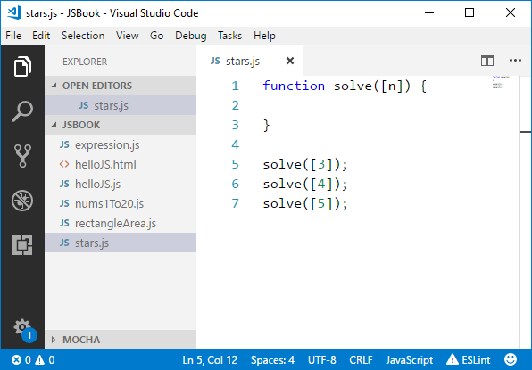


Да се допише програмата по-горе, за да отпечатва квадрат, съставен от звездички. Може да се наложи да се използват **`for`** цикли. Потърсете информация в Интернет.

**Внимание**: тази задача е по-трудна от останалите и нарочно е дадена сега и е обозначена със звездичка, за да ви провокира да потърсите информация в Интернет. Това е едно от най-важните умения, което трябва да развивате докато учите програмирането: **да търсите информация в Интернет**. Това ще правите всеки ден, ако работите като програмисти, така че не се плашете, а се опитайте. Ако имате трудности, можете да потърсите помощ и в СофтУни форума: [https://softuni.bg/forum](https://softuni.bg/forum).

#### Тестване в Judge системата

Тествайте решението си тук: [https://judge.softuni.bg/Contests/Practice/Index/926#5](https://judge.softuni.bg/Contests/Practice/Index/926#5).


## Конзолни, графични и уеб приложения

При **конзолните приложения** (Console Applications), както и сами можете да се досетите, **всички операции** за четене на вход и печатане на изход се **извършват през конзолата**. Там се **въвеждат входните данни**, които се прочитат от приложението, там се **отпечатват и изходните данни** след или по време на изпълнение на програмата.

Докато конзолните приложения **ползват текстовата конзола**, уеб приложенията (Web Applications) **използват уеб-базиран потребителски интерфейс**. За да се **постигне тяхното изпълнение** са необходими две неща - **уеб сървър** и **уеб браузър**, като **браузърът** играе главната роля по **визуализация на данните и взаимодействието с потребителя**. Уеб приложенията са много по-приятни за потребителя, изглеждат визуално много по-добре, използват се мишка и докосване с пръст (при таблети и телефони), но зад всичко това стои програмирането. Затова **трябва да се научим да програмираме** и вече направихме първите си съвсем малки стъпки.

Графичните (GUI) приложения имат **визуален потребителски интерфейс**, директно върху вашия компютър или мобилно устройство, без да е необходим уеб браузър. Графичните приложения (настолни приложения или, иначе казано, desktop apps) **се състоят от един или повече графични прозореца**, в които се намират определени **контроли** (текстови полета, бутони, картинки, таблици и други), **служещи за диалог** с потребителя по по-интуитивен начин. Подобни са и мобилните приложения във вашия телефон и таблет: ползваме форми, текстови полета, бутони и други контроли и ги управляване чрез програмен код. Нали затова се учим сега да пишем код: **кодът е навсякъде в разработката на софтуер**.

## Упражнения: уеб приложения

Сега предстои да направим едно просто **уеб приложение**, за да можем да надникнем в това, какво ще можем да създаваме като напреднем с програмирането и разработката на софтуер. Няма да разглеждаме детайлите по използваните техники и конструкции из основи, а само ще хвърлим поглед върху подредбата и функционалността на създаденото от нас. След като напреднем със знанията си, ще бъдем способни да правим големи и сложни софтуерни приложения и системи. Надяваме се примерите по-долу **да ви запалят интереса**, а не да ви откажат.

### Задача: web приложение „Суматор за числа“

Да се напише **web приложение**, което **изчислява сумата на две числа**:

При въвеждане на две числа в първите две текстови полета и натискане на бутона [**Calculate**] се изчислява тяхната сума и резултатът се показва в третото текстово поле. За нашето приложение ще използваме **технологията HTML**, която в комбинация с **езикa** за програмиране **JavaScript**, позволява създаване на **web приложения и сайтове**, в среда за разработка **Visual Studio Code**.

**HTML** е описателен език, чрез който се декларира съдържанието и информацията на даден уеб сайт. Без да задълбаваме просто ще споменем, че **HTML** се базира на използването на комбинации от **тагове**, за да визуализира и предаде **семантичност** на дадено съдържание. В един от предходните примери ние вече създадохме **HTML страница**, като тогава използвахме **тагът** **`<script>`**.

Обърнете внимание, че ще създадем **уеб-базирано приложение**. Това е приложение, което е достъпно през уеб браузър, точно както любимата ви уеб поща или новинарски сайт. Уеб приложението ще има сървърна част (back-end), която е написана на езика **JavaScript** и клиентска част (front-end), която е написана на езика **HTML**. Уеб приложението се очаква да изглежда приблизително по следния начин:


За разлика от конзолните приложения, които четат и пишат данните си във вид на текст на конзолата, уеб приложенията имат **уеб базиран потребителски интерфейс**. Уеб приложенията се **зареждат от някакъв Интернет адрес** (URL) чрез стандартен уеб браузър. Потребителите пишат входните данни в страница, визуализирана от уеб браузъра, данните се обработват на уеб сървър и резултатите се показват отново в страницата в уеб браузъра. Както споменахме за нашето уеб приложение ще използваме **HTML и JavaScript**. Други технологии, които ни позволяват създаването на **уеб приложения** са например **технологията ASP.NET MVC**, **технологията PHP** и т.н. Тези технологии улесняват създаването на цялостната архитектура на приложението - както сървърна, така и клиентска част. 

Нека пристъпим към реализирането на нашето приложение.

Във VS Code създаваме **нов HTML файл**, който кръщаваме **sumator.html**:

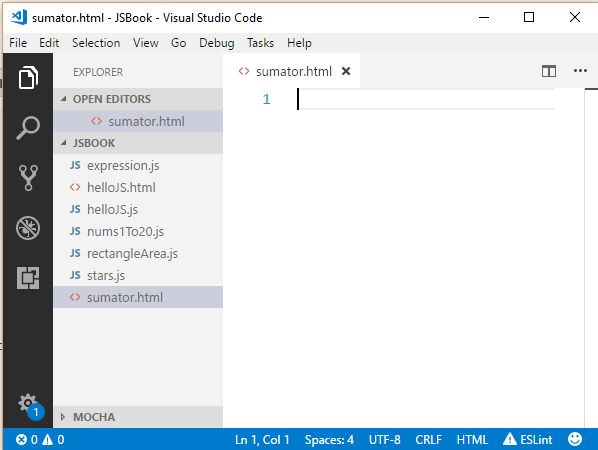

Пишем следния код: 

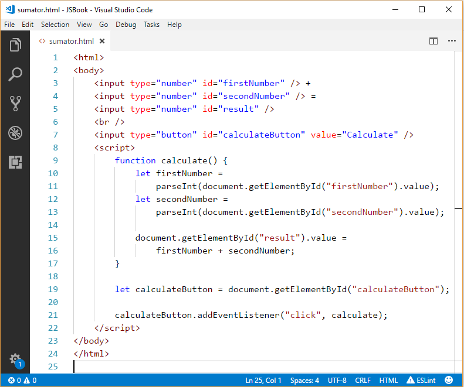


Този код **създава една уеб форма с три текстови полета и един бутон в нея**.  Указано е, че при натискане на бутона [**Calculate**] ще се извика действието **`calculate`**.

Нека разгледаме по - подробно кодът, който току що написахме.

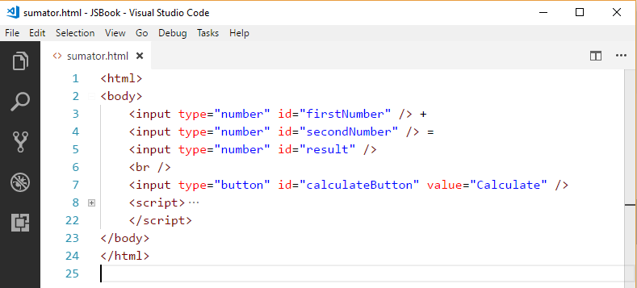

На първите 2 реда декларираме, че в момента ще опишем една **HTML страница**, използвайки таговете **`<html>`** и **`<body>`**, който декларира започването на тялото на нашата страница - или нейната основна част, която ще бъде визуализирана. На последните 2 реда имаме съответните **затварящи тагове**, които декларират край на областта. Може да забележете, че се различават от **отварящите тагове** по наклонената черта пред името - например **`</body>`**.

В тялото на нашата страничка, чрез използването на **HTML тагове** описваме това, което искаме да се визуализира, а именно - 3 полета, в които може да се въвеждат числа. Правим това с тага **`<input type="number">`**. Използвайки този таг ние декларираме, че искаме да имаме визуализация за вход от тип число. Допълнителният **атрибут** - **`id`** служи за да посочим уникалното име на този **таг**. Това име е напълно по наш избор. Атрибутът **`id`** ще ни трябва в последствие, за да можем да получим информация за точно този **HTML елемент**.

След това на 7-ми ред имаме деклариран още един **`input`** таг, като този път типът му е **`button`**. По този начин указваме, че искаме да имаме елемент, върху който може да се натиска и това да доведе до някакви резултати. 

Нека сега разгледаме и **JavaScript кодът**, който написахме: 

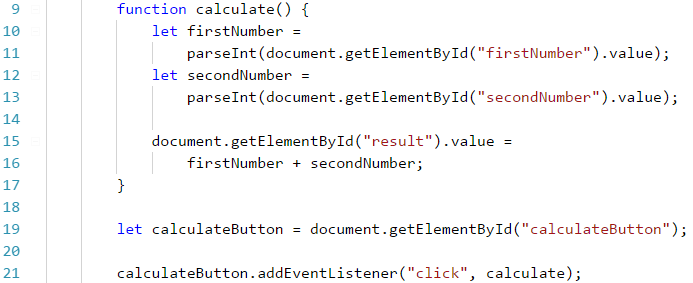

Първо **декларираме функция** **`calculate()`**, която прочита информацията от първите две текстови полета (от нашата HTML страница), след което изчислява сумата и я **присвоява** като стойност на третото поле. Функцията продължава от 9-ти до 17-ти ред. Какво представляват **функциите**, как се **декларират** и **извикват**, ще научим малко по-късно в тази книга.

Нека разгледаме по-детайлно **тялото на функцията**. На 10-ти ред **декларираме променливата** **`firstNumber`**, като ѝ **присвояваме** стойността на текстовото поле с **`id=firstNumber`**. Функцията **`parseInt(...)`** ни подсигурява, че въведеният текст ще бъде конвертиран до число. След това, по аналогичен начин получаваме стойността на второто текстово поле (с **`id=secondNumber`**). Накрая използвайки същия механизъм, вместо да **вземаме стойността** на третото поле с **`id=result`**, ние му **присвояваме** стойност, като го поставяме от лявата страна на равенството.

След това, на 19-ти и 20-ти ред достъпваме нашият бутон и му казваме да **слуша** за **`click`** събития върху него и когато се получи такова събитие, да се **изпълни** функцията **`calculate()`**, която **декларирахме** преди малко. С други думи казано, когато кликнем с мишката върху нашият бутон, ще се изпълни функцията **`calculate()`**.

Приложението е готово. Можем да го стартираме като намерим файлът във файловата система и го отворим. Той ще се зареди в браузърa ни по подразбиране.

Страшно ли изглежда? **Не се плашете!** Имаме да учим още много, за да достигнем ниво на знания и умения, за да пишем свободно уеб-базирани приложения, като в примера по-горе и много по-големи и по-сложни. Ако не успеете да се справите, няма страшно, продължете спокойно напред. След време ще си спомняте с усмивка колко непонятен и вълнуващ е бил първият ви сблъсък с уеб програмирането. Ако имате проблеми с примера по-горе, **гледайте видеото** в началото на тази глава. Там приложението е направено на живо стъпка по стъпка с много обяснения. Или питайте във **форума на СофтУни**: https://softuni.bg/forum.

Целта на горният пример (уеб приложение) не е да се научите, а да докоснете по-надълбоко програмирането, **да разпалите интереса си** към разработката на софтуер и да се вдъхновите да учите здраво. **Имате да учите още много**, но пък е интересно, нали?
