# Глава 2.1. Прости пресмятания с числа

В настоящата глава ще се запознаем със следните концепции и програмни техники:
- Как да работим с **типове данни и променливи**, които са ни необходими при обработка на числа и стрингове?
- Как да **изпечатаме** резултат на екрана?
- Как да **четем** потребителски вход?
- Как да извършваме прости **аритметични операции**: събиране, изваждане, умножение, деление, съединяване на стринг?
- Как да **закръгляме** числа?

## Видео

<div class="video-player">
  Гледайте видео-урок по тази глава тук: <a target="_blank" href="https://www.youtube.com/watch?v=kP_1cKnciyA">https://www.youtube.com/watch?v=kP_1cKnciyA</a>.
</div>
<script src="/assets/js/video.js"></script>

## Пресмятания в програмирането

За компютрите знаем, че са машини, които обработват данни. Всички **данни** се записват в компютърната памет (RAM памет) в **променливи**. Променливите са именувани области от паметта, които пазят данни от определен тип, например число или текст. Всяка една **променлива** в JavaScript има **име** и **стойност**. Ето как бихме дефинирали една променлива, като едновременно с декларацията ѝ, ѝ присвояваме и стойност:


След тяхната обработка, данните се записват отново в променливи (т.е. някъде в паметта, заделена от нашата програма).

## Типове данни и променливи

В програмирането всяка една променлива съхранява определена **стойност** от даден **тип**. Типовете данни могат да бъдат например: **число**, **текст** (стринг), **булев** тип, **дата**, **списък** и др.
Ето няколко примера за типове данни и стойности за тях:
- **number** - тип число: 1, 42, -5, 3.14, NaN, …
- **string** - тип текст (стринг): 'Здрасти', "Hi", 'Beer', …
- **boolean** - булев тип: true, false
- **Date** - дата: Tue Jul 04 2017, …

В езикът JavaScript има три ключови думички за деклариране на променлива. Това са **`var`** **`const`** и **`let`** c. Основната разлика между **`let`** и **`var`** е в обхвата на съществуването на променливата. Докато **`const`** използваме, когато сме сигурни, че това което присвояваме на променливата няма да се променя. Малко по-напред в книгата ще разберем повече подробности за обхвата на променливите, а за сега ще използваме думичката **`let`**, за да декларираме нова променлива.

## Печатане на резултат на екрана

За да изпечатаме текст, число или друг резултат на екрана, е необходимо да извикаме вградената функция **`console.log()`**. С нея можем да принтираме както стойността на променлива, така и директно текст или число.

```javascript
console.log(42); // печатане на число

console.log('Hello!'); // печатане на текст

var msg = 'Hello, JavaScript!';
console.log(msg); // печатане на стойност на променлива
```

## Четене на потребителски вход под формата на цяло число:

За да прочетем потребителски вход под формата на **цяло число**, е необходимо да **дефинираме аргумент** на нашата функция:

```javascript
function sum([arg1, arg2]) {
    let a = parseInt(arg1);
    let b = parseInt(arg2);
    ...
}
```

Нека обърнем внимание, че аргументите **`arg1`** и **`arg2`** биха могли да бъдат в различен тип данни от този който желаем. За това е необходимо да се преобразуват в подходящ за целта такъв. Ако това не се направи, за програмата **всяко едно число** ще бъде просто **текст**, с който **не бихме могли да извършваме** аритметични операции.

### Пример: пресмятане на лице на квадрат със страна **а**

За пример да вземем следната програма, която чете цяло число, умножава го по него самото (вдига го на квадрат) и отпечатва резултата от умножението. Така можем да пресметнем лицето на квадрат по дадена дължина на страната:

```javascript
function calculateSquareArea([arg1]) {
    let a = parseInt(arg1);
    let area = a * a;
    console.log('Square area = ' + area);
}
```

Ако извикаме нашата функция с параметър 3 - **`calculateSquareArea([3])`**, резултатът от кода ще e - **`Square area = 9`**:

Ако опитаме да въведем грешно число, например "**hello**". Ще получим съобщение за грешка по време на изпълнение (exception). Това е нормално. По-късно ще разберем как можем да прихващаме такива грешки и да връщаме по-смислени за потребителя съобщения.

#### Как работи примерът?

На първият ред **`function calculateSquareArea([arg1]) {`** дефинираме нашата функция, като и даваме име и задаваме аргументите, които ще чете. В нашия случай имаме един аргумент, който ще представлява страна на квадрата.

Следващият ред **`let a = parseInt(arg1)`** взима аргумента на функцията **`arg1`** и го преобразува към цяло число чрез функцията **`parseInt(arg1);`**. Резултатът се записва в променлива с име **`a`**.

_**Забележка**: Ako **`arg1`** съдържа **дробно число**, то ще бъде **преобразувано към цяло**. Преобразуването на дробно число към цяло става като се **отстранят** всички числа след запетаята. 
Например: `parseInt(2.3)` = 2, `parseInt(3.8)` = 3_

Следващата команда **`let area = a * a;`** записва в нова променлива **`area`** резултата от умножението на **`a`** по **`a`**.

Следващата команда **`console.log('Square area = ' + area);`** отпечатва посочения текст, като до него долепя изчисленото лице на квадрата, който сме записали в променливата **`area`**.

#### Тестване в Judge системата

Тествайте решението си тук: [https://judge.softuni.bg/Contests/Practice/Index/927#0](https://judge.softuni.bg/Contests/Practice/Index/927#0).

## Четене на дробно число

За да прочетем потребителски вход под формата на **дробно число**, отново е необходимо да **дефинираме аргумент** на нашата функция. Синтаксисът е подобрен както при четене на цяло число, само че тук трябва да използваме функцията `parseFloat()`:

```javascript
function sum([arg1, arg2]) {
    let a = parseFloat(arg1);
    let b = parseFloat(arg2);
    ...
}
```

### Пример: прехвърляне от инчове в сантиметри

Да напишем програма, която чете дробно число в инчове и го обръща в сантиметри:

```javascript
function convertInchesToCentimeters([arg1]) {
    let inches = parseFloat(arg1);
    let centimeters = inches * 2.54;
    console.log('Centimeters = ' + centimeters);
}
```

Нека извикаме функцията и да се уверим, че при подаване на стойност в инчове, получаваме коректен резултат в сантиметри:

```javascript
convertInchesToCentimeters([5]); // Centimeters = 12.7
```

#### Тестване в Judge системата
Тествайте решението си тук: [https://judge.softuni.bg/Contests/Practice/Index/927#1](https://judge.softuni.bg/Contests/Practice/Index/927#1).

## Четене на вход под формата на текст

Както при останалите типове данни, за да прочетем **текст**, е необходимо да **дефинираме аргумент** на нашата функция, след което да го присвоим на променлива:

```javascript
function print([arg1]) {
    let text = arg1;
    ...
}
```

### Пример: поздрав по име

Да напишем програма, която въвежда името на потребителя и го поздравява с текста "**Hello, (име)**".

```javascript  
function sayHello([arg1]) {
    let name = arg1;
    console.log(`Hello, ${name}!`);
}
```

В този случай, изразът **`${name}`** e заместен от **стойността на променливата `name`**. Ето и резултата, ако извикаме функцията с името 'Иван'

```javascript  
sayHello(['Иван']); // Hello, Иван!
```

#### Тестване в Judge системата

Тествайте решението си тук: [https://judge.softuni.bg/Contests/Practice/Index/927#2](https://judge.softuni.bg/Contests/Practice/Index/927#2).


## Съединяване на текст и числа

При печат в конзолата на текст, числа и други данни, **можем да ги съединим**, като използваме шаблони **``` `variable = ${variable}` ```**. В програмирането тези шаблони се наричат **placeholders**. 
Обърнете внимание, че за да бъде разпознат шаблонът, трябва да използваме апостроф **`** вместо обикновени кавички.

```javascript
function printInfo([firstName, lastName, age, town]) {
    console.log(`You are ${firstName} ${lastName}, a ${age}-years old person from ${town}.`);
}
```
Отново извикваме функцията с тестови параметри и се уверяваме, че работи:
```javascript
printInfo(['Ivan', 'Ivanov', 20, 'Sofia']);
```

Освен променливи, в шаблоните можем да правим и прости изчисления.

Възможно е една и съща променлива да бъде използвана като шаблон повече от веднъж. Ето пример:

```javascript
let a = 1;
console.log(`${a} + ${a} = ${a + a}`);
```
Резултатът е:
```
1 + 1 = 2
```

### Тестване в Judge системата

Тествайте решението си тук: [https://judge.softuni.bg/Contests/Practice/Index/927#3](https://judge.softuni.bg/Contests/Practice/Index/927#3).


## Аритметични операции

Да разгледаме базовите аритметични операции в програмирането.

### Събиране на числа (оператор **`+`**)

Можем да събираме числа с оператора **`+`**:

```javascript
let a = 5;
let b = 7;
let sum = a + b; // резултатът е 12
```

### Изваждане на числа (оператор **`-`**)

Изваждането на числа се извършва с оператора **`-`**:

```javascript
function substractNumbers([a, b]) {
    let a = parseInt(a);
    let b = parseInt(b);
    let result = a - b;
    console.log(result);
}
```

Нека проверим резултатa от изпълнението на програмата (при числа 10 и 3):
```javascript
substractNumbers([10, 3]);
```

### Умножение на числа (оператор **`*`**)

Делението на числа се извършва с оператора **`*`**:

```javascript
let a = 5;
let b = 7;
let product = a * b; // 35
```

### Деление на числа (оператор **`/`**)

Делението на числа се извършва с оператора **`/`**. 
* Дробното **деление на 0** не предизвиква грешка, а резултатът е **+/- безкрайност** или специалната стойност **Infinity**.

Ето няколко примера за използване на оператора за делене:

```javascript
console.log(10 / 2.5); // Резултат: 4
console.log(10 / 4); // Резултат: 2.5
console.log(10 / 6); // Резултат: 1.6666666666666667

console.log(a / 0); // Резултат: Infinity
console.log(-a / 0); // Резултат: -Infinity
console.log(0 / 0); // Резултат: NaN (Not a Number), т.е. резултатът
                    // от операцията не е валидна числена стойност
```

## Съединяване на текст и число

Операторът **`+`** освен за събиране на числа служи и за съединяване на текст (долепяне на два символни низа един след друг). В програмирането съединяване на текст с текст или с число наричаме "**конкатенация**". Ето как можем да съединяваме текст и число с оператора **`+`**:

```javascript
let firstName = "Maria";
let lastName = "Ivanova";
let age = 19;
let str = firstName + " " + lastName + " @ " + age; 
console.log(str);  // Maria Ivanova @ 19
```

Ето още един пример:

```javascript
let a = 1.5;
let b = 2.5;
let sum = "The sum is: " + a + b;
console.log(sum);  // The sum is: 1.52.5
```

Забелязвате ли нещо странно? Може би очаквахте числата **`a`** и **`b`** да се сумират? Всъщност конкатенацията работи отляво надясно и горният резултат е абсолютно коректен. Ако искаме да сумираме числата, ще трябва да ползваме **скоби**, за да променим реда на изпълнение на операциите:

```javascript
let a = 1.5;
let b = 2.5;
let sum = "The sum is: " + (a + b);
console.log(sum);  // The sum is: 4
```

## Числени изрази

В програмирането можем да пресмятаме и **числови изрази**, например:

```javascript
let expr = (3 + 5) * (4 – 2);
```
В сила е стандартното правило за приоритетите на аритметичните операции: **умножение и деление се извършват винаги преди събиране и изваждане**. При наличие на **израз в скоби, той се изчислява пръв**, но ние знаем всичко това от училищната математика.

### Пример: изчисляване на лице на трапец

Да напишем програма, която въвежда дължините на двете основи на трапец и неговата височина (по едно дробно число на ред) и пресмята **лицето на трапеца** по стандартната математическа формула:

```javascript
function printТrapezoidArea([arg1, arg2, arg3]) {
    let b1 = parseFloat(arg1);
    let b2 = parseFloat(arg2);
    let h = parseFloat(arg3);
    let area = (b1 + b2) * h / 2;
    console.log("Trapezoid area = " + area);
}
```

Тъй като искаме функцията ни да работи, както с цели, така и с дробни числа, използваме **`parseFloat()`**

Ако стартираме програмата и въведем за страните съответно `3`, `4` и `5`, ще получим следния резултат:
```javascript
printТrapezoidArea([3, 4, 5]); // Trapezoid area = 17.5
```

#### Тестване в Judge системата

Тествайте решението си тук: 

[https://judge.softuni.bg/Contests/Practice/Index/927#4](https://judge.softuni.bg/Contests/Practice/Index/927#4).


## Закръгляне на числа

Понякога, когато работим с дробни числ, а се налага да приведем числата към еднотипен формат. Това привеждане се нарича **закръгляне**. JavaScript предоставя няколко вида закръгляне на числа:

* Закръгляне до следващо (по-голямо) цяло число `ceil()`:
```javascript
let up = Math.ceil(23.45);     // up = 24
```
* Закръгляне до предишно (по-малко) цяло число `.floor()`:
```javascript
let down = Math.floor(45.67);	// down = 45
```

* Отрязване на знаците след десетичната запетая `.trunc()`:
```javascript
let trunc = Math.trunc(45.67);	// trunc = 45
```

* Закръгляне до най-близко число `.toFixed([брой символи след точката])`:
```javascript
(123.456).toFixed(2);	 // 123.46
(123).toFixed(2);	 // 123.00
(123.456).toFixed(0);	 // 123
(123.512).toFixed(0);	 // 124
```

### Пример: периметър и лице на кръг 

Нека напишем програма, която при въвеждане **радиуса r** на кръг **изчислява лицето и периметъра** на кръга / окръжността.

Формули:
- Лице = π \* r \* r
- Периметър = 2 \* π \* r
- π ≈ 3.14159265358979323846…

```javascript
function calculateCircleAreaAndPerimeter([arg1]) {
    let r = parseInt(arg1);
    console.log("Area = " + Math.PI * r * r); 
    // Math.PI - вградена в JavaScript константа за π
    console.log("Perimeter = " + 2 * Math.PI * r);
}
```
Нека извикаме функцията с **радиус `r = 10`**:
```javascript
calculateCircleAreaAndPerimeter([10])
```

#### Тестване в Judge системата

Тествайте решението си тук: [https://judge.softuni.bg/Contests/Practice/Index/927#5](https://judge.softuni.bg/Contests/Practice/Index/927#5).


### Пример: лице на правоъгълник в равнината

Правоъгълник е зададен с **координатите на два от своите два срещуположни ъгъла**. Да се пресметнат **площта и периметъра** му:


В тази задача трябва да съобразим, че ако от по-големия `x` извадим по-малкия `x`, ще получим дължината на правоъгълника. Аналогично, ако от по-големия `y` извадим по-малкия `y`, ще получим височината на правоъгълника. Остава да умножим двете страни. Ето примерна имплементация на описаната логика:

```javascript
function calculateRectangleArea([arg1, arg2, arg3, arg4]) {
    var x1 = parseFloat(arg1);
    var y1 = parseFloat(arg2);
    var x2 = parseFloat(arg3);
    var y2 = parseFloat(arg4);
    
    // Изчисляване страните на правоъгълника:
    var width = Math.max(x1, x2) - Math.min(x1, x2);
    var height = Math.max(y1, y2) - Math.min(y1, y2);

    console.log(width * height);
    console.log(2 * (width + height));
}
```

Използваме **`Math.max(a, b)`**, за да намерим по-голямата измежду стойностите **`a`** и **`b`** и аналогично **`Math.min(a, b)`** за намиране на по-малката от двете стойности.

Нека извикаме функцията с тестови стойности от координатната система:

```javascript
calculateRectangleArea([60, 20, 10, 50]);
```

#### Тестване в Judge системата

Тествайте решението си тук: [https://judge.softuni.bg/Contests/Practice/Index/927#6](https://judge.softuni.bg/Contests/Practice/Index/927#6).


## Какво научихме от тази глава?

Да резюмираме какво научихме от тази глава на книгата:
- **Четене на потребителски вход**: **`sum([number1, number2])`**.
- **Преобразуване към число**: **`let num = parseInt(arg1)`**, **`let num = parseFloat(arg1)`**.
- **Извършване на пресмятания с числа** и използване на съответните **аритметични оператори** [+, -, \*, /, ()]: **`let sum = 5 + 3`**.
- **Извеждане на текст по шаблон** на конзолата: **```console.log(`3 + 5 = ${3 + 5}`)```**.
- Различните типове **закръгляния** на числа **`ceil()`**, **`trunk()`**, **`floor()`** и **`toFixed()`**

## Упражнения: прости пресмятания

Нека затвърдим наученото в тази глава с няколко задачи.

### Празен **JS** файл за решението на задачата ни във Visual Studio Code

Започваме като създадем празен **JS файл** във Visual Studio Code. 
В настоящото практическо занимание ще създадем нова папка и ще добавяме нов JS файл за всяка задача, за да организираме решенията на задачите от упражненията.

* Стартираме Visual Studio Code.
* Създаваме **нов файл:** [**File**] -> [**New File**].

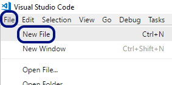

* **Запаметяваме** файла [**File**] -> [**Save**] или чрез клавишната комбинация [**Ctrl + S**].


* Даваме **значещо име** и разширение **.js** на нашия файл.
* Натискаме бутона **Save**.

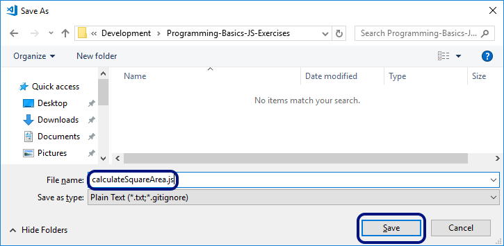

### Задача:	пресмятане на лице на квадрат

Първата задача от тази тема е следната: да се напише конзолна програма, която **въвежда цяло число `a` и пресмята лицето** на квадрат със страна **`a`**. Задачата е тривиално лесна: **въвеждате число** от конзолата, **умножавате го само по себе си** и **печатате получения резултат** на конзолата.

#### Насоки и подсказки

Вече имаме правилно именуван празен файл. Остава да напишем **кода за решаване на задачата**. За целта пишем следния код:

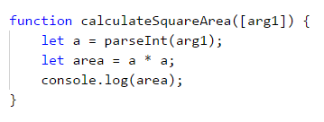

Кодът дефинира функция **`calculateSquareArea()`**, която приема един аргумент **`arg1**`. Тъй като се очаква аргументът да е цяло число, преобразуваме аргумента с функцията **`parseInt()`** и след това изчисляваме **`area = a * a`**. Накрая печатаме стойността на променливата **`area`**. 
За да **тестваме** e нужно в същия файл да **извикаме функцията** с произволен параметър и след това да стартираме програмата като натиснем [**Ctrl + F5**]:

```javascript
calculateSquareArea([5]); // Square = 25
```
#### Тестване в Judge системата

Тествайте решението си тук: [https://judge.softuni.bg/Contests/Practice/Index/927#0](https://judge.softuni.bg/Contests/Practice/Index/927#0). Трябва да получите 100 точки (напълно коректно решение):

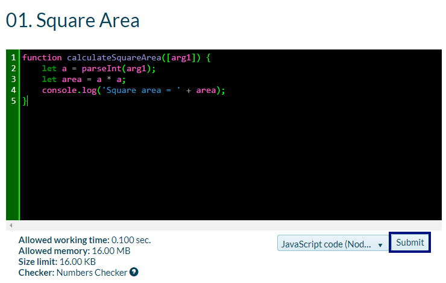

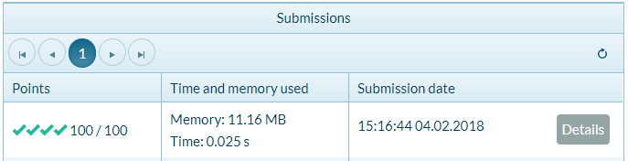


### Задача:	от инчове към сантиметри

Да се напише програма, която **чете от конзолата число** (не непременно цяло) и преобразува числото от **инчове в сантиметри.** За целта **умножава инчовете по 2.54** (защото 1 инч = 2.54 сантиметра).

#### Насоки и подсказки

Първо създаваме **нов файл** в папката с другите решения. Във Visual Studio Code избираме [**File**] -> [**New file**]:

Запаметяваме файла [**Ctrl + S**] под името **`convertInchesToCentimeters.js`** и натискаме бутона **Save**

Следва да напишем **кода на програмата**:

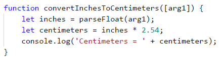

**Извикваме функцията** с параметър **2** и **Стартираме програмата** с [**Ctrl+F5**]:

```javascript
convertInchesToCentimeters([2]);
```

Да тестваме с дробни числа, например с **4.5**:

```javascript
convertInchesToCentimeters([4.5]);
```

#### Тестване в Judge системата

Тествайте решението си тук: [https://judge.softuni.bg/Contests/Practice/Index/927#1](https://judge.softuni.bg/Contests/Practice/Index/927#1).

Решението би трябвало да бъде прието като напълно коректно:


### Задача: поздрав по име

Да се напише програма, която **чете от конзолата име на човек** и отпечатва **`Hello, <name>!`**, където **`<name>`** е въведеното преди това име.

#### Насоки и подсказки

Отново създаваме **нов файл** в папката с другите решения и го запазваме под името **`sayHello.js`**

**Следва да напишем кода** на програмата. Ако се затруднявате, може да ползвате примерния код по-долу:


**Извикваме функцията** с примерен параметър и **Стартираме програмата** с [**Ctrl+F5**], за да тестваме дали работи:

```javascript
sayHello(['Ivan'])
```

#### Тестване в Judge системата

Тествайте решението си тук:  [https://judge.softuni.bg/Contests/Practice/Index/927#2](https://judge.softuni.bg/Contests/Practice/Index/927#2).


### Задача:	съединяване на текст и числа

Напишете JavaScript програма, която прочита от конзолата име, фамилия, възраст и град и печата съобщение от следния вид: **`You are <firstName> <lastName>, a <age>-years old person from <town>`**.

#### Насоки и подсказки

По същия начин създаваме нов файл и го именуваме **`printInfo.js`**:

**Кодът**, който отпечатва описаното в условието на задачата съобщение, трябва да се допише.

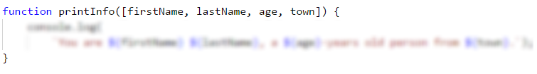


На горната картинка кодът е нарочно даден замъглен, за да помислите как да си го напишете сами.

Следва да се тества решението локално, като извикаме функцията и стартираме с [**Ctrl+F5**].

#### Тестване в Judge системата

Тествайте решението си тук: [https://judge.softuni.bg/Contests/Practice/Index/927#3](https://judge.softuni.bg/Contests/Practice/Index/927#3).


### Задача:	лице на трапец

Напишете програма, която чете от конзолата три числа **b1, b2 и h и пресмята лицето на трапец** с основи **b1 и b2 и височина h. Формулата за лице на трапец е (b1 + b2) * h / 2**.

На фигурата по-долу е показан трапец със страни 8 и 13 и височина 7. Той има лице **(8 + 13) * 7 / 2 = 73.5**.


#### Насоки и подсказки

Отново трябва да добавим във Visual Studio Code файл с име **`calculateTrapezoidArea.js`** и да напишем **кода, който чете входните данни от аргументите на функция, пресмята лицето на трапеца и го отпечатва**:

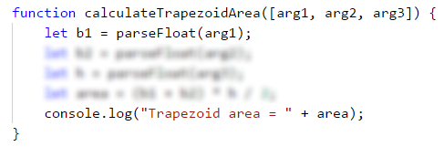

Кодът на картинката е нарочно размазан, за да помислите върху него и да го допишете сами.

**Тествайте** решението локално с извикване на функцията и стартиране с [**Ctrl+F5**].

#### Тестване в Judge системата

Тествайте решението си тук: [https://judge.softuni.bg/Contests/Practice/Index/927#4](https://judge.softuni.bg/Contests/Practice/Index/927#4).


### Задача:	периметър и лице на кръг

Напишете програма, която чете от конзолата **число r** и пресмята и отпечатва **лицето и периметъра на кръг**/**окръжност** с **радиус r**.

#### Примерен вход и изход

| Вход | Изход                                                     |
| ---- | --------------------------------------------------------- |
| 3    | Area = 28.2743338823081 <br> Perimeter = 18.8495559215388 |
| 4.5  | Area = 63.6172512351933 <br> Perimeter = 28.2743338823081 |

#### Насоки и подсказки

За изчисленията можете да използвате следните формули:
-	**`Area = Math.PI * r * r`**.
-	**`Perimeter = 2 * Math.PI * r`**.

#### Тестване в Judge системата

Тествайте решението си тук: [https://judge.softuni.bg/Contests/Practice/Index/927#5](https://judge.softuni.bg/Contests/Practice/Index/927#5).


### Задача: лице на правоъгълник в равнината

**Правоъгълник** е зададен с **координатите** на два от своите срещуположни ъгъла (x1, y1) – (x2, y2). Да се пресметнат **площта и периметъра** му. **Входът** се чете от конзолата. Числата **x1, y1, x2 и y2** са дадени по едно на ред. **Изходът** се извежда на конзолата и трябва да съдържа два реда с по една число на всеки от тях – лицето и периметъра.


#### Примерен вход и изход

| Вход                                 | Изход               |
| ------------------------------------ | ------------------- |
| 60<br>20<br>10<br>50                 | 1500<br>160         |
| 30<br>40<br>70<br>-10                | 2000<br>180         |
| 600.25<br>500.75<br>100.50<br>-200.5 | 350449.6875<br>2402 |

#### Тестване в Judge системата

Тествайте решението си тук: [https://judge.softuni.bg/Contests/Practice/Index/927#6](https://judge.softuni.bg/Contests/Practice/Index/927#6).


### Задача:	лице на триъгълник

Напишете програма, която чете от конзолата **страна и височина на триъгълник** и пресмята неговото лице. Използвайте **формулата** за лице на триъгълник: **area = a * h / 2**. Закръглете резултата до **2 цифри след десетичния знак, използвайки `area.toFixed(2)`**.

#### Примерен вход и изход

| Вход                | Изход                 |
| ------------------- | --------------------- |
| 20 <br>30           | Triangle area = 300   |
| 15 <br>35           | Triangle area = 262.5 |
| 7.75 <br>8.45       | Triangle area = 32.74 |
| 1.23456 <br>4.56789 | Triangle area = 2.82  |

#### Тестване в Judge системата

Тествайте решението си тук: [https://judge.softuni.bg/Contests/Practice/Index/927#7](https://judge.softuni.bg/Contests/Practice/Index/927#7).


### Задача: конвертор - от градуси °C към градуси °F

Напишете програма, която чете **градуси по скалата на Целзий** (°C) и ги преобразува до **градуси по скалата на Фаренхайт** (°F). Потърсете в Интернет подходяща [формула](http://bfy.tw/3rGh "Търсене в Google"), с която да извършите изчисленията. Закръглете резултата до **2 символа след десетичния знак**. Ето няколко примера:

#### Примерен вход и изход

| Вход | Изход |
| ---- | ----- |
| 25   | 77    |
| 0    | 32    |
| -5.5 | 22.1  |
| 32.3 | 90.14 |

#### Тестване в Judge системата

Тествайте решението си тук: [https://judge.softuni.bg/Contests/Practice/Index/927#8](https://judge.softuni.bg/Contests/Practice/Index/927#8).


### Задача: конвертор - от радиани в градуси

Напишете програма, която чете **ъгъл в [радиани](https://bg.wikipedia.org/wiki/Радиан)** (**`rad`**) и го преобразува в **[градуси](https://bg.wikipedia.org/wiki/Градус_(ъгъл))** (`deg`). Потърсете в Интернет подходяща формула. Числото **π** в JavaScript програмите е достъпно чрез **``Math.PI``**. Закръглете резултата до най-близкото цяло число, използвайки функцията **``Math.round(…)``**.

#### Примерен вход и изход

| Вход   | Изход |
| ------ | ----- |
| 3.1416 | 180   |
| 6.2832 | 360   |
| 0.7854 | 45    |
| 0.5236 | 30    |

#### Тестване в Judge системата

Тествайте решението си тук: [https://judge.softuni.bg/Contests/Practice/Index/927#9](https://judge.softuni.bg/Contests/Practice/Index/927#9).


### Задача: конвертор - USD към BGN

Напишете програма за **конвертиране на щатски долари** (USD) **в български лева** (BGN). **Закръглете** резултата до **2 цифри** след десетичния знак. Използвайте фиксиран курс между долар и лев: **1 USD = 1.79549 BGN**.

#### Примерен вход и изход

| Вход | Изход      |
| ---- | ---------- |
| 20   | 35.91 BGN  |
| 100  | 179.55 BGN |
| 12.5 | 22.44 BGN  |

#### Тестване в Judge системата

Тествайте решението си тук: [https://judge.softuni.bg/Contests/Practice/Index/927#10](https://judge.softuni.bg/Contests/Practice/Index/927#10).


### Задача:	\* конзолен междувалутен конвертор

Напишете програма за **конвертиране на парична сума от една валута в друга**. Трябва да се поддържат следните валути: **BGN, USD, EUR, GBP**. Използвайте следните фиксирани валутни курсове:

| Курс  | USD     | EUR     | GBP     |
| :---: | :-----: | :-----: | :-----: |
| 1 BGN | 1.79549 | 1.95583 | 2.53405 |

**Входът** e **сума за конвертиране**, **входна валута** и **изходна валута**. **Изходът** е едно число – преобразуваната сума по посочените по-горе курсове, закръглен до **2 цифри** след десетичната точка. 

#### Примерен вход и изход

| Вход                 | Изход      |
| -------------------- | ---------- |
| 20<br>USD<br>BGN     | 35.91 BGN  |
| 100<br>BGN<br>EUR    | 51.13 EUR  |
| 12.35<br>EUR<br>GBP  | 9.53 GBP   |
| 150.35<br>USD<br>EUR | 138.02 EUR |
 
#### Тестване в Judge системата

Тествайте решението си тук: [https://judge.softuni.bg/Contests/Practice/Index/927#11](https://judge.softuni.bg/Contests/Practice/Index/927#11).


### Задача:	** пресмятане с дати - 1000 дни на Земята

Напишете програма, която въвежда **рождена дата** във формат **`dd-MM-yyyy`** и пресмята датата, на която се навършват **1000 дни** от тази рождена дата и я отпечатва в същия формат.

#### Примерен вход и изход

| Вход       | Изход      |
| ---------- | ---------- |
| 1995-02-25 | 20-11-1997 |
| 2003-11-07 | 02-08-2006 |
| 2002-12-30 | 24-09-2005 |
| 2012-01-01 | 26-09-2014 |
| 1980-06-14 | 10-03-1983 |

#### Насоки и подсказки 
* Потърсете информация за типа **``Date``** в JavaScript и по-конкретно разгледайте функциите **``setDate()``**, **``getDate()``**, **``getMonth()``** и **``getYear()``**. С тяхна помощ може да решите задачата, без да е необходимо да изчислявате дни, месеци и високосни години.
* **Не печатайте** нищо допълнително на конзолата освен изискваната дата!

#### Тестване в Judge системата

Тествайте решението си тук: [https://judge.softuni.bg/Contests/Practice/Index/927#12](https://judge.softuni.bg/Contests/Practice/Index/927#12).


## Графични приложения с числови изрази

За да упражним работата с променливи и пресмятания с оператори и числови изрази, ще направим нещо интересно: ще разработим **уеб приложение** с графичен потребителски интерфейс. В него ще използваме пресмятания с дробни числа.

### Уеб приложение: \*\*\* конвертор от BGN към EUR!
Създайте уеб приложение, което пресмята стойността в **евро** (EUR) на парична сума, зададена в **лева** (BGN). При промяна на стойността в лева, равностойността в евро трябва да се преизчислява автоматично. Използвайте курс лева / евро: **1.95583**.

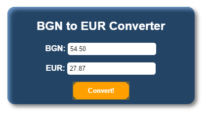

По подобен начин както във първата глава (Първи стъпки в програмирането), за нашето приложение ще използваме езиците **JavaScript**, **HTML** и **CSS**.

1. Първата стъпка е да си **създадем папка** в която ще съхраняваме всички файлове които са необходими за нашето приложение.
2. След това в папката трябва да създадем html файл:
**`index.html`**
```html
<!DOCTYPE html>

<html xmlns="http://www.w3.org/1999/xhtml">
<head>
    <meta charset="utf-8">
    <title>BGN to EUR Converter</title>
</head>
<body>
    <form class="content-form">
        <h2 class="title">BGN to EUR Converter</h2>
        <section class="items">
            <label for="bgn" class="currency">
                <span class="item-currency">BGN: </span>
                <input class="currency-value" type="number" id="bgn" value="0" />
            </label>
            <label for="euro" class="currency">
                <span class="item-currency">EUR: </span>
                <input class="currency-value" type="text" id="euro" readonly />
            </label>
            <input class="primary-btn" type="button" value="Convert!" />
        </section>
    </form>
</body>
</html>
```

Обърнете внимание, че всяка html страница трябва да има определена структура. Например винаги основният код който пишем е в тагът **`<body>`**, и винаги заглавието на страницата е в тагът **`<title>`**.

3. Вече имаме структурата на страницата, остава да добавим и **JavaScript** файл със самата логика. Създаваме нов файл и го именуваме **`converter.js`**

```javascript
function eurConverter() {
    let bgn = document.getElementById("bgn").value;
    let eur = (bgn / 1.95583).toFixed(2);
    document.getElementById("euro").value = eur;    
}
```
4. След като имаме логиката на приложението, трябва да намерим начин да кажем къде да се изпoлзва. 
За целта трябва да направим 2 промени в съществуващия **`index.html`** файл.
* Първо добавяме следния ред точно под **`title`** тагът 
```html
<script src="converter.js" type="text/javascript"></script>
```
По този начин се осъществява връзката между файловете **`index.html`** и **`converter.js`**.
* И второ, намираме и заместваме **`input`** полето с тип **`button`** със следния код :
```html
<input class="primary-btn" type="button" onclick="eurConverter()" value="Convert!" />
```
По този начин задаваме **при клик** на бутона **Convert!** да извикаме функцията **`eurConverter()`**.

Ако стартираме index.html от папката в момента би трябвало да имаме работещо приложение, което да конвертира от bgn към eur.

 
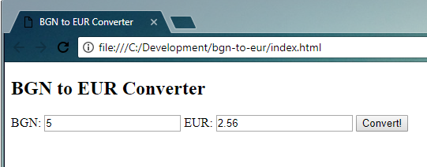

Нека го направим по-красиво.

5.	Създаваме нов файл с разширение **`*.css`** и име "**index.css"**. [CSS](https://www.w3schools.com/html/html_css.asp) служи за стилизиране на елементите в HTML. Отваряме файла **"index.html"** и добавяме следния ред в тага **`<head>`**:

```html
<link rel="stylesheet" href="index.css" type="text/css" />
```

Във файла **`index.css`** слагаме следния код:
```css
body {
    font-family: 'Lato', sans-serif;
    color: #FFFFFF;
}

.content-form {
    width: 50%;
    margin: 5% auto;
    background: #234465;
    padding: 5px 10px 10px;
    border-radius: 15px;
    box-shadow: 5px 5px 10px #808080, 5px 5px 10px #6793c1 inset;
}

.currency-value {
    border: none;
    padding: 5px;
    border-radius: 5px;
}

.title {
    text-align: center;
}

.item-currency {
    font-weight: 700;
}

.currency {
    margin: auto;
    padding-bottom: 15px;
}

.items {
    display: flex;
    flex-direction: column;
    justify-content: flex-start;
}

.primary-btn {
    margin: auto;
    border: none;
    padding: 10px 30px;
    border-radius: 10px;
    background-color: #ffa000;
    color: #FFFFFF;
    font-weight: 700;
}

```

6. Стартираме **`index.html`** файла:

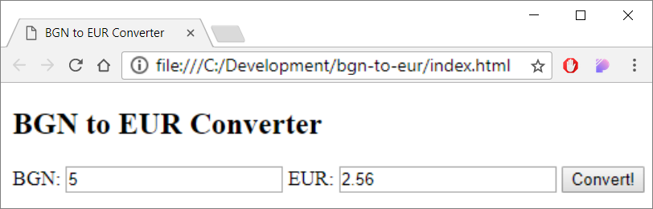


### Уеб приложение: \*\*\* Хвани мишката!

При преместване на курсора на мишката върху изображението, то се премества на случайна позиция. Така се създава усещане, че „**изображението бяга от курсора** и е трудно да се хване“. При „хващане“ на изображението, се извежда съобщение-поздрав.

\* **Подсказка**: напишете обработчик за събитието **`mouseover`** и премествайте изображението на случайна позиция. Използвайте генератор за случайни числа **`Math.random()`**. Позицията на изображението се задава от свойството **`style.position`**. За да „хванете мишката“, напишете функция за събитието **`onclick`**.


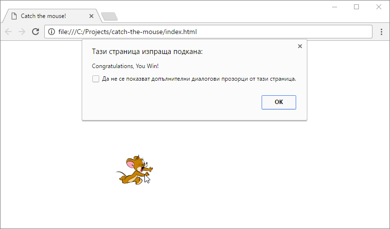

1. Създаваме нова папка **catch-the-mouse** в която ще съхраняваме файловете за уеб приложението.
2. В папката създаваме два файла: index.html и app.js. Структурата на папката трябва да изглежда по следния начин:


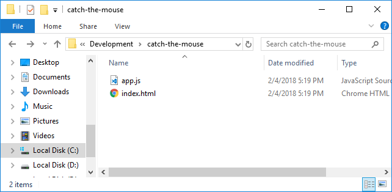

3.	Можете да си помогнете с кода по-долу:

**`index.html`**
```html
<!DOCTYPE html>

<html xmlns="http://www.w3.org/1999/xhtml">
<head>
    <meta charset="utf-8" />
    <title>Catch the mouse!</title>
    <script src="app.js" type="text/javascript"></script>
</head>
<body>
    
</body>
</html>

```

**`app.js`**
```javascript
function chaseMouse() {
    let img = document.getElementById("image");
    img.style.position = "absolute";
    img.style.left = (Math.random() * 300) + "px";
    img.style.top = (Math.random() * 300) + "px";
}

function catchMouse() {
    alert("Congratulations, You Win!")
}
```
4. Намираме изображение от интернет и го добавяме, като го именуваме **`mouse.jpg`**

Тествайте приложението като отворите папката на проекта в **explorer**  и стартирате файла **`index.html`**:

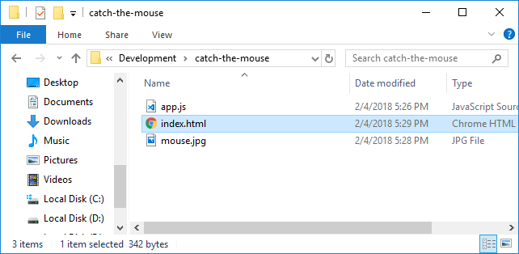
