# Глава 3.1. Прости проверки

В настоящата глава ще разгледаме **условните конструкции в езика JavaScript**, чрез които нашата програма може да има различно действие, в зависимост от дадено условие. Ще обясним синтаксиса на условните оператори за проверки (**`if`** и **`if-else`**) с подходящи примери и ще видим в какъв диапазон живее една променлива (нейният **обхват**). Накрая ще разгледаме техники за **дебъгване**, чрез които постъпково да проследяваме пътя, който извървява нашата програма по време на своето изпълнение.

## Видео

<div class="video-player">
  Гледайте видео-урок по тази глава тук: <a target="_blank" href="https://www.youtube.com/watch?v=0GTknpT5mw8">https://www.youtube.com/watch?v=0GTknpT5mw8</a>.
</div>


## Оператори за сравнение

В програмирането можем да сравняваме стойности чрез следните **оператори**:

* Оператор **`<`** (по-малко)
* Оператор **`>`** (по-голямо)
* Оператор **`<=`** (по-малко или равно)
* Оператор **`>=`** (по-голямо или равно)
* Оператор **`===`** (равно)
* Оператор **`!==`** (различно)

При сравнение резултатът е булева стойност – **`true`** или **`false`**, в зависимост от това дали резултатът от сравнението е истина или лъжа.

Важно е да се отбележи, че в **JavaScript** се използват и още един вид оператори за **сравнение**  **`==`** и **различие** **`!=`**. Прилагането им без задълбочено разбиране води до проблеми и неочаквани резултати, затова няма да ги разглеждаме на този етап от нашата подготовка.

Повече информация за разликите между двата вида оператори за сравнение и различие можете да получите от тук: [https://developer.mozilla.org/en-US/docs/Web/JavaScript/Reference/Operators/Comparison_Operators](https://developer.mozilla.org/en-US/docs/Web/JavaScript/Reference/Operators/Comparison_Operators)

### Примери за сравнение на числа

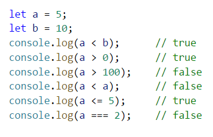

### Примери за сравнение на променливи от тип "текст" (стринг)

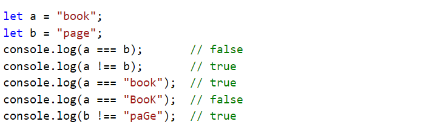

Важно е да се отбележи, че има значение дали буквите в нашият текст са **главни** или **малки**. Ако сравняваните стойности не са **напълно идентични**, резултатът, който ще получим винаги ще бъде **`false`**.

### Оператори за сравнение

В езика **JavaScript** можем да използваме следните оператори за сравнение на данни:

<table>
<tr>
<th>Оператор</th> <th>Означение</th> <th>Работи за</th>
</tr>
<tr>
<td>Проверка за равенство</td><td align="center"> === </td><td rowspan="2"> числа, стрингове, дати</td>
</tr>
<tr>
<td>Проверка за различие</td><td align="center"> !== </td>
</tr>
<tr>
<td>По-голямо</td><td align="center"> > </td><td rowspan="4">числа, дати, други сравними типове</td>
</tr>
<tr>
<td>По-голямо или равно</td><td align="center"> >= </td>
</tr>
<tr>
<td>По-малко</td><td align="center"> &lt; </td>
</tr>
<tr>
<td>По-малко или равно</td><td align="center"> &lt;= </td>
</tr>
</table>


## Прости проверки

В програмирането често **проверяваме дадени условия** и извършваме различни действия, според резултата от проверката. Това става чрез проверката **`if`**, която има следната конструкция:

```javascript
if (булев израз) {
    // тяло на условната конструкция;  
}
```

### Пример: отлична оценка

Въвеждаме оценка като аргумент при извикване на функцията и проверяваме дали тя е отлична (**`≥ 5.50`**).

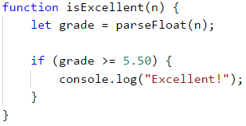

Тествайте кода от примера локално. Опитайте да въведете различни оценки, например **4.75**, **5.49**, **5.50** и **6.00**. При оценки **по-малки от 5.50** програмата няма да изведе нищо, а при оценка **5.50 или по-голяма**, ще изведе "**Excellent!**". Извикваме функцията като записваме нейното име, след което попълваме примерната стойност в скобите:

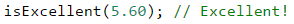

#### Тестване в Judge системата

Тествайте програмата от примера в Judge системата на СофтУни: [https://judge.softuni.bg/Contests/Practice/Index/929#0](https://judge.softuni.bg/Contests/Practice/Index/929#0).


## Проверки с if-else конструкция

Конструкцията **`if`** може да съдържа и **`else`** клауза, с която да окажем конкретно действие в случай, че булевият израз (който е зададен в началото **`if (булев израз)`**) върне отрицателен резултат (**`false`**). Така построена, **условната конструкция** наричаме **`if-else`** и поведението ѝ е следното: ако резултатът от условието е **позитивен** (**`true`**) - извършваме едни действия, a когато е **негативен** (**`false`**) - други. Форматът на конструкцията в езика **JavaScript** е следният:

```javascript
if (булево условие) {
    // тяло на условната конструкция;
} else {
    // тяло на else конструкция;
}

```

### Пример: отлична оценка или не

Подобно на горния пример, въвеждаме оценка и проверяваме дали е отлична, но **изписваме резултат и в двата случая**:

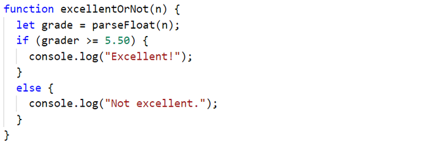

#### Тестване в Judge системата

Тествайте решението си тук: [https://judge.softuni.bg/Contests/Practice/Index/929#1](https://judge.softuni.bg/Contests/Practice/Index/929#1).


## За къдравите скоби { } след if / else

Когато имаме **само една команда** в тялото на **`if` конструкцията**, можем да **пропуснем къдравите скоби**, обозначаващи тялото на условния оператор. Когато искаме да изпълним **блок от код** (група команди), къдравите скоби са **задължителни**. В случай че ги изпуснем, ще се изпълни **само първият ред** след **`if` клаузата**.

<table><tr><td></td>
<td>Добра практика е, <strong>винаги да слагаме къдрави скоби</strong>, понеже това прави кода ни по-четим и по-подреден.</td>
</tr></table>

Ето един пример, в който изпускането на къдравите скоби води до объркване:

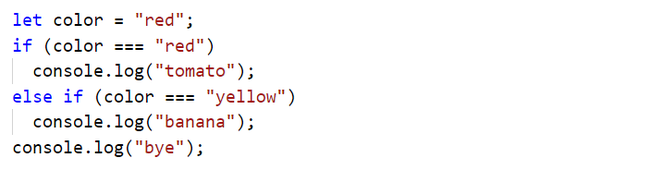

Изпълнението на горния код ще изведе следния резултат на конзолата:

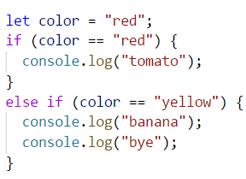

С къдрави скоби:

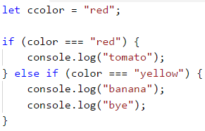

На конзолата ще бъде отпечатано следното:

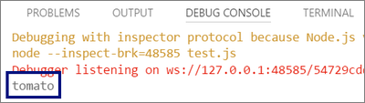

### Пример: четно или нечетно

Да се напише функция, която проверява, дали дадено цяло число е **четно** (even) или **нечетно** (odd).

Задачата можем да решим с помощта на една **`if-else`** конструкция и оператора **`%`**, който връща **остатък при деление** на две числа.

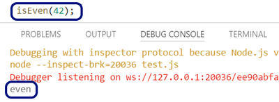

#### Тестване в Judge системата

Тествайте решението си тук: [https://judge.softuni.bg/Contests/Practice/Index/929#2](https://judge.softuni.bg/Contests/Practice/Index/929#2).


### Пример: по-голямото число

Да се напише функция, която чете две цели числа и извежда по-голямото от тях.

Първата ни задача е да **прочетем** двете числа. След което, чрез проста **`if-else`** конструкция, в съчетание с **оператора за по-голямо** (**`>`**), да направим проверка. Част от кода е замъглена умишлено, за да могат читателите да изпробват наученото до момента.

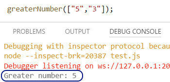

#### Тестване в Judge системата

Тествайте решението си тук: [https://judge.softuni.bg/Contests/Practice/Index/929#3](https://judge.softuni.bg/Contests/Practice/Index/929#3).

## Живот на променлива

Всяка една променлива си има обхват, в който съществува, наречен **variable scope**. Този обхват уточнява къде една променлива може да бъде използвана. В езикът **JavaScript** съществуват **два начина** за инициализиране на променливи. Чрез използването на ключовата дума **`var`** или **`let`**. Важно е да се отбележи разликата между тях, за да избегнем нежелани резултати при създаването на нашите функции.

Променливите, инициализирани чрез ключовата дума **`var`** имат свойствата на **глобални променливи**. Те се характеризират с това, че **могат да бъдат достъпвани навсякъде, независимо от това в коя част на нашия код са били декларирани**.
При използването на ключовата дума **`let`**, нашата променлива приема характеристиките на **локална променлива**. Това означава, че животът й започва от реда, в който сме я **дефинирали** и завършва до първата затваряща къдрава скоба **`}`** (на функцията, на **`if` конструкцията** и т.н.). Затова е важно да знаем, че всяка променлива, инициализирана с ключовата дума **`let`** вътре в тялото на **`if`** , **няма да бъде достъпна извън него**, освен ако не сме я дефинирали по-нагоре в кода.

В примера по-долу, на последните редове, ще се опитаме да извикаме дефинираните променливи. Ще успеем да отпечатаме **`myMoney`**, защото е декларирана в началото на нашата функция, преди **`if` конструкцията**, което я прави **достъпна навсякъде в функцията**. Също така ще е възможно да принтираме и **`salary`**, защото въпреки, че е декларирана в блока на **`if`** конструкцията, тя има характер на **глобална променлива** (понеже е дефинирана с **`var`**) и може да бъде **използвана навсякъде**. При опитът за отпечатването на **`bonus`** променливата, която е инициализирана в **`if` конструкцията**, ще получим **грешка**, тъй като животът на тази променлива свършва с първата затваряща къдрава скоба **`}`**, която в случая е на **`if`** конструкцията:

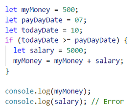

Използването на ключовата дума **`var`** за създаване на променливи е практика, която **в миналото** е била главният начин за дефиниране, но вече е **непрепоръчително** да бъде прилагана. Затова и за всички примери в тази книга ще използваме ключовата дума **`let`**.

Важно е да се отбележи, че съществува и **трети начин** за инициализиране на променливи - чрез използването на ключовата дума **`const`**. Тези променливи имат същия обхват, както дефинираните чрез  **`let`**, но имат една съществена разлика - приемат характеристиките на **константна променлива**. Това означава, че след първоначалното им инициализиране, тяхната стойност е **невъзможно да бъде променяна или предефинирана**.

## Серии от проверки

Понякога се налага да извършим серия от проверки, преди да решим какви действия ще изпълнява нашата програма. В такива случаи, можем да приложим конструкцията **`if-else if…-else` в серия**. За целта използваме следния формат: 

```javascript
if (условие) {
    // тяло на условната конструкция;
} else if (условие2) {
    // тяло на else конструкция;
} else if (условие3) {
    // тяло на else конструкция;
}
…
else {
    // тяло на else конструкция;
}
```

### Пример: число от 1 до 9 на английски

Да се изпише число в интервала от 1 до 9 с текст на английски език (числото се подава като параметър при извикване на функцията). Можем да прочетем числото и след това чрез **серия от проверки** отпечатваме съответстващата му английска дума:

```javascript
function number1to9([arg1]) {
  let num = parseInt(arg1);
  
  if (num === 1) {
      console.log("one");
  } else if (num === 2) {
      console.log("two");
  } else if (num === 3) {
      console.log("three");
  }
  // TODO: add more checks
  else {
      console.log("number too big"); 
  }
}
```

Програмната логика от примера по-горе **последователно сравнява** входното число от функцията с цифрите от 1 до 9, като **всяко следващо сравнение се извършва, само в случай че предходното сравнение не е било истина**. В крайна сметка, ако никое от **`if`** условията не е изпълнено, се изпълнява последната **`else` клаузa**.

#### Тестване в Judge системата

Тествайте решението си тук: [https://judge.softuni.bg/Contests/Practice/Index/929#4](https://judge.softuni.bg/Contests/Practice/Index/929#4).


## Упражнения: прости проверки

За да затвърдим знанията си за условните конструкции **`if`** и **`if-else`**, ще решим няколко практически задачи.

### Задача: бонус точки 

Дадено е **цяло число** – брой точки. Върху него се начисляват **бонус точки** по правилата, описани по-долу. Да се напише функция, която пресмята **бонус точките** за това число и **общия брой точки** с бонусите.

- Ако числото е **до 100** включително, бонус точките са 5.
- Ако числото е **по-голямо от 100**, бонус точките са **20%** от числото.
- Ако числото е **по-голямо от 1000**, бонус точките са **10%** от числото.
- Допълнителни бонус точки (начисляват се отделно от предходните):
    * За **четно** число -> + 1 т.
    * За число, което **завършва на 5** -> + 2 т.
 
#### Примерен вход и изход

| Вход | Изход |
| --- | ---- |
| 20 | 6<br>26 |
| 175 | 37<br>212 |
| 2703 | 270.3<br>2973.3 |
| 15875 | 1589.5<br>17464.5 |

#### Насоки и подсказки

Основните и допълнителните бонус точки можем да изчислим с поредица от няколко **`if-else-if-else`** проверки. Като за **основните бонус точки имаме 3 случая** (когато въведеното число е до 100, между 100 и 1000 и по-голямо от 1000), а за **допълнителните бонус точки - още 2 случая** (когато числото е четно и нечетно).

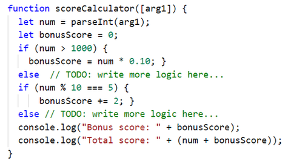

Ето как би изглеждал резултатът при извикване на функцията с 175:

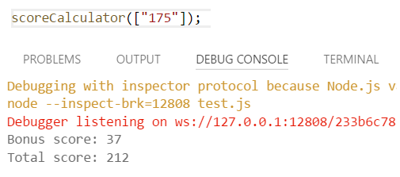

Обърнете внимание, че за тази задача Judge е настроен да игнорира всичко, което не е число, така че можем да печатаме не само числата, но и уточняващ текст.

#### Тестване в Judge системата

Тествайте решението си тук: [https://judge.softuni.bg/Contests/Practice/Index/929#5](https://judge.softuni.bg/Contests/Practice/Index/929#5).


### Задача: сумиране на секунди

Трима спортни състезатели финишират за някакъв **брой секунди** (между **1** и **50**). Да се напише програма, която въвежда времената на състезателите и пресмята **сумарното им време** във формат "минути:секунди". Секундите да се изведат с **водеща нула** (2 -> "02", 7 -> "07", 35 -> "35").

#### Примерен вход и изход

| Вход | Изход |
| --- | ---- |
| 35<br>45<br>44 | 2:04 |
| 22<br>7<br>34 | 1:03 |
| 50<br>50<br>49 | 2:29 |
| 14<br>12<br>10 | 0:36 |

#### Насоки и подсказки

Първо сумираме трите числа, за да получим общия резултат в секунди. Понеже **1 минута = 60** секунди, ще трябва да изчислим броя минути и броя секунди в диапазона от 0 до 59:
- Ако резултатът е между 0 и 59, отпечатваме 0 минути + изчислените секунди.
- Ако резултатът е между 60 и 119, отпечатваме 1 минута + изчислените секунди минус 60.
- Ако резултатът е между 120 и 179, отпечатваме 2 минути + изчислените секунди минус 120.
- Ако секундите са по-малко от 10, извеждаме водеща нула преди тях.

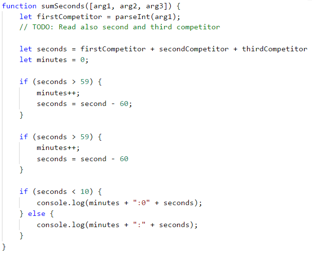

#### Тестване в Judge системата

Тествайте решението си тук: [https://judge.softuni.bg/Contests/Practice/Index/929#6](https://judge.softuni.bg/Contests/Practice/Index/929#6).


### Задача: конвертор за мерни единици

Да се напише функция, която **преобразува разстояние** между следните **8 мерни единици**: **`m`, `mm`, `cm`, `mi`, `in`, `km`, `ft`, `yd`**. Използвайте съответствията от таблицата по-долу:

| Входна единица | Изходна единица |
| :-------------: | :--------------: |
| 1 meter (m) | 1000 millimeters (mm) |
| 1 meter (m) | 100 centimeters (cm) |
| 1 meter (m) | 0.000621371192 miles (mi) |
| 1 meter (m) | 39.3700787 inches (in) |
| 1 meter (m) | 0.001 kilometers (km) |
| 1 meter (m) | 3.2808399 feet (ft)  |
| 1 meter (m) | 1.0936133 yards (yd) |

Входните данни се състоят от три реда:

- Първи ред: число за преобразуване.
- Втори ред: входна мерна единица.
- Трети ред: изходна мерна единица (за резултата).

#### Примерен вход и изход

| Вход | Изход |
| --- | ---- |
| 12 <br>km <br>ft | 39370.0788 |
| 150 <br>mi <br>in | 9503999.99393599 |
| 450 <br>yd <br>km | 0.41147999937455 |

#### Насоки и подсказки

Прочитаме си входните данни, като към прочитането на мерните единици можем да добавим метода **`toLowerCase()`**, който ще направи всички букви малки. Както виждаме от таблицата в условието, можем да конвертираме само **между метри и някаква друга мерна единица**. Следователно трябва първо да изчислим числото за преобразуване в метри. Затова трябва да направим набор от проверки, за да определим каква е входната мерна единица, а след това и за изходната мерна единица.

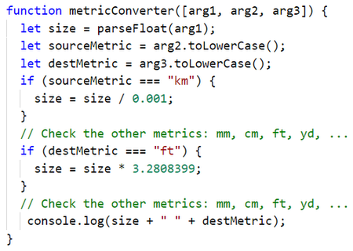

#### Тестване в Judge системата

Тествайте решението си тук: [https://judge.softuni.bg/Contests/Practice/Index/929#7](https://judge.softuni.bg/Contests/Practice/Index/929#7).


## Дебъгване - прости операции с дебъгер

До момента писахме доста код и често пъти в него имаше грешки, нали? Сега ще покажем един инструмент, с който можем да намираме грешките по-лесно.

### Какво е "дебъгване"?

**Дебъгване** е процесът на „**закачане**“ към изпълнението на програмата, който ни позволява да проследим поетапно процеса на изпълнение. Можем да следим **ред по ред** какво се случва с нашата програма, какъв път следва, какви стойности имат дефинираните променливи на всяка стъпка от дебъгването и много други неща, които ни позволяват да откриваме грешки (**бъгове**).

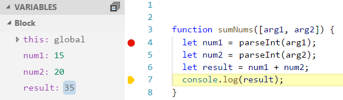

### Дебъгване във Visual Studio Code

Добавяме точка, до която програмата да спре изпълнението си **(breakpoint)** и след това стартираме програмата в **debug режим** чрез натискане на бутона [**F5**]. Програмата се изпълнява до моментът, в който достигне нашата точка на прекъсване. След това преминаваме към **следващия ред** на изпълнение с [**F10**]. 

## Упражнения: прости проверки

Нека затвърдим наученото в тази глава с няколко задачи.

### Празен Visual Studio Code файл

Стартираме Visual Studio Code. Създаваме нов файл [**File**] -> [**New File**]:

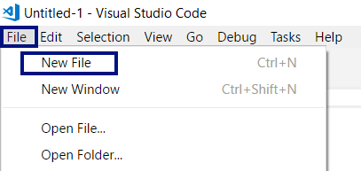

След това ни се появява нов файл, който за момента е анонимен за нашата система. За да може нашият код да бъде правилно разпознаваем е нужно да го запазим като **JavaScript** файл: [**File**] -> [**Save**]:

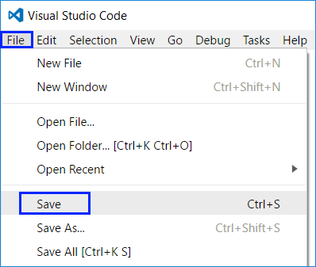

След това ни се отваря прозорец, в който трябва да зададем име на нашия файл, **задължително с разширение .js**:

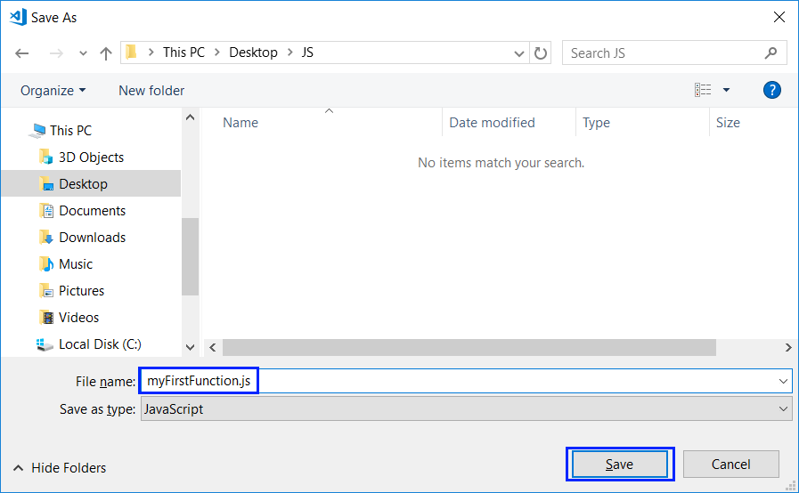


### Задача: проверка за отлична оценка

Първата задача от упражненията за тази тема е да се напише **JavaScript функция**, която **приема оценка** (десетично число) и отпечатва "**Excellent!**", ако оценката е **5.50** или по-висока.

#### Примерен вход и изход

| Вход | Изход |
| --- | ---- |
| 6 | Excellent! |
| 5 | (няма изход) |
| 5.5 | Excellent! |
| 5.49 | (няма изход) |

#### Насоки и подсказки

Създаваме **нов анонимен файл** чрез [**File**] -> [**New File**]. След това го запаметяваме ([**File**] -> [**Save**]), като **JavaScript файл**, като го запазим под разширение **.js**  
 
Вече имаме готов JavaScript файл. Остава да решим задачата. За целта пишем следния код:

 

**Стартираме** програмата с [**Ctrl+F5**], за да я **тестваме** с различни входни стойности:

 
 
При стойности **над 5.50** - получаваме резултат **Excellent!**.

 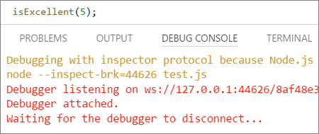
 
 При стойности **под 5.50** - не получаваме резултат.

#### Тестване в Judge системата

Тествайте решението си тук: [https://judge.softuni.bg/Contests/Practice/Index/929#0](https://judge.softuni.bg/Contests/Practice/Index/929#0).

 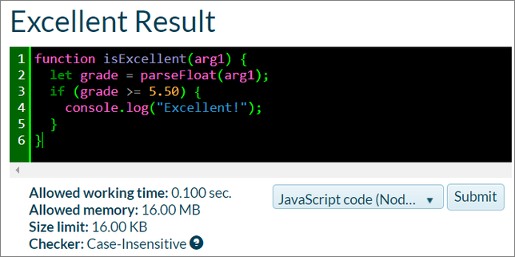 

 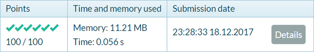


### Задача: отлична оценка или не

Следващата задача от тази тема е да се напише **JavaScript функция**, която **приема оценка** (десетично число) и отпечатва “**Excellent!**”, ако оценката е **5.50** или по-висока, или “**Not excellent.**” в противен случай.

#### Примерен вход и изход

| Вход | Изход |
| --- | ---- |
| 6 | Excellent! |
| 5 | Not excellent. |
| 5.5 | Excellent! |
| 5.49 | Not excellent. |

#### Насоки и подсказки

Първо създаваме **нов JavaScript файл**. Следва да **напишем кода** на програмата. Може да си помогнем със следния примерен код:  

 

Следва да извикваме функцията, като и подаваме примерни параметри и я тестваме дали работи коректно:

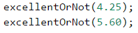

 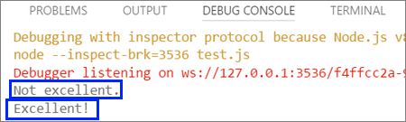

#### Тестване в Judge системата

Тествайте решението си тук: [https://judge.softuni.bg/Contests/Practice/Index/929#1](https://judge.softuni.bg/Contests/Practice/Index/929#1).

 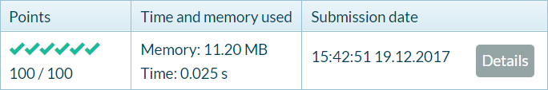


### Задача: четно или нечетно

Да се напише програма, която въвежда **цяло число** и печата дали е **четно** или **нечетно**.

#### Примерен вход и изход

| Вход | Изход |
| --- | ---- |
| 2 | even |
| 3 | odd |
| 25 | odd |
| 1024 | even |

#### Насоки и подсказки

Отново, първо добавяме **нов JavaScript файл**. Проверката дали дадено число е четно, може да се реализира с оператора **`%`**, който ще ни върне **остатъка при целочислено деление на 2** по следния начин: **`let isEven = (num % 2 == 0)`**.

Остава да **стартираме** програмата с [**Ctrl+F5**] и да я тестваме:  

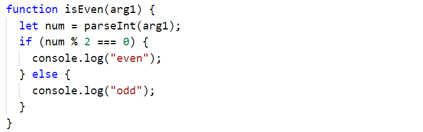

#### Тестване в Judge системата

Тествайте решението си тук: [https://judge.softuni.bg/Contests/Practice/Index/929#2](https://judge.softuni.bg/Contests/Practice/Index/929#2).


### Задача: намиране на по-голямото число

Да се напише програма, която въвежда **две цели числа** и отпечатва по-голямото от двете.

#### Примерен вход и изход

| Вход | Изход |
|-----|------|
|5<br>3| 5 |
|3<br>5| 5 |
|10<br>10| 10 |
|-5<br>5| 5 |

#### Насоки и подсказки

Както обикновено, първо трябва да добавим **нов JavaScript файл**. За кода на програмата ни е необходима единична **`if-else`** конструкция. Може да си помогнете частично с кода от картинката, който е умишлено замъглен, за да помисли читателя как да го допише сам:  


След като сме готови с имплементацията на решението, извикваме функцията като й подаваме примерни параметри, **стартираме** програмата с [**Ctrl+F5**] и я тестваме:

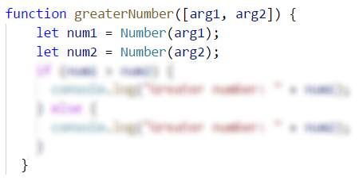

#### Тестване в Judge системата

Тествайте решението си тук: [https://judge.softuni.bg/Contests/Practice/Index/929#3](https://judge.softuni.bg/Contests/Practice/Index/929#3).


### Задача: изписване на число до 9 с думи

Да се напише функция, която приема **цяло число в диапазона** [**0 … 9**] и го **изписва с думи** на английски език. Ако числото е извън диапазона, изписва “**number too big**”.

#### Примерен вход и изход

| Вход | Изход |
| --- | ---- |
| 5 | five |
| 1 | one |
| 9 | nine |
| 10 | number too big |

#### Насоки и подсказки

Може да използваме поредица **`if-else`** конструкции, с които да разгледаме възможните **11 случая**.

#### Тестване в Judge системата

Тествайте решението си тук: [https://judge.softuni.bg/Contests/Practice/Index/929#4](https://judge.softuni.bg/Contests/Practice/Index/929#4).


### Задача: познай паролата

Да се напише функция, която **приема парола** (произволен текст) и проверява дали въведеното **съвпада** с фразата “**s3cr3t!P@ssw0rd**”. При съответствие да се изведе “**Welcome**”, а при несъответствие да се изведе “**Wrong password!**”. 

#### Примерен вход и изход

| Вход | Изход |
| --- | ---- |
| qwerty | Wrong password! |
| s3cr3t!P@ssw0rd | Welcome |
| s3cr3t!p@ss | Wrong password! |

#### Насоки и подсказки

Използвайте **`if-else`** конструкцията.

#### Тестване в Judge системата

Тествайте решението си тук: [https://judge.softuni.bg/Contests/Practice/Index/929#8](https://judge.softuni.bg/Contests/Practice/Index/929#8).


### Задача: число от 100 до 200

Да се напише функция, която като параметър **приема цяло число** и проверява дали е **под 100**, **между 100 и 200** или **над 200**. Да се отпечатат съответно съобщения, като в примерите по-долу.

#### Примерен вход и изход

| Вход | Изход |
| --- | ---- |
| 95 | Less than 100 |
| 120 | Between 100 and 200 |
| 210 | Greater than 200 |

#### Тестване в Judge системата

Тествайте решението си тук: [https://judge.softuni.bg/Contests/Practice/Index/929#9](https://judge.softuni.bg/Contests/Practice/Index/929#9).


### Задача: еднакви думи

Да се напише функция, която като параметър **приема две думи** и проверява дали са еднакви. Да не се прави разлика между главни и малки букви. Да се изведе “**yes**” или “**no**”. 

#### Примерен вход и изход

| Вход | Изход |
| --- | ---- |
| Hello<br>Hello | yes |
| SoftUni<br>softuni | yes |
| Soft<br>Uni | no |
| beer<br>vodka | no |
| HeLlO<br>hELLo | yes |

#### Насоки и подсказки

Преди сравняване на думите, е препоръчително да ги обърнете в долен регистър, за да не оказва влияние размера на буквите (главни / малки): **`word = word.toLowerCase()`**.

#### Тестване в Judge системата

Тествайте решението си тук: [https://judge.softuni.bg/Contests/Practice/Index/929#10](https://judge.softuni.bg/Contests/Practice/Index/929#10).


### Задача: информация за скоростта

Да се напише функция, която като параметър **приема скорост** (десетично число) и отпечатва **информация за скоростта**. При скорост **до 10** (включително), отпечатайте "**slow**". При скорост **над 10** и **до 50**, отпечатайте "**average**". При скорост **над 50 и до 150**, отпечатайте "**fast**". При скорост **над 150 и до 1000**, отпечатайте "**ultra fast**". При по-висока скорост, отпечатайте "**extremely fast**".

#### Примерен вход и изход

| Вход | Изход |
| --- | ---- |
| 8 | slow |
| 49.5 | average |
| 126 | fast |
| 160 | ultra fast |
| 3500 | extremely fast |

#### Тестване в Judge системата

Тествайте решението си тук: [https://judge.softuni.bg/Contests/Practice/Index/929#11](https://judge.softuni.bg/Contests/Practice/Index/929#11).


### Задача: лица на фигури

Да се напише функция, която **приема размерите на геометрична фигура** и **пресмята лицето й**. Фигурите са четири вида: квадрат (**square**), правоъгълник (**rectangle**), кръг (**circle**) и триъгълник (**triangle**).

Като първи аргумент на функцията се подава вида на фигурата (**`square`**, **`rectangle`**, **`circle`**, **`triangle`**).
* Ако фигурата е **квадрат**, като следващ аргумент подаваме едно число – дължина на страната му.
* Ако фигурата е **правоъгълник**, като следващи аргументи подаваме две числа – дължините на страните му.
* Ако фигурата е **кръг**, като следващ аргумент подаваме едно число – радиусa на кръга.
* Ако фигурата е **триъгълник**,  като следващи аргументи подаваме две числа – дължината на страната му и дължината на височината към нея.

Резултатът да се закръгли до **3 цифри след десетичния знак**. 

#### Примерен вход и изход

| Вход | Изход |
| --- | ---- |
| square<br>5 | 25 |
| rectangle<br>7<br>2.5 | 17.5 |
| circle<br>6 | 113.097 |
| triangle<br>4.5<br>20 | 45 |

#### Тестване в Judge системата

Тествайте решението си тук: [https://judge.softuni.bg/Contests/Practice/Index/929#12](https://judge.softuni.bg/Contests/Practice/Index/929#12).


### Задача: време + 15 минути

Да се напише функция, която като параметър **приема час и минути** от 24-часово денонощие и изчислява колко ще е **часът след 15 минути**. Резултатът да се отпечата във формат **`hh:mm`**. Часовете винаги са между 0 и 23, а минутите винаги са между 0 и 59. Часовете се изписват с една или две цифри. Минутите се изписват винаги с по две цифри и с **водеща нула**, когато е необходимо.

#### Примерен вход и изход

| Вход | Изход |
| --- | ---- |
| 1<br>46 | 2:01 |
| 0<br>01 | 0:16 |
| 23<br>59 | 0:14 |
| 11<br>08 | 11:23 |
| 12<br>49 | 13:04 |

#### Насоки и подсказки

Добавете 15 минути и направете няколко проверки. Ако минутите надвишат 59, **увеличете часовете** с 1 и **намалете минутите** с 60. По аналогичен начин разгледайте случая, когато часовете надвишат 23. При печатането на минутите, **проверете за водеща нула**.

#### Тестване в Judge системата

Тествайте решението си тук: [https://judge.softuni.bg/Contests/Practice/Index/929#13](https://judge.softuni.bg/Contests/Practice/Index/929#13).


### Задача: еднакви 3 числа

Да се напише функция, в която се подават като аргументи **3 числа** и се отпечатва дали те са еднакви (**yes** / **no**).

#### Примерен вход и изход

| Вход | Изход |
| --- | ---- |
| 5<br>5<br>5 | yes |
| 5<br>4<br>5 | no |
| 1<br>2<br>3 | no |

#### Тестване в Judge системата

Тествайте решението си тук: [https://judge.softuni.bg/Contests/Practice/Index/929#14](https://judge.softuni.bg/Contests/Practice/Index/929#14).


### Задача\*:  изписване на число от 0 до 100 с думи

Да се напише функция, която превръща число в диапазона [**0 … 100**] в текст. 

#### Примерен вход и изход

| Вход | Изход |
| --- | ---- |
| 25 | twenty five |
| 42 | forty two |
| 6  | six |

#### Насоки и подсказки

Проверете първо за **едноцифрени числа** и ако числото е едноцифрено, отпечатайте съответната дума за него. След това проверете за **двуцифрени числа**. Тях отпечатвайте на две части: лява част (**десетици** = числото / 10) и дясна част (**единици** = числото % 10). Ако числото има 3 цифри, трябва да е 100 и може да се разгледа като специален случай.

#### Тестване в Judge системата

Тествайте решението си тук: [https://judge.softuni.bg/Contests/Practice/Index/929#15](https://judge.softuni.bg/Contests/Practice/Index/929#15).


## Графично Web приложение

След като направихме няколко упражнения върху **условни конструкции (проверки)**, сега нека направим нещо по-интересно: приложение с графичен потребителски интерфейс за конвертиране на валути. Ще използваме знанията от тази глава, за да избираме измежду няколко налични валути и съответно да извършваме пресмятания по различен курс спрямо избраната валута.

### Задача\**: Конвертор за валути

Нека разгледаме как да създадем графично (**GUI**) приложение за **конвертиране на валути**. Приложението ще изглежда приблизително като на картинката по-долу:  

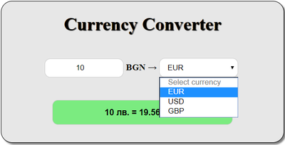

За визуализация ще използваме **интернет браузър**, който възпроизвежда **HTML** страници. Ще създадем нова такава и ще изградим **структурата**, **облика** и **функционалността** на нашето приложение.

Както обикновено **създаваме нов файл**, след това го запаметяваме с име **Currency-Converter**, но този път добавяме разширение **.html**.

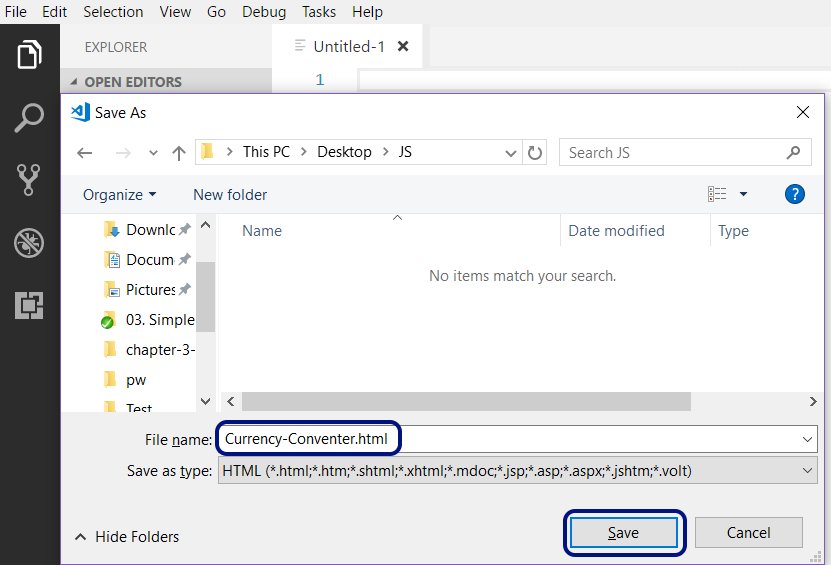


Отваряме новосъздаденият файл въвеждаме **структурата на документа**, под формата на **HTML код**:

```html
<!DOCTYPE html>
<html>
<head>
  <meta charset="utf-8">
  <meta name="viewport" content="width=device-width, initial-scale=1">
  <meta http-equiv="x-ua-compatible" content="ie=edge">
  <title>Currency Converter</title>
  <style>

        /* enter styling here */

  </style>
</head>
<body>
  <main id="conventer-window">
    <h1>Currency Converter</h1>
    <form name="conventer">
      <input type="number" placeholder="Enter number" min="0" 
      id="cash-input" onkeyup="convert()" onchange="convert()">
      <span>BGN &#8594; </span>
      <select onchange="convert()" id="currency-options">
        <option selected disabled>Select currency</option>
        <option value="eur">EUR</option>
        <option value="usd">USD</option>
        <option value="gbp">GBP</option>
      </select>
      <br />
      <input type="text" name="result" id="result" disabled>
    </form>
  </main>
  <script>

    // enter Javascript functionality here

  </script>
</body>
</html>
```

Запазваме файла и го отваряме.

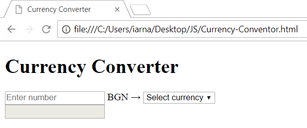
     
Вече сме изградили структурата на документа, но той може да бъде визуално подобрен след като добавим допълнителни **стилове**. За целта добавяме следният код в **`<style>`** секцията на нашия **HTML** документ:

```css
body {
  background-color: #fff;
}

main {
  margin: 200px auto;
  height: 250px;
  width: 500px;
  background-color: #e7e7e7;
  border: 1px solid black;
  border-radius: 20px;
  box-shadow: 3px 3px 3px gray;
}

h1 {
  text-align: center;
  color: #000;
  text-shadow: 1px 1px 1px #000;
}

form {
  width: 400px;
  margin:20px auto;
  text-align: center;
}

span {
  font-weight:bold;
  font-size: 16px;
}

input[type=number], input[type=text], select {
    width: 140px;
    padding: 8px 10px;
    margin: 20px 0;
    display: inline-block;
    border: 1px solid #ccc;
    border-radius: 10px;
    box-sizing: border-box;
    outline: none;
    text-align: center
}
 input[type=text] {
   width: 80%;
   margin-top:20px;
   background-color: #7beb80;
   padding: 12px 10px;
   color:black;
   font-weight: bold;
   font-size: 15px;
 }

 input:focus {
   border: 2px solid #26a5e0;
 }
```

Вече имаме и по-приятен изглед на нашето приложение.
Остава да добавим и **функциалността**. Тя се добавя в **``<script>``** секцията в нашия **HTML** документ.
Ще използваме следния **JavaScript код** за обработка на събитията:

```javascript
function convert(){
  let x = document.getElementById("cash-input").value;
  let e = document.getElementById("currency-options");
  let selected = e.options[e.selectedIndex].text;
  let result;
  
  if (selected === "EUR") {
      result = x + " " + "лв. = " + (x * 1.95583).toFixed(2) + " " + selected;
      document.getElementById("result").value = result;
  } else if (selected === "USD") {
      result = x + " " + "лв. = " + (x * 1.63760).toFixed(2)  + " " + selected;
      document.getElementById("result").value = result;
  } else if (selected === "GBP") {
      result = x + " " + "лв. = " + (x * 2.22920).toFixed(2)  + " " + selected;
      document.getElementById("result").value = result;
  }
}
```

Горният код взима **сумата** за конвертиране от полето **`cash-input`** и **избраната валута** за резултата от полето **`currency-options`**. След това с **условна конструкция**, според избраната валута, сумата се дели на **валутния курс** (който е фиксиран твърдо в сорс кода). Накрая се генерира текстово **съобщение с резултата** (закръглен до 2 цифри след десетичния знак) и се записва в зелената кутийка **`result`**. Опитайте!

Ако имате проблеми с примерите по-горе, **гледайте видеото** в началото на тази глава или питайте във **форума на СофтУни**: https://softuni.bg/forum.
