# Глава 4.1. По-сложни проверки

В **настоящата** глава ще разгледаме **вложените проверки** в езика **JavaScript**, чрез които нашата програма може да изпълнява **условни конструкции**, в които има **вложени други условни конструкции**. Наричаме ги **"вложени"**, защото **поставяме `if` конструкция** в **друга `if` конструкция**. Ще разгледаме и как да използваме **по-сложни логически условия** с подходящи примери.

## Видео
<div class="video-player">
  Гледайте видео-урок по тази глава тук: <a target="_blank"
  href="https://youtube.com/watch?v=JRLA_zpQfpQ">
  https://www.youtube.com/watch?v=JRLA_zpQfpQ</a>.
</div>

## Вложени проверки

Доста често програмната логика налага използването на **`if`** или **`if-else`** конструкции, които се съдържат една в друга. Те биват наричани **вложени** **`if`** или **`if-else`** конструкции. Както се подразбира от названието **"вложени"**, това са **`if`** или **`if-else`** конструкции, които са поставени в други **`if`** или **`else`** конструкции.

```javascript
if (condition1) {
    if (condition2) {
        // тяло; 
    } else {
        // тяло;
    }
}
```

Влагането на повече от три условни конструкции една в друга не се счита за добра практика и трябва да се избягва, най-вече чрез оптимизиране на структурата/алгоритъма на кода и/или чрез използването на друг вид условна конструкция, който ще разгледаме по-надолу в тази глава.

### Пример: обръщение според възраст и пол

Според въведени **възраст** (десетично число) и **пол** (**m** / **f**) да се отпечата обръщение:
* “**Mr.**” – мъж (пол “**m**”) на 16 или повече години.
* “**Master**” – момче (пол “**m**”) под 16 години.
* “**Ms.**” – жена (пол “**f**”) на 16 или повече години.
* “**Miss**” – момиче (пол “**f**”) под 16 години.

#### Примерен вход и изход

|Вход|Изход|Вход|Изход|
|----|----|----|----|
|12<br>f|Miss|17<br>m|Mr.|

|Вход|Изход|Вход|Изход|
|----|----|----|----|
|25<br>f|Ms.|13.5<br>m|Master|

#### Решение

Можем да забележим, че **изходът** на програмата **зависи от няколко неща**. Първо трябва да проверим какъв **пол** е въведен и после да проверим **възрастта**. Съответно ще използваме **няколко** **`if-else`** блока. Тези блокове ще бъдат **вложени**, т.е. от **резултата** на първия ще **определим** кои от **другите** да изпълним.


След прочитане на входните данни от конзолата ще трябва да се изпълни следната примерна програмна логика:


#### Тестване в Judge системата

Тествайте решението си тук: [https://judge.softuni.bg/Contests/Practice/Index/931#0](https://judge.softuni.bg/Contests/Practice/Index/931#0).


### Пример: квартално магазинче

Предприемчив българин отваря по едно **квартално магазинче** в **няколко града** с различни **цени** за следните **продукти**:

|продукт / град|Sofia|Plovdiv|Varna|
|:-------:|:-------:|:-------:|:-------:|
|coffee<br>water<br>beer<br>sweets<br>peanuts|0.50<br>0.80<br>1.20<br>1.45<br>1.60<br>|0.40<br>0.70<br>1.15<br>1.30<br>1.50<br>|0.45<br>0.70<br>1.10<br>1.35<br>1.55|

По даден **град** (стринг), **продукт** (стринг) и **количество** (десетично число) да се пресметне цената.

#### Примерен вход и изход

|Вход|Изход|Вход|Изход|
|-------|-------|-------|-------|
|coffee<br>Varna<br>2|0.90|peanuts<br>Plovdiv<br>1|1.50|

|Вход|Изход|Вход|Изход|
|-------|-------|-------|-------|
|beer<br>Sofia<br>6|7.20|water<br>Plovdiv<br>3|2.10|

#### Решение

**Прехвърляме** всички букви в **долен регистър** с метода **`.toLowerCase()`**, за да сравняваме продукти и градове **без значение** от малки / главни букви.


#### Тестване в Judge системата

Тествайте решението си тук: [https://judge.softuni.bg/Contests/Practice/Index/931#1](https://judge.softuni.bg/Contests/Practice/Index/931#1).


## По-сложни проверки

Нека разгледаме как можем да правим по-сложни логически проверки. Може да използваме логическо "**И**" (**`&&`**), логическо "**ИЛИ**" (**`||`**), логическо **отрицание** (**`!`**) и **скоби** (**`()`**).

### Логическо "И"

Както видяхме, в някои задачи се налага да правим **много проверки наведнъж**. Но какво става, когато за да изпълним някакъв код, трябва да бъдат изпълнени **повече** условия и **не искаме** да правим **отрицание** (**`else`**) за всяко едно от тях? Вариантът с вложените **`if` блокове** е валиден, но кодът би изглеждал много **неподреден** и със сигурност - **труден** за четене и поддръжка.  

Логическо "**И**" (оператор **`&&`**) означава няколко условия да са **изпълнени едновременно**. В сила е следната таблица на истинност:

|a|b|a && b|
|-----|-----|-----|
|true<br>true<br>false<br>false|true<br>false<br>true<br>false|true<br>false<br>false<br>false|

### Как работи операторът && ?

Операторът **`&&`** приема **няколко булеви** (условни) израза, които имат стойност **`true`** или **`false`**, и ни връща **един** булев израз като **резултат**. Използването му **вместо** редица вложени **`if`** блокове прави кода **по-четлив**, **по-подреден** и **по-лесен** за поддръжка. Но как **работи**, когато поставим **няколко** условия едно след друго? Както видяхме по-горе, логическото **"И"** връща **`true`**, **само** когато приема като **аргументи изрази** със стойност **`true`**. Съответно, когато имаме **последователност** от аргументи, логическото "**И**" проверява или докато **свършат** аргументите, или докато не **срещне** аргумент със стойност **`false`**. 

**Пример**:

```javascript
let a = true;
let b = true;
let c = false;
let d = true;

let result = a && b && c && d;
// false (като d не се проверява)
```

Програмата ще се изпълни по **следния** начин: **започва** проверката от **`а`**, **проверява** я и отчита, че има стойност **`true`**, след което **проверява `b`**. След като е **отчела**, че **`a`** и **`b`** връщат стойност **`true`**, **проверява следващия** аргумент. Стига до **`c`** и отчита, че променливата има стойност **`false`**. След като програмата отчете, че аргументът **`c`** има стойност **`false`**, тя изчислява израза **до `c`**, **независимо** каква е стойността на **`d`**. Затова проверката на **`d`** се **прескача** и целият израз бива изчислен като **`false`**.

### Пример: точка в правоъгълник

Проверка дали **точка {x, y}** се намира **вътре в правоъгълника {x1, y1} – {x2, y2}**. Входните данни се четат от конзолата и се състоят от 6 реда: десетичните числа **x1**, **y1**, **x2**, **y2**, **x** и **y** (като се гарантира, че **x1 < x2** и **y1 < y2**).

#### Примерен вход и изход

|Вход |Изход |Визуализация|
|-----|------|:------:|
|2<br>-3<br>12<br>3<br>8<br>-1|Inside||

#### Решение

Една точка е вътрешна за даден многоъгълник, ако **едновременно** са изпълнени следните четири условия:

* Точката е надясно от лявата страна на правоъгълника.
* Точката е наляво от дясната страна на правоъгълника.
* Точката е надолу от горната страна на правоъгълника.
* Точката е нагоре от долната страна на правоъгълника.
 


#### Тестване в Judge системата

Тествайте решението си тук: [https://judge.softuni.bg/Contests/Practice/Index/931#2](https://judge.softuni.bg/Contests/Practice/Index/931#2).


## Логическо "ИЛИ"

Логическо **"ИЛИ"** (оператор **`||`**) означава да е **изпълнено поне едно** измежду няколко условия. Подобно на оператора **`&&`**, логическото **"ИЛИ"** приема няколко аргумента от **булев** (условен) тип и връща **`true`** или **`false`**. Лесно можем да се досетим, че **получаваме** като стойност **`true`**, винаги когато поне **един** от аргументите има стойност **`true`**. Типичен пример за логиката на този оператор е следният:

В училище учителят казва: "Иван или Петър да измият дъската". За да бъде изпълнено това условие (дъската да бъде измита), е възможно само Иван да я измие, само Петър да я измие или и двамата да го направят.

|a|b|a &#124;&#124; b|
|:-----:|:-----:|:-----:|
|true<br>true<br>false<br>false|true<br>false<br>true<br>false|true<br>true<br>true<br>false|


### Как работи операторът || ?

Вече научихме какво **представлява** логическото **"ИЛИ"**. Но как всъщност се реализира? Както при логическото **"И"**, програмата **проверява** от ляво на дясно **аргументите**, които са зададени. За да получим **`true`** от израза, е необходимо **само един** аргумент да има стойност **`true`**, съответно проверката **продължава** докато се срещне **аргумент** с **такава** стойност или докато **не свършат** аргументите.

Ето един **пример** за оператора **`||`** в действие:

```javascript
let a = false;
let b = true;
let c = false;
let d = true;

let result = a || b || c || d;
// true (като c и d не се проверяват)
```

Програмата **проверява `а`**, отчита, че има стойност **`false`** и продължава. Стигайки до **`b`**, отчита, че има стойност **`true`** и целият **израз** получава стойност **`true`**, **без** да се проверява **`c`** и **`d`**, защото техните стойности **не биха променили** резултата на израза.

### Пример: плод или зеленчук

Нека проверим дали даден продукт е **плод** или **зеленчук**. Плодовете "**fruit**" са **banana**, **apple**, **kiwi**, **cherry**, **lemon** и **grapes**. Зеленчуците "**vegetable**" са **tomato**, **cucumber**, **pepper** и **carrot**. Всички останали са "**unknown**".

#### Примерен вход и изход

|Вход|Изход|
|----|----|
|banana<br>tomato<br>java|fruit<br>vegetable<br>unknown|

#### Решение

Трябва да използваме няколко условни проверки с логическо "**ИЛИ**" (**`||`**):


#### Тестване в Judge системата

Тествайте решението си тук: [https://judge.softuni.bg/Contests/Practice/Index/931#3](https://judge.softuni.bg/Contests/Practice/Index/931#3).


## Логическо отрицание

**Логическо отрицание** (оператор **`!`**) означава да **не е изпълнено** дадено условие.

|a|!a|
|:----:|:----:|
|true|false|

Операторът **`!`** приема като **аргумент** булева променлива и **обръща** стойността ѝ.

### Пример: невалидно число

Дадено **число е валидно**, ако е в диапазона [**100 … 200**] или е **0**. Да се направи проверка за **невалидно** число.

#### Примерен вход и изход

|Вход|Изход|
|----|----|
|75|invalid|
|150| (няма изход)|
|220|invalid|

#### Решение

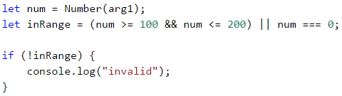

#### Тестване в Judge системата

Тествайте решението си тук: [https://judge.softuni.bg/Contests/Practice/Index/931#4](https://judge.softuni.bg/Contests/Practice/Index/931#4).


## Операторът скоби `()`

Както останалите оператори в програмирането, така и операторите **`&&`** и **`||`** имат приоритет, като в случая **`&&`** е с по-голям приоритет от **`||`**. Операторът **`()`** служи за **промяна на приоритета на операторите** и се изчислява пръв, също както в математиката. Използването на скоби също така придава по-добра четимост на кода и се счита за добра практика.


## По-сложни логически условия

Понякога условията може да са доста сложни, така че да изискват дълъг булев израз или поредица от проверки. Да разгледаме няколко такива примера.

### Пример: точка върху страна на правоъгълник

Да се напише програма, която проверява дали **точка {x, y}** се намира **върху някоя от страните на правоъгълник {x1, y1} - {x2, y2}**. Входните данни се четат от конзолата и се състоят от 6 реда: десетичните числа **x1**, **y1**, **x2**, **y2**, **x** и **y** (като се гарантира, че **x1 < x2** и **y1 < y2**). Да се отпечата "**Border**" (точката лежи на някоя от страните) или "**Inside / Outside**" (в противен случай).

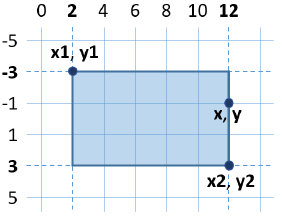

#### Примерен вход и изход

|Вход|Изход|Вход|Изход|
|-----|-----|-----|-----|
|2<br>-3<br>12<br>3<br>12<br>-1|Border|2<br>-3<br>12<br>3<br>8<br>-1|Inside / Outside|

#### Решение

Точка лежи върху някоя от страните на правоъгълник, ако:
* **x** съвпада с **x1** или **x2** и същевременно **y** е между **y1** и **y2** или
* **y** съвпада с **y1** или **y2** и същевременно **x** е между **x1** и **x2**.

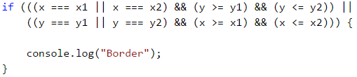

Предходната проверка може да се опрости по този начин:

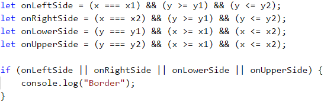

Вторият начин с допълнителните булеви променливи е по-дълъг, но е много по-разбираем от първия, нали? Препоръчително е, когато пишем булеви условия, да ги правим **лесни за четене и разбиране**, а не кратки. Ако се налага, ползваме допълнителни променливи със смислени имена. Имената на булевите променливи трябва да подсказват каква стойност се съхранява в тях.

Остава да допишете кода, за да отпечатва “**Inside / Outside**”, ако точката не е върху някоя от страните на правоъгълника.

#### Тестване в Judge системата

След като допишете решението, може да го тествате тук: [https://judge.softuni.bg/Contests/Practice/Index/931#5](https://judge.softuni.bg/Contests/Practice/Index/931#5).


### Пример: магазин за плодове

Магазин за плодове в **работни дни** продава на следните **цени**:

|Плод|Цена|
|:-----:|:-----:|
|banana<br>apple<br>orange<br>grapefruit<br>kiwi<br>pineapple<br>grapes|2.50<br>1.20<br>0.85<br>1.45<br>2.70<br>5.50<br>3.85|

В почивни дни цените са **по-високи**:

|Плод|Цена|
|:-----:|:-----:|
|banana<br>apple<br>orange<br>grapefruit<br>kiwi<br>pineapple<br>grapes|2.70<br>1.25<br>0.90<br>1.60<br>3.00<br>5.60<br>4.20|

Напишете програма, която чете от конзолата **плод** (banana / apple / …), **ден от седмицата** (Monday / Tuesday / …) и **количество (десетично число)** и **пресмята цената** според цените от таблиците по-горе. Резултатът да се отпечата **закръглен с 2 цифри след десетичния знак**. При **невалиден ден** от седмицата или **невалидно име** на плод да се отпечата **“error”**.

#### Примерен вход и изход

|Вход|Изход|Вход|Изход|
|----|----|----|----|
|orange<br>Sunday<br>3|2.70|kiwi<br>Monday<br>2.5|6.75|

|Вход|Изход|Вход|Изход|
|----|----|----|----|
|grapes<br>Saturday<br>0.5|2.10|tomato<br>Monday<br>0.5|error|

#### Решение

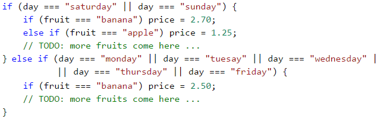

#### Тестване в Judge системата

Тествайте решението си тук: [https://judge.softuni.bg/Contests/Practice/Index/931#6](https://judge.softuni.bg/Contests/Practice/Index/931#6).


### Пример: търговски комисионни

Фирма дава следните **комисионни** на търговците си според **града**, в който работят и **обема на продажбите s**:

|Град|0 <= s <= 500|500 < s <= 1000|1000 < s <= 10000|s > 10000|
|:----:|:----:|:----:|:----:|:----:|
|Sofia<br>Varna<br>Plovdiv|5%<br>4.5%<br>5.5%|7%<br>7.5%<br>8%|8%<br>10%<br>12%|12%<br>13%<br>14.5%|

Напишете програма, която чете име на **град** (стринг) и обем на **продажбите** (десетично число) и изчислява размера на  комисионната. Резултатът да се изведе закръглен с **2 десетични цифри след десетичния знак**. При **невалиден град или обем на продажбите** (отрицателно число) да се отпечата "**error**".

#### Примерен вход и изход

|Вход|Изход|Вход|Изход|Вход|Изход|
|-----|-----|-----|-----|-----|-----|
|Sofia<br>1500|120.00|Plovdiv<br>499.99|27.50|Kaspichan<br>-50|error|

#### Решение

При прочитането на входа можем да обърнем града в малки букви (с метода **`.toLowerCase()`**). Първоначално задаваме комисионната да е **`-1`**. Тя ще бъде променена, ако градът и ценовият диапазон бъдат намерени в таблицата с комисионните. За да изчислим комисионната според града и обема на продажбите се нуждаем от няколко вложени **`if` проверки**, както е в примерния код по-долу:

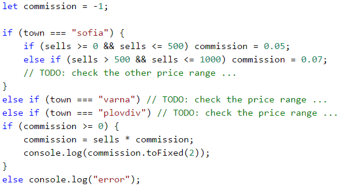

#### Тестване в Judge системата

Тествайте решението си тук: [https://judge.softuni.bg/Contests/Practice/Index/931#7](https://judge.softuni.bg/Contests/Practice/Index/931#7).


<table><tr><td></td>
<td><b>Добра практика</b> е да използваме <b>блокове</b>, които <b>заграждаме</b> с къдрави скоби <b><code>{ }</code></b> след <b><code>if</code></b> и <b><code>else</code></b>. Също така, препоръчително e при писане да <b>отместваме</b> кода <b>след <code>if</code> и <code>else</code></b> с една табулация <b>навътре</b>, за да направим кода по-лесно четим.</td>
</tr></table>


## Условна конструкция switch-case

Конструкцията **`switch-case`** работи като поредица **`if-else`** блокове. Когато работата на програмата ни зависи от стойността на **една променлива**, вместо да правим последователни проверки с **`if-else`** блокове, можем да **използваме** условната конструкция **`switch-case`**. Тя се използва за **избор измежду списък с възможности**. Конструкцията сравнява дадена стойност с определени константи и в зависимост от резултата предприема действие.

**Променливата**, която искаме да **сравняваме**, поставяме в **скобите след оператора `switch`** и се нарича "**селектор**". Тук **типът трябва да е сравним** (числа, стрингове). **Последователно** започва **сравняването** с всяка една **стойност**, която **се намира** след **`case` етикетите**. При съвпадение започва изпълнението на кода от съответното място и продължава, докато стигне оператора **`break`**. При **липса** на **съвпадение**, се изпълнява **`default`** конструкцията, **ако** такава **съществува**.

```javascript
switch (селектор) {
    case стойност1:
        конструкция;
        break;
    case стойност2:
        конструкция;
        break;
    case стойност3:
        конструкция;
        break;
    …
    default:
        конструкция;
        break;
}
```

### Пример: ден от седмицата

Нека напишем програма, която принтира **деня от седмицата** (на английски) според **въведеното число** (1 … 7) или "**Error**", ако е подаден невалиден ден.

#### Примерен вход и изход

|Вход|Изход|
|-----|-----|
|1<br>7<br>-1|Monday<br>Sunday<br>Error|

#### Решение

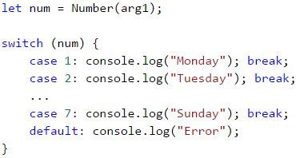

<table><tr><td></td>
<td>Добра практика е на <b>първо</b> място да поставяме онези <b><code>case</code> случаи</b>, които обработват <b>най-често случилите се ситуации</b>, а <b><code>case</code> конструкциите</b>, обработващи <b>по-рядко възникващи ситуации</b>, да оставим в <b>края, преди <code>default</code> конструкцията</b>. Друга добра практика е да <b>подреждаме <code>case</code> етикетите</b> в <b>нарастващ ред</b>, без значение дали са целочислени или символни.</td>
</tr></table>

#### Тестване в Judge системата

Тествайте решението си тук: [https://judge.softuni.bg/Contests/Practice/Index/931#8](https://judge.softuni.bg/Contests/Practice/Index/931#8).


### Множество етикети в switch-case

В **JavaScript** имаме възможността да **използваме множество `case`** етикети, когато те трябва да изпълняват **един и същи** код. При този начин на записване, когато програмата ни намери **съвпадение**, ще изпълни **следващия** срещнат код, тъй като **след** съответния **`case`** етикет **липсва код** за изпълнение и **`break`** оператор:

```javascript
switch (селектор) {
    case стойност1:
    case стойност2:
    case стойност3:
        конструкция;
        break;
    case стойност4:
    case стойност5:
        конструкция;
        break;
    …
    default:
        конструкция;
        break;
}
```

### Пример: вид животно

Напишете програма, която принтира вида на животно според името му: 

* dog -> **mammal**
* crocodile, tortoise, snake -> **reptile**
* others -> **unknown**

#### Примерен вход и изход

|Вход|Изход|Вход|Изход|Вход|Изход|
|-----|-----|-----|-----|-----|-----|
|tortoise|reptile|dog|mammal|elephant|unknown|

#### Решение

Можем да решим задачата чрез **`switch-case`** проверки с множество етикети по следния начин:

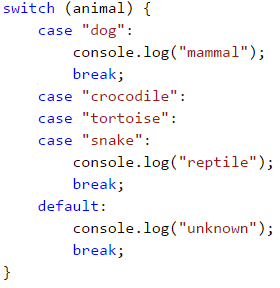

#### Тестване в Judge системата

Тествайте решението си тук: [https://judge.softuni.bg/Contests/Practice/Index/931#9](https://judge.softuni.bg/Contests/Practice/Index/931#9).


## Какво научихме от тази глава?

Да си припомним новите конструкции и програмни техники, с които се запознахме в тази глава:

### Вложени проверки

```javascript
if (condition1) {
    if (condition2) {
        // тяло; 
    } else {
        // тяло;
    }
}
```

### По-сложни проверки с &&, ||, ! и ()

```javascript
if ((x === left || x === right) && y >= top && y <= bottom)
    console.log(…); 
```

#### Switch-case проверки

```javascript
switch (селектор) {
    case стойност1:
        конструкция;
        break;
    case стойност2:
    case стойност3:
        конструкция;
        break;
    …
    default:
        конструкция;
        break;
}
```


## Упражнения: по-сложни проверки

Нека сега да упражним работата с по-сложни проверки. Да решим няколко практически задачи.

### Задача: кино

В една кинозала столовете са наредени в **правоъгълна** форма в **r** реда и **c** колони. Има три вида прожекции с билети на **различни** цени:

* **Premiere** – премиерна прожекция, на цена **12.00** лева.
* **Normal** – стандартна прожекция, на цена **7.50** лева.
* **Discount** – прожекция за деца, ученици и студенти на намалена цена от **5.00** лева.

Напишете програма, която въвежда **тип прожекция** (стринг), брой **редове** и брой **колони** в залата (цели числа) и изчислява **общите приходи** от билети при **пълна зала**. Резултатът да се отпечата във формат като в примерите по-долу - с 2 цифри след десетичния знак.

#### Примерен вход и изход

|Вход|Изход|Вход|Изход|
|----|-----|----|-----|
|Premiere<br>10<br>12|1440.00 leva|Normal<br>21<br>13|2047.50 leva|

#### Насоки и подсказки 

При прочитането на входа можем да обърнем типа на прожекцията в малки букви (с метода **`.toLowerCase()`**). Създаваме и инициализираме променлива, която ще ни съхранява изчислените приходи. В друга променлива пресмятаме пълния капацитет на залата. Използваме условната конструкция **`switch-case`** , за да изчислим прихода в зависимост от вида на прожекцията и отпечатваме резултата на конзолата в зададения формат (потърсете нужната **JavaScript** функционалност в интернет). 

Примерен код (части от кода са замъглени с цел да се стимулира самостоятелно мислене и решение):

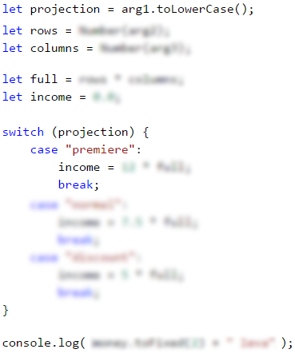

#### Тестване в Judge системата

Тествайте решението си тук: [https://judge.softuni.bg/Contests/Practice/Index/931#10](https://judge.softuni.bg/Contests/Practice/Index/931#10).


### Задача: волейбол

Влади е студент, живее в София и си ходи от време на време до родния град. Той е много запален по волейбола, но е зает през работните дни и играе **волейбол** само през **уикендите** и в **празничните дни**. Влади играе **в София** всяка **събота**, когато **не е на работа** и **не си пътува до родния град**, както и в **2/3 от празничните дни**. Той пътува до **родния си град h пъти** в годината, където играе волейбол със старите си приятели в **неделя**. Влади **не е на работа 3/4 от уикендите**, в които е в София. Отделно, през **високосните години** Влади играе с **15% повече** волейбол от нормалното. Приемаме, че годината има точно **48 уикенда**, подходящи за волейбол. 
Напишете програма, която изчислява **колко пъти Влади е играл волейбол** през годината. **Закръглете резултата** надолу до най-близкото цяло число (напр. 2.15 -> 2; 9.95 -> 9).

Входните данни се четат от конзолата:

* Първият ред съдържа думата “**leap**” (високосна година) или “**normal**” (нормална година с 365 дни).
* Вторият ред съдържа цялото число **p** – брой празници в годината (които не са събота или неделя).
* Третият ред съдържа цялото число **h** – брой уикенди, в които Влади си пътува до родния град.

#### Примерен вход и изход

|Вход|Изход|Вход|Изход|
|-----|-----|-----|-----|
|leap<br>5<br>2|45|normal<br>3<br>2|38|

|Вход|Изход|Вход|Изход|
|-----|-----|-----|-----|
|normal<br>11<br>6|44|leap<br>0<br>1|41|

#### Насоки и подсказки

Стандартно прочитаме входните данни от конзолата като за избягване на грешки при въвеждане, обръщаме текста в малки букви с метода **`.toLowerCase()`**. Последователно пресмятаме **уикендите прекарани в София**, **времето за игра в София** и **общото време за игра**. Накрая проверяваме дали годината е **високосна**, правим допълнителни изчисления при необходимост и извеждаме резултата на конзолата, **закръглен надолу** до най-близкото **цяло число** (потърсете **JavaScript** клас с такава функционалност в интернет).

Примерен код (части от кода са замъглени с цел да се стимулира самостоятелно мислене и решение):

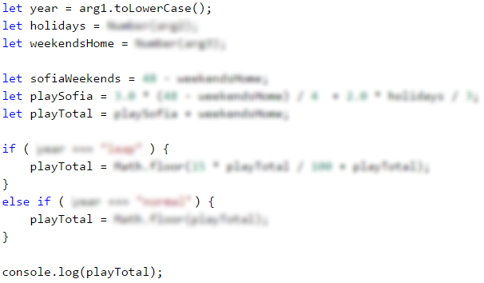

#### Тестване в Judge системата

Тествайте решението си тук: [https://judge.softuni.bg/Contests/Practice/Index/931#11](https://judge.softuni.bg/Contests/Practice/Index/931#11).


### Задача: * точка във фигурата

Фигура се състои от **6 блокчета с размер h \* h**, разположени като на фигурата. Долният ляв ъгъл на сградата е на позиция {0, 0}. Горният десен ъгъл на фигурата е на позиция {**2\*h**, **4\*h**}. На фигурата координатите са дадени при **h = 2**:

<p>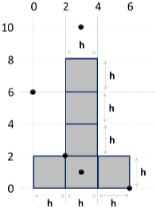</p>

Да се напише програма, която въвежда цяло число **h** и координатите на дадена **точка {x, y}** (цели числа) и отпечатва дали точката е вътре във фигурата (**inside**), вън от фигурата (**outside**) или на някоя от стените на фигурата (**border**).

#### Примерен вход и изход

|Вход|Изход|Вход|Изход|
|-----|-----|-----|-----|
|2<br>3<br>10|outside|2<br>3<br>1|inside|

|Вход|Изход|Вход|Изход|
|-----|-----|-----|-----|
|2<br>2<br>2|border|2<br>6<br>0|border|

|Вход|Изход|Вход|Изход|
|----|-----|-----|-----|
|2<br>0<br>6|outside|15<br>13<br>55|outside|

|Вход|Изход|Вход|Изход|
|-----|-----|-----|-----|
|15<br>29<br>37|inside|15<br>37<br>18|outside|

|Вход|Изход|Вход|Изход|
|-----|-----|-----|-----|
|15<br>-4<br>7|outside|15<br>30<br>0|border|

#### Насоки и подсказки

Примерна логика за решаване на задачата (не е единствената правилна):

* Може да разделим фигурата на **два правоъгълника** с обща стена:

<p>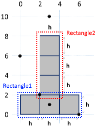</p>

* Една точка е **външна (outside)** за фигурата, когато е едновременно **извън** двата правоъгълника.
* Една точка е **вътрешна (inside)** за фигурата, ако е вътре в някой от правоъгълниците (изключвайки стените им) или лежи върху общата им стена.
* В **противен случай** точката лежи на стената на правоъгълника (**border**).

Примерен код (части от кода са замъглени с цел да се стимулира самостоятелно мислене и решение):

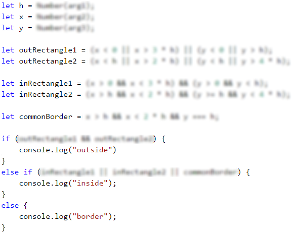

#### Тестване в Judge системата

Тествайте решението си тук: [https://judge.softuni.bg/Contests/Practice/Index/931#12](https://judge.softuni.bg/Contests/Practice/Index/931#12).


## Упражнениe: графично приложение с по-сложни проверки

В тази глава научихме как можем да правим **проверки с нетривиални условия**. Нека сега приложим тези знания, за да създадем нещо интересно: настолно приложение, което визуализира точка и правоъгълник. Това е прекрасна визуализация за една от задачите от упражненията.

### Задача: * точка и правоъгълник – графично (GUI) приложение

Задачата, която си поставяме е да се разработи графично (**GUI**) приложение за **визуализация на точка и правоъгълник**. Приложението трябва да изглежда приблизително по следния начин:

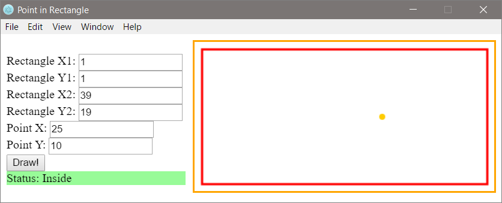

От контролите вляво се задават координатите на **два от ъглите на правоъгълник** (десетични числа) и координатите на **точка**. Приложението **визуализира графично** правоъгълника и точката и изписва дали точката е **вътре** в правоъгълника (**Inside**), **вън** от него (**Outside**) или на някоя от стените му (**Border**). Приложението **премества и мащабира** координатите на правоъгълника и точката, за да бъдат максимално големи, но да се събират в полето за визуализация в дясната страна на приложението.

<table><tr><td></td>
<td><b>Внимание</b>: това приложение е значително <b>по-сложно</b> от предходните графични приложения, които разработвахме до сега, защото изисква ползване на функции за чертане (Canvas ), работа с HTML, JavaScript и GUI framework (Electron).</td>
</tr></table>

Следват инструкции за изграждане на приложението стъпка по стъпка:

1. Първо ще си създадем отделна папка за проекта на нашето приложение с подходящо име, например "**Point-in-Rectangle**".

2. Инсталираме **Electron** – работна рамка (**framework**) за създаване на графични (**GUI**) приложения с JavaScript. Изпълняваме следната команда на конзолата (Command Prompt / Bash):
```
npm install -g electron
```

3. В папката на проекта създаваме **JavaScript файл** с име **main.js** като във VS Code натиснем [**Ctrl + N**]. След това записваме новия файл с [**Ctrl + Shift + S**] и въвеждайки желаното име на файла.

4. Кодът, описан в **main.js**, управлява събитията и създава нови прозорци в приложението. Трябва да изглежда по следния начин: 

```javascript
const path = require('path');
const url = require('url');
const { app, BrowserWindow } = require('electron');

let win;

function createWindow () {
    win = new BrowserWindow({width: 750, height: 300, resizable: false});
    win.loadURL(url.format({
        pathname: path.join(__dirname, 'index.html'),
        protocol: 'file:',
        slashes: true
    }));
    
    win.on('closed', () => { win = null; });
}

app.on('ready', createWindow);

app.on('window-all-closed', () => { app.quit(); });

app.on('activate', () => {
    if (win === null) {
        createWindow();
    }
});
```

5. В папката на проекта създаваме и нов **HTML** файл с име **`index.html`**. Тагът **`<title>`** е задължителен за всеки **html** документ и дефинира заглавието му. Влизаме в него и написваме **`"Point in Rectangle"`**:

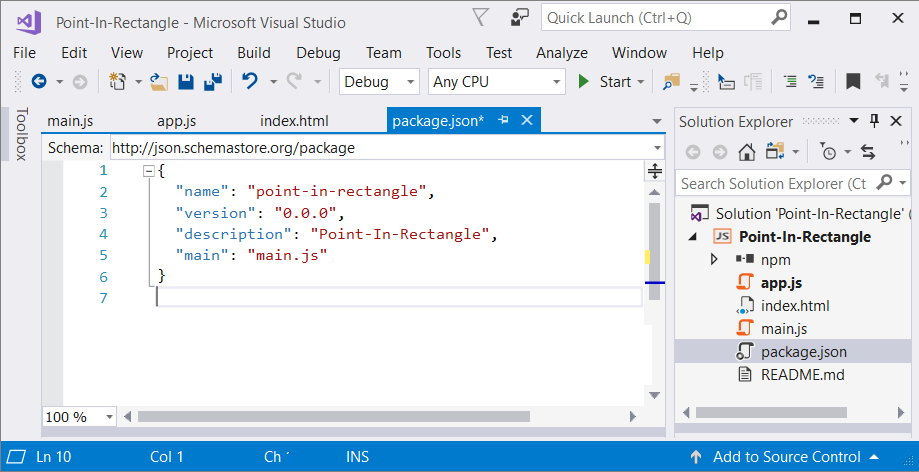

Добавяме следния код под тага **`<title>`** в **index.html** файла:

```javascript
<script src="app.js" type="text/javascript"></script>
```

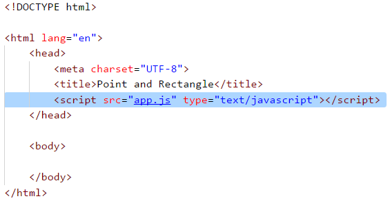

По този начин се осъществява връзката между файловете **`index.html`** и **`app.js`** (който ще създадем малко по-късно). Тагът **`<body>`** дефинира **тялото на html документа**. Написваме в него следния код:

```html
<body>
    <div style="float:left">
        <br />
        <label>Rectangle X1:</label>
        <input id="rect-x1" type="number" />
        <br />
        
        <label>Rectangle Y1:</label>
        <input id="rect-y1" type="number" />
        <br />
        
        <label>Rectangle X2:</label>
        <input id="rect-x2" type="number" />
        <br />
        
        <label>Rectangle Y2:</label>
        <input id="rect-y2" type="number" />
        <br />
        
        <label>Point X:</label>
        <input id="point-x" type="number" />
        <br />
        
        <label>Point Y:</label>
        <input id="point-y" type="number" />
        <br />
        
        <input type="button" onclick="draw()" value="Draw!" />
        <br />

        <div id="result">
            <label>Status:</label>
            <span id="status"></span>
        </div>
    </div>
    
    <div style="float:right">
        <canvas style="border: 2px solid orange;" id="a" width="400" height="200">
            This text is displayed if your browser does not support HTML5 Canvas.
        </canvas>
    </div>
</body>
```

За въвеждане координатите на правоъгълника и на точката, използваме **`input`** полета от тип **`Number`**, с тагове **`<label>`**. За да чертаем геометрични фигури в приложението, използваме html тага **`<canvas>`**:

<p>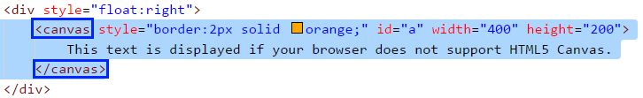</p>

Той приема следните параметри:
  - **Ширина** (width) в пиксели (px)
  - **Височина** (height) в пиксели (px)
  - **Очертание** (border)
  
За да се отразяват промените в приложението, файловете трябва да се запазват с **`[Ctrl+S]`**.

За да стартираме приложението, изпълняваме в конзолата (в папката на текущия проект) следната команда: 
```
electron .
```

Приложението трябва да изглежда по следния начин:

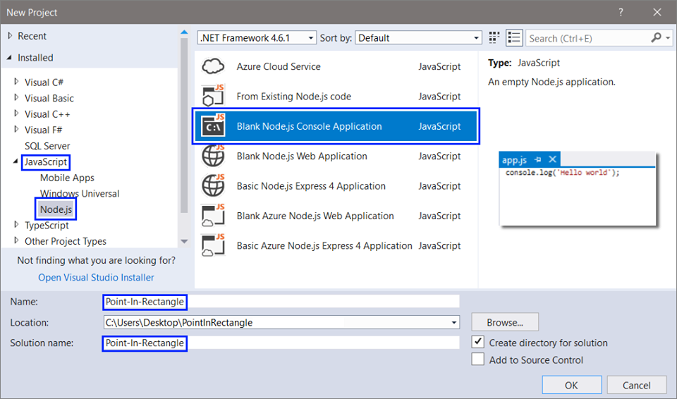

6. Остава да се имплементира най-сложната част: **визуализация на правоъгълника и точката** в полето на елемента **`<canvas>`** чрез функцията **`draw()`** във файла **`app.js`**, който създаваме в директорията на приложението, по начина, описан в Точка 2.
  
Създаваме  <a target="_blank" href="https://developer.mozilla.org/en-US/docs/Web/API/CanvasRenderingContext2D">**`CanvasRenderingContext2D`**</a> обект като напишем следния код:
  
```javascript
// Create canvas element
let canvas = document.getElementById('a');
let context = canvas.getContext('2d');
```

Елементът **`<canvas>`** е поле, в което обектът, генериран чрез метода <a target="_blank" href="https://developer.mozilla.org/en-US/docs/Web/API/HTMLCanvasElement/getContext">**`.getContext('2d')`**</a>, чертае графики, текст, изображения и други елементи. В случая променливата **`context`** представлява този обект. Записваме в отделни променливи координатите на двата ъгъла на правоъгълника:
  
```javascript
// Get input for rectangle coordinates
let rectX1 = Number(document.getElementById("rect-x1").value) * 10;
let rectY1 = Number(document.getElementById("rect-y1").value) * 10;
let rectX2 = Number(document.getElementById("rect-x2").value) * 10;
let rectY2 = Number(document.getElementById("rect-y2").value) * 10;
```

Стойностите на координатите са достъпни чрез **`id`** на **`<input>`** полетата. За по-добра визуализация на екрана, мащабираме стойностите като **ги увеличaваме 10 пъти**. Следващата стъпка е да се пресметнат страните на правоъгълника, тъй като обектът **`context`** рисува правоъгълник по четири параметъра: **`x`** - координата, **`y`** - координата, **`ширина`** в пиксели и **`височина`** в пиксели:

```javascript
// Calculate rectangle parameters
let rectWidth = Math.abs(rectX1 - rectX2);
let rectHeight = Math.abs(rectY1 - rectY2);
```

Можем да използваме кода по-долу, който рисува червен правоъгълник, според зададените във формата координати, използвайки метода <a target="_blank" href="https://www.w3schools.com/tags/canvas_strokerect.asp">**`.strokeRect(...)`**</a>:

```javascript
// Set rectangle style
context.strokeStyle = "#ff0000";
context.lineWidth = 3;

// Draw rectangle with given parameters
context.strokeRect(rectX1, rectY1, rectWidth, rectHeight);
```

Аналогично на правоъгълника, взимаме координатите на точката и ги мащабираме. След това задаваме стил на точката - оранжев цвят. За по-добра визуализация на екрана, преобразуваме точката в кръг с метода <a target="_blank" href="https://www.w3schools.com/tags/canvas_arc.asp">**`.arc(...)`**</a>. Този метод приема пет параметъра: **`x`** - координата, **`y`** - координата, **`радиус`**, **`начало на дъгата`** в радиани, **`край на дъгата`** в радиани:

```javascript
// Get input for point coordinates
let pointX = Number(document.getElementById("point-x").value) * 10;
let pointY = Number(document.getElementById("point-y").value) * 10;

// Set point style and draw point
context.beginPath();
context.fillStyle = "#ffcc00";
context.arc(pointX, pointY, 4, 0, 2 * Math.PI);
context.closePath();
context.fill();
```

За да отрaзим резултатите в **`if`** проверките, запазваме в отделни променливи следните елементи от html кода:

```javascript
// Assign variables to (<div id="result">) and (<span id="status">) html elements
let result = document.getElementById("status");
let output = document.getElementById("result");
```

Последната стъпка е проверка на позицията на точката спрямо правоъгълника:

```javascript
// Check point position
if () {
    result.innerHTML = "Inside";
    output.style.backgroundColor = "palegreen";
} else if () {
    result.innerHTML = "Border";
    output.style.backgroundColor = "gold";
} else {
    result.innerHTML = "Outside";
    output.style.backgroundColor = "lightsalmon";
}
```

Нека помислим как **да допишем** недовършените (нарочно) условия в **`if`** конструкциите. Кодът по-горе нарочно не се компилира, защото целта му е читателят да помисли как и защо работи и да допълним липсващите части. Горният код взима координатите на правоъгълника и точката и проверява дали точката е вътре, вън или на страна на правоъгълника. При визуализацията на резултата се сменя и цвета на фона на текстовия блок, който го съдържа.

Това е пълната версия на функцията **`draw()`**:

```javascript
function draw() {
    // Create canvas element
    let canvas = document.getElementById('a');
    let context = canvas.getContext('2d');
       
    // Clear canvas window
    context.clearRect(0, 0, canvas.width, canvas.height);
        
    // Get input for rectangle coordinates
    let rectX1 = Number(document.getElementById("rect-x1").value) * 10;
    let rectY1 = Number(document.getElementById("rect-y1").value) * 10;
    let rectX2 = Number(document.getElementById("rect-x2").value) * 10;
    let rectY2 = Number(document.getElementById("rect-y2").value) * 10;
        
    // Calculate rectangle parameters
    let rectWidth = Math.abs(rectX1 - rectX2);
    let rectHeight = Math.abs(rectY1 - rectY2);
        
    // Set rectangle style
    context.strokeStyle = "#ff0000";
    context.lineWidth = 3;
        
    // Draw rectangle with given parameters
    context.strokeRect(rectX1, rectY1, rectWidth, rectHeight);
        
    // Get input for point coordinates
    let pointX = Number(document.getElementById("point-x").value) * 10;
    let pointY = Number(document.getElementById("point-y").value) * 10;
        
    // Set point style and draw point
    context.beginPath();
    context.fillStyle = "#ffcc00";
    context.arc(pointX, pointY, 4, 0, 2 * Math.PI);
    context.closePath();
    context.fill();
        
    // Assign variables to (div id="result") and (span id="status") html elements
    let result = document.getElementById("status");
    let output = document.getElementById("result");
        
    // Check point position
    if (pointX > rectX1 && pointX < rectX2 && pointY > rectY1 && pointY < rectY2) {
        result.innerHTML = "Inside";
        output.style.backgroundColor = "palegreen";
    } else if ((pointX === rectX1 || pointX === rectX2) && pointY >= rectY1 && pointY <= rectY2 
                || (pointY === rectY1 || pointY === rectY2) && pointX >= rectX1 && pointX <= rectX2) {
        result.innerHTML = "Border";
        output.style.backgroundColor = "gold";
    } else {
        result.innerHTML = "Outside";
        output.style.backgroundColor = "lightsalmon";
    }
}
```

Стартираме приложението чрез файла **index.html** и го тестваме (с въвеждане на различни входни данни). Пробваме да въвеждаме различни правоъгълници и да позиционираме точката на различни позиции, да преоразмеряваме приложението и виждаме дали се държи коректно. Ако приложението не работи коректно, проверяваме за грешки. Най-вероятната причина за грешка е, ако сме написали кода на неправилно място.

Накрая стартираме приложението в собствен GUI прозорец: 
```
electron .
```

**Случай 1: Точката се намира в правоъгълника**:


**Случай 2: Точката лежи на една от страните на правоъгълника**:

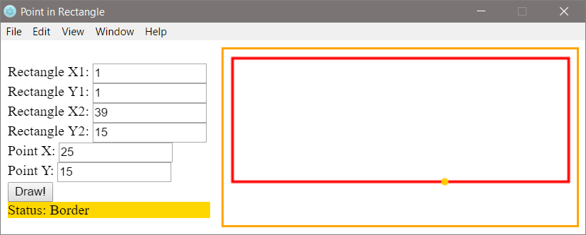

**Случай 3: Точката се намира извън правоъгълника**:

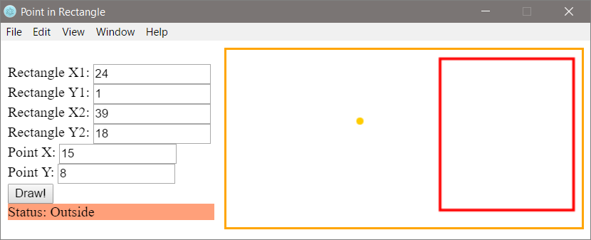

Ако имате трудности с последната задача, питайте във **форума на СофтУни**: https://softuni.bg/forum.
