# Глава 5.1. Повторения (цикли)

В настоящата глава ще се запознаем с конструкциите за **повторение на група команди**, известни в програмирането с понятието "**цикли**". Ще напишем няколко цикъла с използване на оператора **`for`** в най-простата му форма. Накрая ще решим няколко практически задачи, изискващи повторение на поредица от действия, като използваме цикли.


## Видео

<div class="video-player">
  Гледайте видео-урок по тази глава тук: <a target="_blank"
  href="https://www.youtube.com/watch?v=qTh58nRP-nE">
  https://www.youtube.com/watch?v=qTh58nRP-nE</a>.
</div>


## Повторения на блокове код (for цикъл)

В програмирането често пъти се налага **да изпълним блок с команди няколко пъти**. За целта се използват т.нар. **цикли**. Нека разгледаме един пример за **`for` цикъл**, който преминава последователно през числата от 1 до 10 и ги отпечатва:

```js
for (let i = 1; i <= 10; i++) {
    console.log("i = " + i);
}
```

Цикълът започва с **оператора `for`** и преминава през всички стойности за дадена променлива в даден интервал, например всички числа от 1 до 10 включително, и за всяка стойност изпълнява поредица от команди.

В декларацията на цикъла може да се зададе **начална стойност** и **крайна стойност**. **Тялото на цикъла** обикновено се огражда с къдрави скоби **`{ }`** и представлява блок с една или няколко команди. На фигурата по-долу е показана структурата на един **`for` цикъл**:

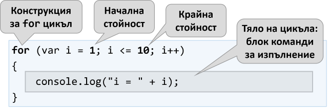

В повечето случаи един **`for` цикъл** се завърта от **`1`** до **`n`** (например от 1 до 10). Целта на цикъла е да се **премине последователно** през числата 1, 2, 3, …, n и за всяко от тях да се **изпълни някакво действие**. В примера по-горе променливата **`i`** приема стойности от 1 до 10 и в тялото на цикъла се отпечатва текущата стойност. Цикълът се повтаря 10 пъти и всяко от тези повторения се нарича "**итерация**".

### Пример: числа от 1 до 100

Да се напише програма, която **печата числата от 1 до 100**. Програмата не приема вход и отпечатва числата от 1 до 100 едно след друго, по едно на ред.

#### Насоки и подсказки

Можем да решим задачата с **`for` цикъл** , с който преминаваме, с помощта на променливата **`i`**, през числата от 1 до 100 и ги печатаме в тялото на цикъла:


**Стартираме** програмата с [**Ctrl+F5**] и я **тестваме**:

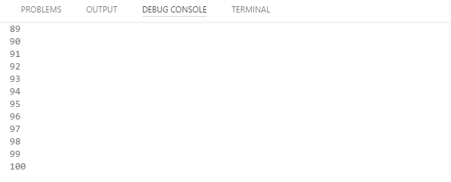

#### Тестване в Judge системата

Тествайте решението си тук: [https://judge.softuni.bg/Contests/Practice/Index/933#0](https://judge.softuni.bg/Contests/Practice/Index/933#0).

Трябва да получите **100 точки** (напълно коректно решение).


## Code Snippet за for цикъл във Visual Studio Code

Докато програмираме, постоянно се налага да пишем цикли, десетки пъти всеки ден. Затова в повечето среди за разработка (IDE) има **шаблони за код** (**code snippets**) за писане на цикли. Един такъв шаблон е **шаблонът за `for` цикъл във Visual Studio Code**. Напишете **`for`** в редактора за JavaScript код във Visual Studio Code и **натиснете един път** [**Tab**]:

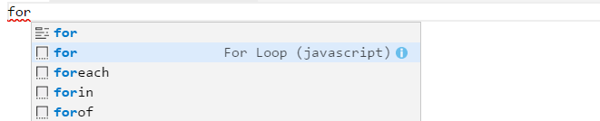

 **VS Code** ще разгъне за вас шаблон и ще напише цялостен **`for` цикъл**:

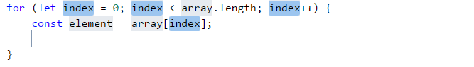

**Опитайте сами**, за да усвоите умението да ползвате шаблона за код за **`for` цикъл** във Visual Studio Code.

### Пример: числа до 1000, завършващи на 7

Да се напише програма, която намира всички числа в интервала [**1 … 1000**], които завършват на 7. 

#### Насоки и подсказки

Задачата можем да решим като комбинираме **`for` цикъл** за преминаваме през числата от 1 до 1000 и **проверка** за всяко число дали завършва на 7. Има и други решения, разбира се, но нека решим задачата чрез **завъртане на цикъл + проверка**:

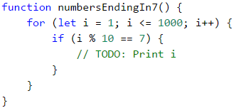

#### Тестване в Judge системата

Тествайте решението си тук: [https://judge.softuni.bg/Contests/Practice/Index/933#1](https://judge.softuni.bg/Contests/Practice/Index/933#1).

### Пример: всички латински букви

Да се напише програма, която отпечатва буквите от латинската азбука: **a, b, c, …, z**.

#### Насоки и подсказки

Може да решим задачата като завъртим **`for` цикъл**, който преминава последователно през кодовете на всички букви от латинската азбука, като съобразим, че кодът (поредният номер в [Unicode номерацията на буквите и символите](https://unicode-table.com/en/)\) на ‘`a`’ е 97, кодът на ‘`b`’ е 98 и т.н., а кодът на ‘`z`’ е 122. Преминаването от номер на буква към самата буква става с функцията `String.fromCharCode(x)`. Ето примерна реализация:

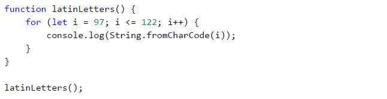

Ако искаме да направим кода с една идея по-четим, можем да го напишем така:


#### Тестване в Judge системата

Тествайте решението си тук: [https://judge.softuni.bg/Contests/Practice/Index/933#2](https://judge.softuni.bg/Contests/Practice/Index/933#2).

### Пример: сумиране на числа

Да се напише програма, която **въвежда `n` цели числа и ги сумира**.

* От първия ред на входа се въвежда броят числа **`n`**.
* От следващите **`n`** реда се въвежда по едно число.
* Числата се сумират и накрая се отпечатва резултатът.

#### Примерен вход и изход

| Вход | Изход |
| --- | --- |
| 2<br>10<br>20 | 30 |
| 3<br>-10<br>-20<br>-30 | -60 |
| 4<br>45<br>-20<br>7<br>11<br> | 43 |
| 1<br>999 | 999 | 
| 0 | 0 |

#### Насоки и подсказки

Можем да решим задачата за сумиране на числа по следния начин:
 - Четем входното число **`n`**.
 - Започваме първоначално със сума **`sum = 0`**.
 - Въртим цикъл от 1 до **`args.length`**. На всяка стъпка от цикъла четем число **`args[i]`** и го добавяме към сумата **`sum`**.
 - Накрая отпечатваме получената сума **`sum`**.
 
Ето и сорс кода на решението:

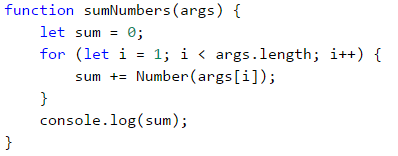

#### Тестване в Judge системата

Тествайте решението си тук: [https://judge.softuni.bg/Contests/Practice/Index/933#3](https://judge.softuni.bg/Contests/Practice/Index/933#3).

### Пример: най-голямо число

Да се напише програма, която въвежда **n цели числа** (**n** > 0) и намира **най-голямото** измежду тях. На първия ред на входа се въвежда броят числа **n**. След това се въвеждат самите числа, по едно на ред. Примери:

#### Примерен вход и изход

| Вход | Изход |
| --- | --- |
| 2<br>100<br>99 | 100 | 
| 3<br>-10<br>20<br>-30 | 20 |
| 4<br>45<br>-20<br>7<br>99<br> | 99 | 
| 1<br>999 | 999 |
| 2<br>-1<br>-2 | -1 |

#### Насоки и подсказки

Първо въвеждаме едно число **`n`** (броят числа, които предстои да бъдат въведени). Задаваме на текущия максимум **`max`** първоначална неутрална стойност, например **-10000000000000** (или **`Number.NEGATIVE_INFINITY`**). С помощта на **`for` цикъл**, чрез който итерираме **n пъти** (**`n = args[0]`**), прочитаме по едно цяло число **`num`**. Ако прочетеното число **`num`** е по-голямо от текущия максимум **`max`**, присвояваме стойността на **`num`** в променливата **`max`**. Накрая, в **`max`** трябва да се е запазило най-голямото число. Отпечатваме го на конзолата.

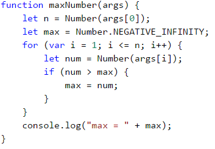

#### Тестване в Judge системата

Тествайте решението си тук: [https://judge.softuni.bg/Contests/Practice/Index/933#4](https://judge.softuni.bg/Contests/Practice/Index/933#4).


### Пример: най-малко число

Да се напише програма, която въвежда **n цели числа** (**n** > 0) и намира **най-малкото** измежду тях. Първо се въвежда броя числа **n**, след тях още **n** числа по едно на ред. 

#### Примерен вход и изход

| Вход | Изход | 
| --- | --- |
| 2<br>100<br>99 | 99 |
| 3<br>-10<br>20<br>-30 | -30 |
| 4<br>45<br>-20<br>7<br>99<br> | -20 |

#### Насоки и подсказки

Задачата е абсолютно аналогична с предходната, само че започваме с друга неутрална начална стойност.

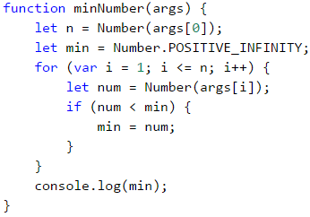

#### Тестване в Judge системата

Тествайте решението си тук: [https://judge.softuni.bg/Contests/Practice/Index/933#5](https://judge.softuni.bg/Contests/Practice/Index/933#5).


### Пример: лява и дясна сума

Да се напише програма, която въвежда **2 \* n цели числа** и проверява дали **сумата на първите n числа** (лява сума) е равна на **сумата на вторите n числа** (дясна сума). При равенство се печата **"Yes" + сумата**, иначе се печата **"No" + разликата**. Разликата се изчислява като положително число (по абсолютна стойност). Форматът на изхода трябва да е като в примерите по-долу.

#### Примерен вход и изход

| Вход | Изход | Вход | Изход |
| --- | --- | --- | --- | 
| 2<br>10<br>90<br>60<br>40 | Yes, sum = 100 | 2<br>90<br>9<br>50<br>50 | No, diff = 1 |

#### Насоки и подсказки

Първо въвеждаме числото **n**, след това първите **n** числа (**лявата** половина) и ги сумираме. Продължаваме с въвеждането на още **n** числа (**дясната** половина) и намираме и тяхната сума. Изчисляваме **разликата** между намерените суми по абсолютна стойност: **`Math.abs(leftSum - rightSum)`**. Ако разликата е **0**, отпечатваме **"Yes" + сумата**, в противен случай - отпечатваме **"No" + разликата**.

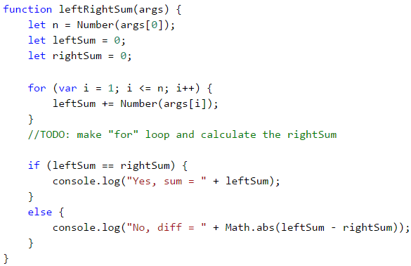

#### Тестване в Judge системата

Тествайте решението си тук: [https://judge.softuni.bg/Contests/Practice/Index/933#6](https://judge.softuni.bg/Contests/Practice/Index/933#6).


### Пример: четна / нечетна сума

Да се напише програма, която въвежда **n цели числа** и проверява дали **сумата на числата на четни позиции** е равна на **сумата на числата на нечетни позиции**. При равенство печата **"Yes" + сумата**, иначе печата **"No" + разликата**. Разликата се изчислява по абсолютна стойност. Форматът на изхода трябва да е като в примерите по-долу.

#### Примерен вход и изход

| Вход | Изход |
| --- | --- |
| 4<br>10<br>50<br>60<br>20 | Yes<br>Sum = 70 |
| 4<br>3<br>5<br>1<br>-2 | No<br>Diff = 1 |
| 3<br>5<br>8<br>1 | No<br>Diff = 2 |

#### Насоки и подсказки

Въвеждаме числата едно по едно и изчисляваме двете **суми** (на числата на **четни** позиции и на числата на **нечетни** позиции). Както в предходната задача, изчисляваме абсолютната стойност на разликата и отпечатваме резултата (**"Yes" + сумата** при разлика 0 или **"No" + разликата** в противен случай).

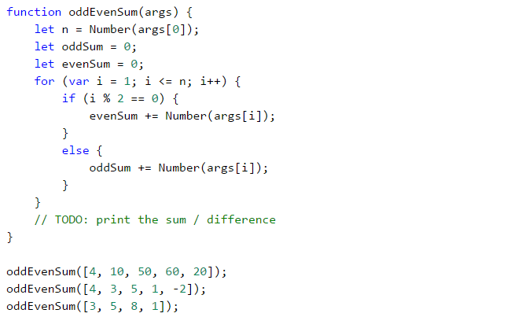

#### Тестване в Judge системата

Тествайте решението си тук: [https://judge.softuni.bg/Contests/Practice/Index/933#7](https://judge.softuni.bg/Contests/Practice/Index/933#7).


### Пример: сумиране на гласните букви

Да се напише програма, която въвежда **текст** (стринг), изчислява и отпечатва **сумата от стойностите на гласните букви** според таблицата по-долу:

| a | e | i | o | u | 
| :---: | :---: | :---: | :---: | :---: |
| 1 | 2 | 3 | 4 | 5 |

#### Примерен вход и изход

| Вход | Изход | Вход | Изход | 
| --- | --- | --- | --- |
| hello | 6<br>(e+o = 2+4 = 6) | bamboo | 9<br>(a+o+o = 1+4+4 = 9) |
| hi | 3<br>(i = 3) | beer | 4<br>(e+e = 2+2 = 4) |

#### Насоки и подсказки

Прочитаме входния текст **`arg1`**, зануляваме сумата и завъртаме цикъл от **0** до **`input.length`** (дължината на текста). Проверяваме всяка буква **`input[i]`** дали е гласна и съответно добавяме към сумата стойността ѝ.

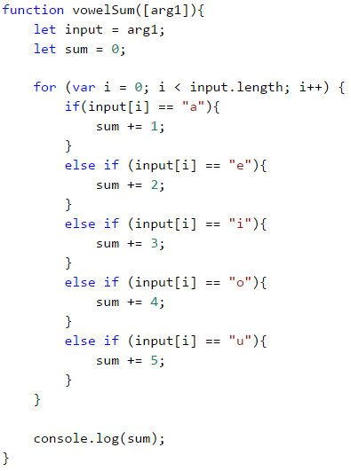

#### Тестване в Judge системата

Тествайте решението си тук: [https://judge.softuni.bg/Contests/Practice/Index/933#8](https://judge.softuni.bg/Contests/Practice/Index/933#8).


## Какво научихме от тази глава?

Можем да повтаряме блок код с **`for` цикъл**:

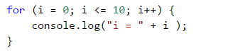

Можем да извършваме различни математически операции:

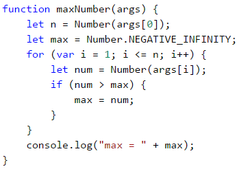

## Упражнения: повторения (цикли)

След като се запознахме с циклите, идва време **да затвърдим знанията си на практика**, а както знаете, това става с много писане на код. Да решим няколко задачи за упражнение:

### Задача: елемент, равен на сумата на останалите

Да се напише програма, която въвежда **n цели числа** и проверява дали сред тях съществува число, което е равно на сумата на всички останали. Ако има такъв елемент, се отпечатва **"Yes" + неговата стойност**, в противен случай - **"No" + разликата между най-големия елемент и сумата на останалите** (по абсолютна стойност). 

#### Примерен вход и изход

| Вход | Изход | Коментар |
| --- | --- | :---: |
| 7<br>3<br>4<br>1<br>1<br>2<br>12<br>1 | Yes<br>Sum = 12 | 3 + 4 + 1 + 2 + 1 + 1 = 12 |
| 4<br>6<br>1<br>2<br>3 | Yes<br>Sum = 6 | 1 + 2 + 3 = 6 |
| 3<br>1<br>1<br>10 | No<br>Diff = 8 | &#124;10 - (1 + 1)&#124; = 8 |
| 3<br>5<br>5<br>1 | No<br>Diff = 1 | &#124;5 - (5 + 1)&#124; = 1 |
| 3<br>1<br>1<br>1 | No<br>Diff = 1 | - |

#### Насоки и подсказки

Трябва да изчислим **сумата** на всички елементи, да намерим **най-големия** от тях и да проверим търсеното условие.

#### Тестване в Judge системата

Тествайте решението си тук: [https://judge.softuni.bg/Contests/Practice/Index/933#9](https://judge.softuni.bg/Contests/Practice/Index/933#9).


### Задача: четни / нечетни позиции

Напишете програма, която чете **n числа** и пресмята **сумата**, **минимума** и **максимума** на числата на **четни** и **нечетни** позиции (броим от 1). Когато няма минимален / максимален елемент, отпечатайте **"No"**. 

#### Примерен вход и изход

| Вход | Изход | Вход | Изход |
| --- | --- | --- | --- |
| 6<br>2<br>3<br>5<br>4<br>2<br>1 | OddSum=9,<br>OddMin=2,<br>OddMax=5,<br>EvenSum=8,<br>EvenMin=1,<br>EvenMax=4 | 2<br>1.5<br>-2.5 | OddSum=1.5,<br>OddMin=1.5,<br>OddMax=1.5,<br>EvenSum=-2.5,<br>EvenMin=-2.5,<br>EvenMax=-2.5 |
| 1<br>1 | OddSum=1,<br>OddMin=1,<br>OddMax=1,<br>EvenSum=0,<br>EvenMin=No,<br>EvenMax=No | 0 | OddSum=0,<br>OddMin=No,<br>OddMax=No,<br>EvenSum=0,<br>EvenMin=No,<br>EvenMax=No |
| 5<br>3<br>-2<br>8<br>11<br>-3 | OddSum=8,<br>OddMin=-3,<br>OddMax=8,<br>EvenSum=9,<br>EvenMin=-2,<br>EvenMax=11 | 4<br>1.5<br>1.75<br>1.5<br>1.75 | OddSum=3,<br>OddMin=1.5,<br>OddMax=1.5,<br>EvenSum=3.5,<br>EvenMin=1.75,<br>EvenMax=1.75 |
| 1<br>-5 | OddSum=-5,<br>OddMin=-5,<br>OddMax=-5,<br>EvenSum=0,<br>EvenMin=No,<br>EvenMax=No | 3<br>-1<br>-2<br>-3 | OddSum=-4,<br>OddMin=-3,<br>OddMax=-1,<br>EvenSum=-2,<br>EvenMin=-2,<br>EvenMax=-2 |

#### Насоки и подсказки

Задачата обединява няколко предходни задачи: намиране на **минимум**, **максимум** и **сума**, както и обработка на елементите от **четни и нечетни позиции**. Припомнете си ги.

В тази задача е по-добре да се работи с **дробни числа** (не цели). Сумата, минимумът и максимумът също са дробни числа. Трябва да използваме **неутрална начална стойност** при намиране на минимум / максимум, например **1000000000.0** и **-1000000000.0**. Ако получим накрая неутралната стойност, печатаме **“No”**.

#### Тестване в Judge системата

Тествайте решението си тук: [https://judge.softuni.bg/Contests/Practice/Index/933#10](https://judge.softuni.bg/Contests/Practice/Index/933#10).

### Задача: еднакви двойки

Дадени са **2 \* n числа**. Първото и второто формират **двойка**, третото и четвъртото също и т.н. Всяка двойка има **стойност** – сумата от съставящите я числа. Напишете програма, която проверява **дали всички двойки имат еднаква стойност**.

В случай, че е еднаква отпечатайте **"Yes, value=…" + стойността**, в противен случай отпечатайте **максималната разлика** между две последователни двойки в следния формат - **"No, maxdiff=…" + максималната разлика**. 

Входът се състои от число **n**, следвано от **2*n цели числа**, всички по едно на ред.

#### Примерен вход и изход

| Вход | Изход | Коментар |
| --- | --- | :---: | 
| 3<br>1<br>2<br>0<br>3<br>4<br>-1| Yes, value=3 | стойности = {3, 3, 3}<br>еднакви стойности | 
| 2<br>1<br>2<br>2<br>2 | No, maxdiff=1 | стойности = {3, 4}<br>разлики = {1}<br>макс. разлика = 1 |
| 4<br>1<br>1<br>3<br>1<br>2<br>2<br>0<br>0 | No, maxdiff=4 | стойности = {2, 4, 4, 0}<br>разлики = {2, 0, 4}<br>макс. разлика = 4 |
| 1<br>5<br>5 | Yes, value=10 | стойности = {10}<br>една стойност<br>еднакви стойности |
| 2<br>-1<br>0<br>0<br>-1 | Yes, value=-1 | стойности = {-1, -1}<br>еднакви стойности | 
| 2<br>-1<br>2<br>0<br>-1 | No, maxdiff=2 | стойности = {1, -1}<br>разлики = {2}<br>макс. разлика = 2 |

#### Насоки и подсказки

Прочитаме входните числа **по двойки**. За всяка двойка пресмятаме **сумата** ѝ. Докато четем входните двойки, за всяка двойка, без първата, трябва да пресметнем **разликата с предходната**. За целта е необходимо да пазим в отделна променлива сумата на предходната двойка. Накрая намираме **най-голямата разлика** между две двойки. Ако е **0**, печатаме **“Yes”** + стойността, в противен случай - **“No”** + разликата.

#### Тестване в Judge системата

Тествайте решението си тук: [https://judge.softuni.bg/Contests/Practice/Index/933#11](https://judge.softuni.bg/Contests/Practice/Index/933#11).

## Упражнения: графични и уеб приложения

В настоящата глава се запознахме с **циклите** като конструкция в програмирането, която ни позволява да повтаряме многократно дадено действие или група от действия. Сега нека си поиграем с тях. За целта ще начертаем няколко фигурки, които се състоят от голям брой повтарящи се графични елементи, но този път не на конзолата, а в графична среда, използвайки "**графика с костенурка**". Ще е интересно. И никак не е сложно. Опитайте!

### Задача: чертане с костенурка – графично приложение (GUI)

Целта на следващото упражнение е да си поиграем с една **библиотека за рисуване**, известна като **“графика с костенурка” (turtle graphics)**. Ще изградим графично приложение, в което ще **рисуваме различни фигури**, придвижвайки нашата **“костенурка”** по екрана чрез операции от типа “отиди напред 100 позиции”, “завърти се надясно на 30 градуса”, “отиди напред още 50 позиции”. Приложението ще изглежда приблизително така:

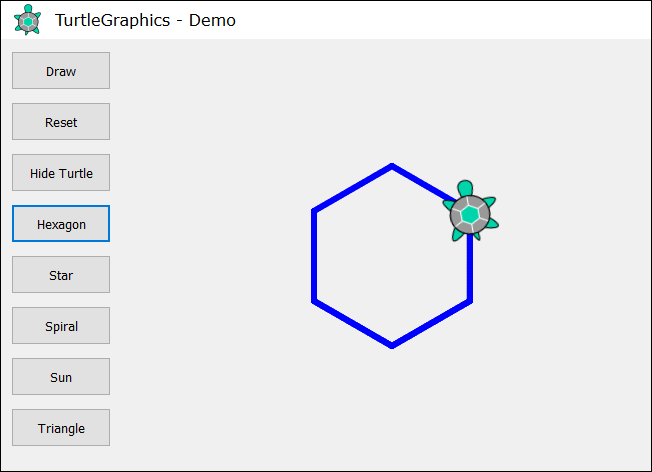

Нека първо се запознаем с **концепцията за рисуване “Turtle Graphics”**. Може да разгледаме следните източници:

* Дефиниция на понятието “turtle graphics”: [http://c2.com/cgi/wiki?TurtleGraphics](http://c2.com/cgi/wiki?TurtleGraphics)
* Статия за “turtle graphics” в Wikipedia: [https://en.wikipedia.org/wiki/Turtle_graphics](https://en.wikipedia.org/wiki/Turtle_graphics)
* Интерактивен онлайн инструмент за чертане на фигури с костенурка:<br>[http://davidbau.github.io/jquery-turtle/demo.html](http://davidbau.github.io/jquery-turtle/demo.html)

Ще реализираме приложението като използваме следните технологии:
  - Език **HTML** – за описание на потребителския интерфейс (поле за рисуване и бутони).
  - **JavaScript** код – за да имплементираме действията на бутоните.
  - JS библиотека **[jQuery](https://jquery.com/)** – за улеснение на достъпа до елементите в потребителския интерфейс.
  - JS библиотека **[jQuerу-Turtle](https://github.com/PencilCode/jquery-turtle)** – за имплементация на чертане по екрана с механиката на “turtle graphics”.
  
Разполагаме с две възможности, за да създадем заредим всички библиотеки и ресурси за нашето уеб приложение **Turtle Graphics**:

+ **Зареждане на ресурсите чрез CDN** (Content Delivery Network).

Този вариант е подходящ, когато имаме постоянна интернет връзка. Нужно е да направим стандартен HTML файл (примерно **index.html**) и запишем в него следния код:

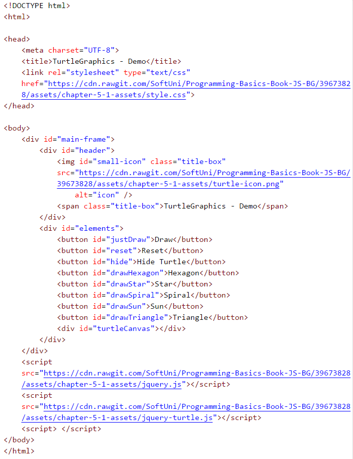

Всички необходими ресурси ще се зареждат автоматично при стартирането на файла и можем директно да започнем с въвеждането на нашия **JavaScript** код.

Ако по някаква причина нямате постоянен достъп до Интернет, може да използвате втората опция:

+ **Локално зареждане на ресурсите.**

При нея трябва сами да свалите всички необходими файлове и да промените няколко реда в html файла. Започнете, като създадете папка с име **Turtle-Demo** и в нея направете основния **html файл** и подпапка за нужните ресурси:

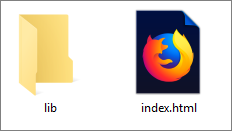

В папка **"lib"** трябва да сложим няколко файла, които можем да свалим от онлайн хранилището на книгата: [https://github.com/SoftUni/Programming-Basics-Book-JS-BG/tree/master/assets/chapter-5-1-assets](https://github.com/SoftUni/Programming-Basics-Book-JS-BG/tree/master/assets/chapter-5-1-assets)

За ваше улеснение сме сложили файловете и в удобен за сваляне архив **Turtle-Graphics-Demo-Files.zip**:

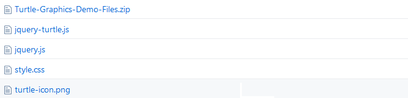

Нека разгледаме всеки един от тях:

> **jquery.js (версия 2.0.3)**

Една от най-известните JavaScript библиотеки, която предлага **бързина и функционалност** при работа с HTML потребителски интерфейс. Тя променя начина по който пишем код и планираме неговата структура. Запознайте се с инструмента на адрес: [https://jquery.com](https://jquery.com/)

> **jquery-turtle.js (версия 2.0.8)**

Плъгин (приставка), написан от **Дейвид Бау** за jQuery - **jQuery-turtle** , който дава набор от функции за **рисуване на графики** от тип "костенурка". Подробна информация и правила за употреба, може да намерите тук: [https://github.com/davidbau/jquery-turtle](https://github.com/davidbau/jquery-turtle)

> **style.css**

Набор от **правила за дизайн**, обособени в отделен файл.

> **turtle-icon.png**

**Растерна графика**, която използваме с цел по-добра презентация на приложението.

След като сме сложили файловете в папката, трябва да сменим мрежовия адрес на ресурсите в нашия **HTML** файл - **index.html**:

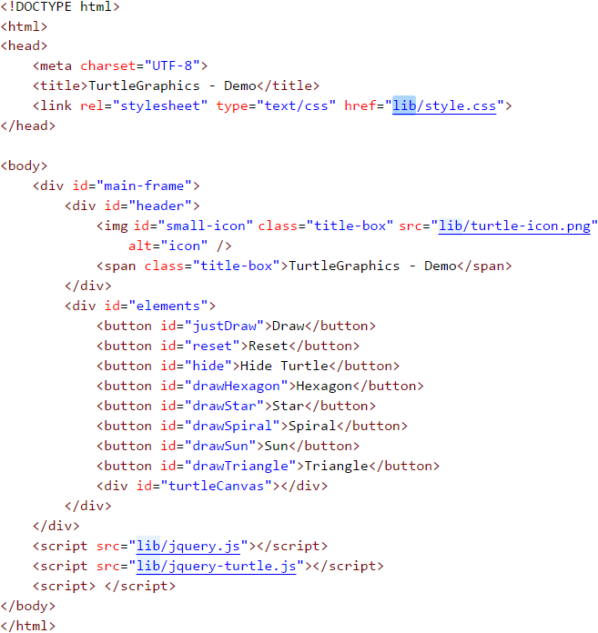

След тази промяна, при всяко стартиране на файла, браузъра ни ще зарежда файловете локално от папката **"lib"**.

Сега можем да преминем към забавната част - **писането на JavaScript код** за уеб приложението. Той ще бъде разположен между последната двойка **`script`** тагове в горния HTML файл (`index.html`): 

```html
<script> </script>
```
Кодът с функциите на приложението ще бъде сравнително кратък (около 70-80 реда) и затова не е нужно да го отделяме в нов самостоятелен файл. Важно е само да го разположим правилно в нашия HTML файл.

<table><tr><td></td>
<td>Препоръчително е всички JavaScript файлове да се поставят в края на HTML документа, преди завършващия <strong>"body"</strong> таг. С това гарантираме по-бързото зареждане на страницата, защото не забавяме рендирането (обработването) на елементите и.</td>
</tr></table>

Винаги **първо поставяме файла с библиотеката** [**jquery.js**], след това този с кода на приставката [**jquery-turtle.js**]. Едва тогава записваме нашия код, защото той се базира на първите два файла. Ако се опитаме да ги разместим ще получим грешки и приложението ни няма да функционира нормално.

Библиотеката **"jQuery"** ни позволява да манипулираме **HTML** елементи, като използваме валидни селектори за дизайн (**CSS**). Нужно е да приложим конкретен синтаксис:
```js
$('#ID') или $('.Class')  
```
Можем да използваме името на **HTML** елемента, **ID** или неговия **клас**. Селекторите винаги са низове от текст, затова се ограждат в единични или двойни кавички. Ако селектора е **ID** (самостоятелно име за всеки елемент), в началото се поставя **знака диез** (**#**). Но ако сме решили да селектираме **чрез клас** (едно име за множество елементи), тогава записваме **точка**.

Придържайки се към документацията на **jQuery-turtle**, трябва да инициализираме нашия обект и да зададем основни характеристики на "костенурката". Със следния код ще определим **размера** на графиката (**`turtleScale`**) и **скоростта** на движение (**`turtleSpeed`**):

```js
eval($.turtle());
$('#turtle').css('turtleScale', '2').css('turtleSpeed', '4');
```

След като сме готови с основата на нашето приложение, остава да напишем функциите за всеки бутон. За тази цел използваме предварително зададените от нас селектори (**ID**) на обектите в **html файла**. Ще споделим кода за първите три бутона, за да се запознаете с основните принципи:

+ **Бутон "Draw"**

Закачаме функция към елемента с **ID** (селектор) **"justDraw"**, която да се активира в момента на кликване върху бутона:

```js
$('#justDraw').click(function() {
    cg();
    for (let index = 0; index < 4; index++) {
        $('#turtle').pen('blue', '5')
        .lt(30).fd(150)
        .lt(120).fd(150)
        .lt(120).fd(150);
    }
});
```
Първо **изтриваме графиките** с функцията **`cg()`** (clear graphics) и **построяваме** елементарен **цикъл**, който да се повтори 4 пъти. Целенасочено използваме ключовата дума **`let`** за дефиниране на променливата **`index`**. По този начин гарантираме автономността на променливата за конкретния цикъл и може без проблем да използваме същото наименование отново. 

При всяка итерация (повторение) прилагаме конкретни методи за движение с определена стойност (завъртане наляво и движение напред):

```js
.lt(30) // завъртане наляво (left) с аргумент 30
.fd(150) // движение напред (forward) с аргумент 150
```

Чрез техниката на приковаването (chaining) спестяваме допълнително писане на код:

```js
$('#turtle').pen('blue', '5').lt(30).fd(150).lt(120) ...
        
// което е по-кратка версия на класическия метод:

$('#turtle').pen('blue', '5');
$('#turtle').lt(30);
$('#turtle').fd(150);
$('#turtle').lt(120);
$('#turtle').fd(150);
...       
```

+ **Бутон "Reset"**

Закачаме функция към елемента с **ID** (селектор) **"reset"**, която да се активира в момента на кликване:

```js
$('#reset').click(function() {
    window.location.reload();
});
```
Чрез **`window.location.reload()`** aктивираме **презареждане на прозореца**, с което нулираме текущото му състояние. Важно е да отбележим, че **`location`** е **характеристика** на обекта **`window`**, а **`reload()`** e **метод** на **`location`**.

+ **Бутон "Hide Turtle"**

Закачаме функция към елемента с **ID** (селектор) **"hide"**, която да се активира при кликване върху бутона:

```js
$('#hide').click(function() {
        $('#turtle').toggle();
        $(this).text(function(i, text) {
          return text === "Hide Turtle" ? "Show Turtle" : "Hide Turtle";
      });
});
```
Използваме готова функция от библиотеката **jQuery - `toggle()`**. Чрез нея **скриваме и показваме** елементи. Отделно ще прикачим друга функция, която да **променя текста на бутона** при кликване. Трябва да използваме ключовата дума **`this`**. Тя има съществена роля в синтаксиса на езика JavaScript и **мислено** може да я заменим със **self/itself**. В конкретния случай е равна на елемента **`hide`**, т.е. **`this = #hide`**. Обръщаме се към самия елемент и задаваме функция за смяна на текста, която също се активира при всяко направено кликване върху бутона.

Нека да обобщим кода, който написахме до момента:

```html
<script>
eval($.turtle());
$('#turtle').css('turtleScale', '2').css('turtleSpeed', '4');

$('#reset').click(function() {
    window.location.reload();
});

$('#justDraw').click(function() {
    cg();
    for (let index = 0; index < 4; index++) {
        $('#turtle').pen('blue', '5')
        .lt(30).fd(150)
        .lt(120).fd(150)
        .lt(120).fd(150);
    }
});

$('#hide').click(function() {
        $('#turtle').toggle();
        $(this).text(function(i, text) {
          return text === "Hide Turtle" ? "Show Turtle" : "Hide Turtle";
      });
});
</script>
```

Остава да решим проблема с автоматичното изтриване на полето за рисуване при натискане на нов бутон. Не желаем фигурите да се чертаят една върху друга или всеки път да използваме бутона **Reset**.

+ **Функция `resetCanvas()`**

```js
function resetCanvas() {
    cg();
    home();
    $('#turtle').css('turtleScale', '2').css('turtleSpeed', '4');
}
```
Прилагаме предварително зададените функции в приставката на Дейвид Бау, за да **изтрием всички графични елементи** (**`cg()`**) и **преместим** костенурката в **стартовата и позиция** (**`home()`**). След това задаваме отново първоначалните настройки на елемента **`turtle`**. Цялата функция **`resetCanvas()`** се прибавя в началото на всяка нова функция, която ще прикачим към останалите бутони.

**Пример:**
```js
$('#drawSpiral').click(function() {
    resetCanvas();
    $('#turtle').css('turtleSpeed', '4');
    for (let index = 0; index < X; index++) {
        // replace "X" with an appropriate number
        // some code you need to add
    }
});
```
По ваша преценка, можете да променяте скоростта на анимацията и цвета на контура, като добавяте новата настройка директно в функцията **`click(...)`** и приложената в него функция за всеки бутон:

```js
$('#turtle').css('turtleSpeed', '6').pen('red', '5');
```

### Задача: * чертане на шестоъгълник с костенурката

Добавете функция за бутон [**Hexagon**], който чертае правилен шестоъгълник:


**Подсказка:**

В цикъл повторете 6 пъти следното:
* Ротация на 60 градуса.
* Движение напред с 90.

### Задача: * чертане на звезда с костенурката

Добавете функция за бутон [**Star**], който чертае звезда с 5 върха (**петолъчка**), като на фигурата по-долу:

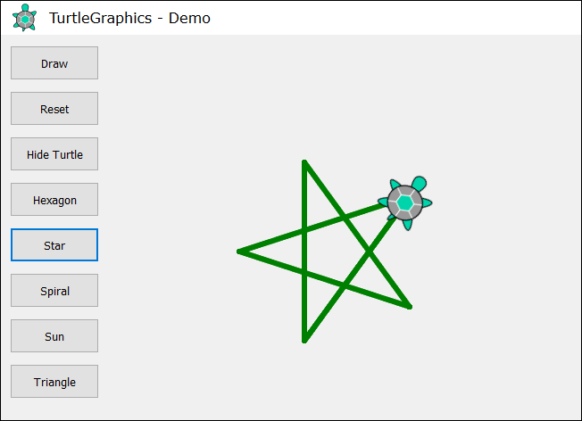

**Подсказка:**

Сменете цвета: **`$("#turtle").pen("green", "5")`** 

В цикъл повторете 5 пъти следното:
* Движение напред със 180.
* Ротация на 144 градуса.

### Задача * чертане на спирала с костенурката

Добавете функция за бутон [**Spiral**], който чертае спирала с 30 върха като на фигурата по-долу:

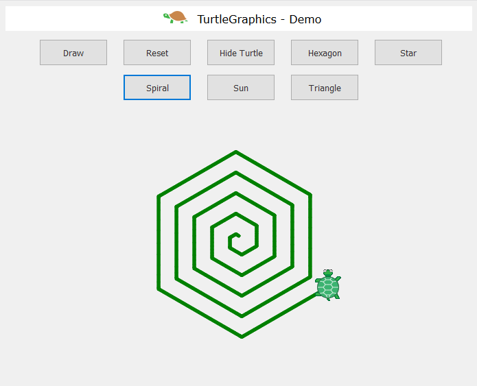

**Подсказка:**

Чертайте в цикъл, като движите напред и завъртате. С всяка стъпка увеличавайте постепенно дължината на движението с 5 напред и завъртайте на 60 градуса.

### Задача: * чертане на слънце с костенурката

Добавете функция за бутон [**Sun**], който чертае слънце с 36 върха като на фигурата по-долу:


**Подсказка:**
 
В цикъл повторете 36 пъти следното:
* Движение напред с 200.
* Ротация на 170 градуса.

### Задача: * чертане на спирален триъгълник с костенурката

Добавете функция за бутон [**Triangle**], който чертае три триъгълника с по 22 върха като на фигурата по-долу:

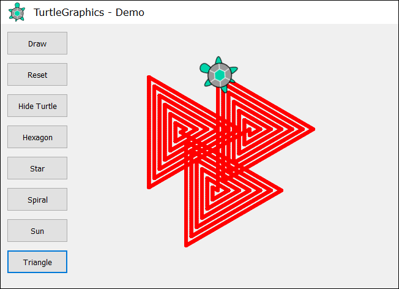

**Подсказка:**

Чертайте в цикъл като движите напред и завъртате. С всяка стъпка увеличавайте с 10 дължината на движението напред и завъртайте на 120 градуса. Повторете в още един цикъл 3 пъти за трите триъгълника.

Ако имате проблеми с примерния проект по-горе, питайте във **форума на СофтУни**: https://softuni.bg/forum.
