# Глава 7.1. По-сложни цикли

След като научихме какво представляват и за какво служат **`for` циклите**, сега предстои да се запознаем с **други видове цикли**, както и с някои **по-сложни конструкции за цикъл**. Те ще разширят познанията ни и ще ни помагат в решаването на по-трудни и по-предизвикателни задачи. По-конкретно, ще разгледаме как се ползват следните програмни конструкции:

  * цикли **със стъпка**
  * **`while`** цикли
  * **`do-while`** цикли
  * **безкрайни** цикли

В настоящата тема ще разберем и какво представлява операторът **`break`**, както и **как** чрез него да **прекъснем** един цикъл.


## Видео

<div class="video-player">
  Гледайте видео-урок по тази глава тук: <a target="_blank"
  href="https://www.youtube.com/watch?v=KuaOHr3RpNs">
  https://www.youtube.com/watch?v=KuaOHr3RpNs</a>.
</div>


## Цикли със стъпка

В главата **"Повторения (цикли)"** научихме как работи **`for`** цикълът и вече знаем кога и с каква цел да го използваме. В тази тема ще обърнем **внимание** на една определена и много важна **част от конструкцията** му, а именно **стъпката**.  

### Какво представлява стъпката?

**Стъпката** е тази **част** от конструкцията на **`for`** цикъла, която указва с **колко** да се **увеличи** или **намали** стойността на **водещата** му променлива. Тя се декларира последна в скелета на **`for`** цикъла.

Най-често е с **размер `1`** и в такъв случай, вместо да пишем **`i += 1`** или **`i -= 1`**, можем да използваме операторите 
**`i++`** или **`i--`**. Ако искаме стъпката ни да е **различна от 1**, при увеличение използваме оператора **`i +=` + `размера на стъпката`**, а при намаляване **`i -=` + `размера на стъпката`**. При стъпка 3, цикълът би изглеждал по следния начин: 


Следва поредица от примерни задачи, решението на които ще ни помогне да разберем по-добре употребата на **стъпката** във **`for`** цикъл.

### Пример: числата от 1 до N през 3

Да се напише програма, която отпечатва числата **от 1 до n** със **стъпка 3**. Например, **ако n = 100**, то резултатът ще е: **1, 4, 7, 10, …, 94, 97, 100**.

Можем да решим задачата чрез следната поредица от действия (алгоритъм):

  * Създаваме функция, която ще приема числото **`n`**.
  * Изпълняваме **`for` цикъл** от **1** до **`n`** с размер на стъпката **3**.
  * В **тялото на цикъла** отпечатваме стойността на текущата стъпка.
  
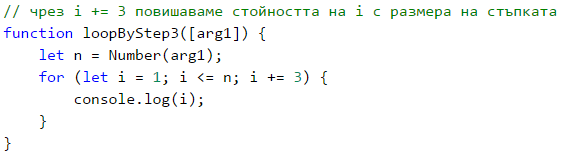

#### Тестване в Judge системата

Тествайте решението си тук: [https://judge.softuni.bg/Contests/Practice/Index/937#0](https://judge.softuni.bg/Contests/Practice/Index/937#0).

### Пример: числата от N до 1 в обратен ред

Да се напише програма, която отпечатва числата **от n до 1 в обратен ред** (стъпка -1). Например, **ако n = 100**, то резултатът ще е: **100, 99, 98, …, 3, 2, 1**.

Можем да решим задачата по следния начин:

  * Създаваме функция, която ще приема числото **`n`**.
  * В него изпълняваме **`for` цикъл**, като присвояваме **`let i = n`** .
  * Обръщаме условието на цикъла: **`i >= 1`**.
  * Дефинираме размера на стъпката: **-1**.
  * В **тялото на цикъла** отпечатваме стойността на текущата стъпка.

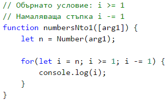

#### Тестване в Judge системата

Тествайте решението си тук: [https://judge.softuni.bg/Contests/Practice/Index/937#1](https://judge.softuni.bg/Contests/Practice/Index/937#1).

### Пример: числата от 1 до 2^n с for цикъл

В следващия пример ще разгледаме ползването на обичайната стъпка с размер 1.

Да се напише програма, която отпечатва числата **от 1 до 2^n** (две на степен n). Например, **ако n = 10**, то резултатът ще е **1, 2, 4, 8, 16, 32, 64, 128, 256, 512, 1024**.

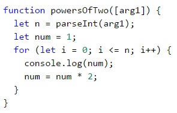

#### Тестване в Judge системата

Тествайте решението си тук: [https://judge.softuni.bg/Contests/Practice/Index/937#2](https://judge.softuni.bg/Contests/Practice/Index/937#2).

### Пример: четни степени на 2

Да се отпечатат **четните** степени на **2** до **2^n**: **2^0, 2^2, 2^4, 2^8, …, 2^n**. Например, ако **n = 10**, то резултатът ще е **1, 4, 16, 64, 256, 1024**.

Ето как можем да решим задачата:

  * Създаваме функция, която ще приема числото **`n`**.
  * Декларираме променлива **`num`** за текущото число, на която присвояваме начална **стойност 1**.
  * За **стъпка** на цикъла задаваме стойност **2**.
  * В **тялото на цикъла**: oтпечатваме стойността на текущото число и **увеличаваме текущото число `num` 4 пъти** (според условието на задачата).

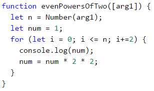

#### Тестване в Judge системата

Тествайте решението си тук: [https://judge.softuni.bg/Contests/Practice/Index/937#3](https://judge.softuni.bg/Contests/Practice/Index/937#3).

## While цикъл

Следващият вид цикли, с които ще се запознаем, се наричат **`while` цикли**. Специфичното при тях е, че повтарят блок от команди, **докато дадено условие е истина**. Като структура се различават от тази на **`for`** циклите, но имат по-опростен синтаксис.


### Какво представлява while цикълът?

В програмирането **`while` цикълът** се използва, когато искаме да **повтаряме** извършването на определена логика, докато **е в сила дадено условие**. Под "**условие**", разбираме всеки **израз**, който връща **`true`** или **`false`**. Когато **условието** стане **грешно**, **`while`** цикълът **прекъсва** изпълнението си и програмата **продължава** с изпълняването на кода след цикъла. Конструкцията за **`while` цикъл** изглежда по този начин:

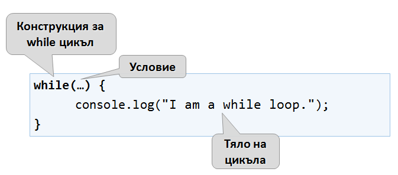

Следва поредица от примерни задачи, решението на които ще ни помогне да разберем по-добре употребата на **`while`** цикъла.


### Пример: редица числа 2k+1

Да се напише програма, която отпечатва всички **числа ≤ n** от редицата: **1, 3, 7, 15, 31, …**, като приемем, че всяко следващо число = **предишно число \* 2 + 1**.

Ето как можем да решим задачата:

* Създаваме функция, която ще приема числото **`n`**.
* Декларираме променлива **`num`** за текущото число, на която присвояваме начална **стойност 1**.
* За условие на цикъла слагаме **текущото число <= n**.
* В **тялото на цикъла**: отпечатваме стойността на променливата и я увеличаваме, използвайки формулата от условието на задачата.

Ето и примерна реализация на описаната идея:

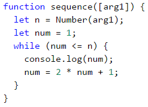
 
#### Тестване в Judge системата

Тествайте решението си тук: [https://judge.softuni.bg/Contests/Practice/Index/937#4](https://judge.softuni.bg/Contests/Practice/Index/937#1).

### Пример: число в диапазона [1 … 100]

Да се въведе цяло число в диапазона [**1 … 100**]. Ако то е невалидно, да се въведе отново. В случая, за невалидно число ще считаме всяко такова, което **не е** в зададения диапазон.

За да решим задачата, можем да използваме следния алгоритъм:

* Декларираме променлива **`i`**, на която присвояваме начална стойност **0**. Чрез нея ще запазваме позицията на всяко число, което е подадено на функцията.
* Декларираме променлива **`num`**, на която присвояваме целочислената стойност на пърия аргумент, подаден на функцията.
* За условие на цикъла слагаме израз, който е **`true`**, ако числото **не е** в диапазона, посочен в условието.
* В **тялото на цикъла**: увеличаваме **`i`**, за да може, при следващото завъртане на цикъла, да вземем следващото число, което е подадено на функцията. Отпечатваме съобщение със съдържание "**Invalid number!**" на конзолата, след което присвояваме нова стойност за **`num`** (следващия аргумент, подаден на функцията).
* След като вече сме валидирали числото, извън тялото на цикъла отпечатваме стойността му.

Ето и примерна реализация на алгоритъма чрез **`while` цикъл**:

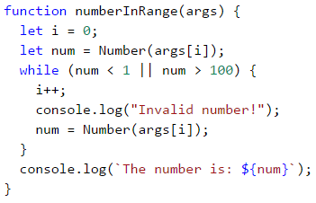

#### Тестване в Judge системата

Тествайте решението си тук: [https://judge.softuni.bg/Contests/Practice/Index/937#5](https://judge.softuni.bg/Contests/Practice/Index/937#5).


## Най-голям общ делител (НОД)

Преди да продължим към следващата задача, е необходимо да се запознаем с определението за **най-голям общ делител** (**НОД**).

**Определение за НОД**: най-голям общ делител на две **естествени** числа **a** и **b** е най-голямото число, което се дели **едновременно** и на **a**, и на **b** без остатък. Например:


|a|b|НОД| 
|:---:|:---:|:---:| 
|24|16|8|
|67|18|1|
|12|24|12|
|15|9|3|
|10|10|10|
|100|88|4|

## Алгоритъм на Евклид

В следващата задача ще използваме един от първите публикувани алгоритми за намиране на НОД - **алгоритъм на Евклид**:

**Докато** не достигнем остатък 0:

* Делим по-голямото число на по-малкото.
* Вземаме остатъка от делението.

**Псевдо-код** за алгоритъма на Евклид:

```javascript
while b ≠ 0
  var oldB = b;
  b = a % b;
  a = oldB;
print а;
```

### Пример: най-голям общ делител (НОД)

Да се подадат **цели** числа **a** и **b** и да се намери **НОД(a, b)**.

Ще решим задачата чрез **алгоритъма на Евклид**:

* Декларираме променливи **`a`** и **`b`**, на които присвояваме **целочислени** стойности, подадени на функцията.
* За условие на цикъла слагаме израз, който е **`true`**, ако числото **`b`** **е различно** от **0**.
* В **тялото на цикъла** следваме указанията от псевдо кода:
   * Декларираме временна променлива, на която присвояваме **текущата** стойност на **`b`**.
   * Присвояваме нова стойност на **`b`**, която е остатъка от делението на **`a`** и **`b`**.
   * На променливата **`a`** присвояваме **предишната** стойност на променливата **`b`**.
* След като цикълът приключи и сме установили НОД, го отпечатваме на екрана.

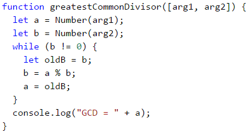

#### Тестване в Judge системата

Тествайте решението си тук: [https://judge.softuni.bg/Contests/Practice/Index/937#6](https://judge.softuni.bg/Contests/Practice/Index/937#6).

## Do-while цикъл

Следващият цикъл, с който ще се запознаем, е **`do-while`**, в превод - **прави-докато**. По структура, той наподобява **`while`**, но има съществена разлика между тях. Тя се състои в това, че **`do-while`** ще изпълни тялото си **поне веднъж**. Защо се случва това? В конструкцията на **`do-while`** цикъла, **условието** винаги се проверява **след** тялото му, което от своя страна гарантира, че при **първото завъртане** на цикъла, кодът ще се **изпълни**, а **проверката за край на цикъл** ще се прилага върху всяка **следваща** итерация на **`do-while`**. 

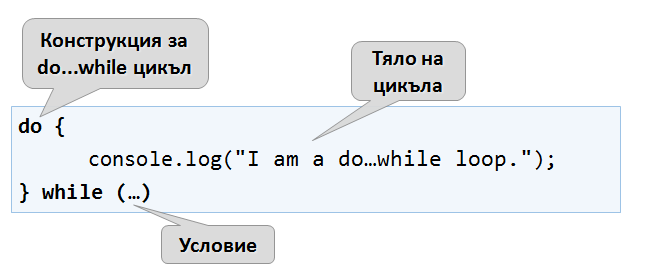

Следва обичайната поредица от примерни задачи, чиито решения ще ни помогнат да разберем по-добре **`do-while`** цикъла.


### Пример: изчисляване на факториел

За естествено число **n** да се изчисли **n! = 1 \* 2 \* 3 \* … \* n**. Например, ако **n = 5**, то резултатът ще бъде: **5!** = 1 \* 2 \* 3 \* 4 \* 5 = **120**.

Ето как по-конкретно можем да пресметнем факториел:

* Декларираме променливата **`n`**, на която присвояваме целочислена стойност подадена на функцията.
* Създаваме още една променлива - **`fact`**, чиято начална стойност е 1. Нея ще използваме за изчислението и съхранението на факториела.
* За условие на цикъла ще използваме **`n > 1`**, тъй като всеки път, когато извършим изчисленията в тялото на цикъла, ще намаляваме стойността на **`n`** с 1.
* В тялото на цикъла:
   * Присвояваме нова стойност на **`fact`**, която е резултат от умножението на текущата стойност на **`fact`** с текущата стойност на **`n`**.
   * Намаляваме стойността на **`n`** с **-1**.
* Извън тялото на цикъла отпечатваме крайната стойност на факториела.

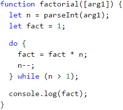

#### Тестване в Judge системата

Тествайте решението си тук: [https://judge.softuni.bg/Contests/Practice/Index/937#7](https://judge.softuni.bg/Contests/Practice/Index/937#7).

### Пример: сумиране на цифрите на число

Да се сумират цифрите на цяло **положително** число **n**. Например, ако **n = 5634**, то резултатът ще бъде: 5 + 6 + 3 + 4 = **18**.

Можем да използваме следната идея, за да решим задачата:

* Декларираме променливата **`n`**, на която присвояваме стойност, равна на въведеното от потребителя число.
* Създаваме втора променлива - **`sum`**, чиято начална стойност е 0. Нея ще използваме за изчислението и съхранението на резултата.
* За условие на цикъла ще използваме **`n > 0`**, тъй като след всяко изчисление на резултата в тялото на цикъла, ще премахваме последната цифра от **`n`**.
* В тялото на цикъла:
   * Присвояваме нова стойност на **`sum`**, която е резултат от събирането на текущата стойност на **`sum`** с последната цифра на **`n`**.
   * Присвояваме нова стойност на **`n`**, която е резултат от премахването на последната цифра от **`n`**.
* Извън тялото на цикъла отпечатваме крайната стойност на сумата.

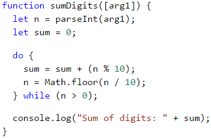

<table><tr><td></td>
<td><code><strong>n % 10</strong></code>: <b>връща</b> последната цифра на числото <code><strong>n</strong></code>.<br>
<code><strong>Math.floor(n / 10)</strong></code>: <b>изтрива</b> последната цифра на <code><strong>n</strong></code>.</td>
</tr></table>

#### Тестване в Judge системата

Тествайте решението си тук: [https://judge.softuni.bg/Contests/Practice/Index/937#8](https://judge.softuni.bg/Contests/Practice/Index/937#8).

## Безкрайни цикли и операторът break

До момента се запознахме с различни видове цикли, като научихме какви конструкции имат те и как се прилагат. Следва да разберем какво е **безкраен цикъл**, кога възниква и как можем да **прекъснем** изпълнението му чрез оператора **`break`**.

### Безкраен цикъл. Що е то?

Безкраен цикъл наричаме този цикъл, който **повтаря безкрайно** изпълнението на тялото си. При **`while`** и **`do-while`** циклите проверката за край е условен израз, който **винаги** връща **`true`**. Безкраен **`for`** възниква, когато **липсва условие за край**. 

Ето как изглежда **безкраен `while`** цикъл:

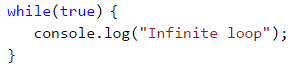

А така изглежда **безкраен `for`** цикъл:

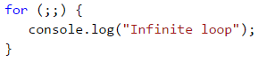


### Оператор break

Вече знаем, че безкрайният цикъл изпълнява определен код до безкрайност, но какво става, ако желаем в определен момент при дадено условие, да излезем принудително от цикъла? На помощ идва операторът **`break`**, в превод - **спри, прекъсни**.

<table><tr><td></td>
<td>Операторът <b><code>break</code></b> спира изпълнението на цикъла към момента, в който е извикан, и продължава от първия ред след края на цикъла. Това означава, че текущата итерация на цикъла няма да бъде завършена до край и съответно останалата част от кода в тялото на цикъла няма да се изпълни.</td>
</tr></table>

### Пример: прости числа

В следващата задача се изисква да направим **проверка за просто число**. Преди да продължим към нея, нека си припомним какво са простите числа.

**Определение**: едно цяло число е **просто**, ако се дели без остатък единствено на себе си и на 1. По дефиниция простите числа са положителни и по-големи от 1. Най-малкото просто число е **2**.

Можем да приемем, че едно цяло число **n** е просто, ако **n > 1** и **n** не се дели на число между **2** и **n-1**.

Първите няколко прости числа са: 2, 3, 5, 7, 11, 13, 17, 19, 23, 29, 31, 37, 41, 43, …

За разлика от тях, **непростите (композитни) числа** са такива числа, чиято композиция е съставена от произведение на прости числа.

Ето няколко примерни непрости числа: 
* **10** = 2 * 5
* **42** = 2 * 3 * 7
* **143** = 13 * 11

**Алгоритъм за проверка** дали дадено цяло число е **просто**: проверяваме дали **n > 1** и дали **n** се дели на **2**, **3**, …, **n-1** без остатък.
* Ако се раздели на някое от числата, значи е **композитно**.
* Ако не се раздели на никое от числата, значи е **просто**.

<table><tr><td></td>
<td>Можем да оптимизираме алгоритъма, като вместо проверката да е до <code><strong>n-1</strong></code>, да се проверяват делителите до <code><strong>√n</strong></code>. Помислете защо.</td>
</tr></table>

### Пример: проверка за просто число. Оператор break

Да се провери дали едно число **n** е просто. Това ще направим като проверим дали **n** се дели на числата между 2 и √n.

Ето го алгоритъма за проверка за просто число, разписан постъпково:

* Декларираме променливата **`n`**, на която присвояваме цялото число, което е подадено на функцията.
* Създаваме булева променлива **`prime`** с начална стойност **`true`**. Приемаме, че едно число е просто до доказване на противното.
* Създаваме **`for`** цикъл, чиято начална стойност за променливата на цикъла задаваме 2, за условие **текущата ѝ стойност `<= √n`**. Стъпката на цикъла е 1.
* В **тялото на цикъла** проверяваме дали **`n`**, разделено на **текущата стойност** има остатък. Ако от делението **няма остатък**, то променяме **`prime`** на **`false`** и излизаме принудително от цикъла чрез оператор **`break`**.
* В зависимост от стойността на **`prime`** отпечатваме дали числото е просто (**`true`**) или съответно съставно (**`false`**).

Ето и примерна имплементация на описания алгоритъм:

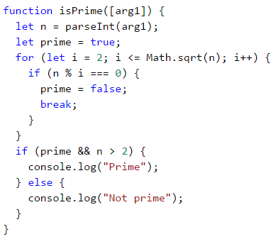

Оставаме да добавите **проверка дали входното число е по-голямо от 1**, защото по дефиниция числа като 0, 1, -1 и -2 не са прости.

#### Тестване в Judge системата

Тествайте решението си тук: [https://judge.softuni.bg/Contests/Practice/Index/937#9](https://judge.softuni.bg/Contests/Practice/Index/937#9).

### Пример: оператор break в безкраен цикъл

Да се напише програма, която проверява дали едно число **n** е четно, ако е - да се отпечатва на екрана. За четно считаме число, което се дели на 2 без остатък. При невалидно число да се връща към повторно въвеждане и да се изписва съобщение, което известява, че въведеното число не е четно.

Ето една идея как можем да решим задачата:

* Декларираме променлива **`i`**, на която присвояваме начална стойност **0**. Чрез нея ще запазваме позицията на всяко число, което е подадено на функцията.
* Декларираме променлива **`num`**, на която присвояваме начална стойност **0**.
* Създаваме безкраен **`while`** цикъл, като за условие ще зададем **`true`**.
* В **тялото на цикъла**:
   * Вземаме целочислена стойност, която е подадена на функцията и я присвояваме на **`num`**.
   * Ако **числото е четно**, излизаме от цикъла чрез **`break`**. 
   * В **противен случай** извеждаме съобщение, което гласи, че **числото не е четно**. Увеличаваме **`i`**, за да може, при следващото завъртане на цикъла, да вземем следващото число, което е подадено на функцията. Итерациите продължават, докато не се въведе четно число.
* Отпечатваме четното число на екрана.

Ето и примерна имплементация на идеята:

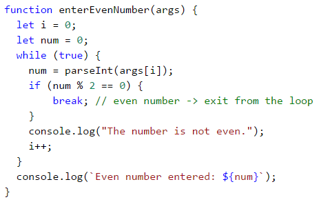

#### Тестване в Judge системата

Тествайте решението си тук: [https://judge.softuni.bg/Contests/Practice/Index/937#10](https://judge.softuni.bg/Contests/Practice/Index/937#10).

## Вложени цикли и операторът break

След като вече научихме какво са **вложените цикли** и как работи операторът **`break`**, е време да разберем как работят двете заедно. За по-добро разбиране, нека стъпка по стъпка да напишем **програма**, която трябва да направи всички възможни комбинации от **двойки числа**. Първото число от комбинацията е нарастващо от 1 до 3, а второто е намаляващо от 3 до 1. Задачата трябва да продължи изпълнението си, докато **`i + j`** **не** е равно на 2 (т.е. **`i = 1`** и **`j = 1`**).

Желаният резултат е:

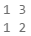

Ето едно **грешно решение**, което изглежда правилно на пръв поглед:


Ако оставим програмата ни по този начин, резултатът ни ще е следният:

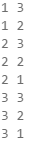

Защо се получава така? Както виждаме, в резултата **липсва "1 1"**. Когато програмата стига до там, че **`i = 1`** и **`j = 1`**, тя влиза в **`if`** проверката и изпълнява **`break`** операцията. По този начин се **излиза от вътрешния цикъл**, но след това продължава изпълнението на външния. **`i`** нараства, програмата влиза във вътрешния цикъл и принтира резултата.

<table><tr><td></td>
<td>Когато във <b>вложен цикъл</b> използваме оператора <b><code>break</code></b>, той прекъсва изпълнението <b>само</b> на вътрешния цикъл.</td>
</tr></table>

Какво е **правилното решение**? Един начин за решаването на този проблем е чрез деклариране на **`bool` променлива**, която следи за това, дали трябва да продължава въртенето на цикъла. При нужда от изход (излизане от всички вложени цикли), променливата сменя стойността си на  **`true`** и се излиза от вътрешния цикъл с **`break`**, а при последваща проверка се напуска и външния цикъл. Ето и примерна имплементация на тази идея:

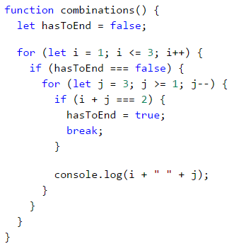

По този начин, когато **`i + j = 2`**, програмата ще направи променливата **`hasToEnd = true`** и ще излезе от вътрешния цикъл. При следващото завъртане на външния цикъл, чрез **`if`** проверката, програмата няма да може да стигне до вътрешния цикъл и ще прекъсне изпълнението си. 

### Тестване в Judge системата

Тествайте решението си тук: [https://judge.softuni.bg/Contests/Practice/Index/937#11](https://judge.softuni.bg/Contests/Practice/Index/937#11).

## Задачи с цикли

В тази глава се запознахме с няколко нови вида цикли, с които могат да се правят повторения с по-сложна програмна логика. Да решим няколко задачи, използвайки новите знания.

### Задача: числа на Фибоначи

Числата на Фибоначи в математиката образуват редица, която изглежда по следния начин: **1, 1, 2, 3, 5, 8, 13, 21, 34, …**.

**Формулата** за образуване на редицата е:

```javascript
F0 = 1
F1 = 1
Fn = Fn-1 + Fn-2
```

#### Примерен вход и изход

|Вход (n)|Изход|Коментар|
|----|-----|---------|
|10|89|F(11) = F(9) + F(8)|
|5|8|F(5) = F(4) + F(3)|
|20|10946|F(20) = F(19) + F(18)|
|0|1| |
|1|1| |

Да се въведе **цяло** число **n** и да се пресметне **n-тото число на Фибоначи**.

#### Насоки и подсказки

Идея за решаване на задачата:

* Декларираме **променлива `n`**, на която присвояваме целочислена стойност, подадена на функцията.
* Създаваме променливите **`f0`** и **`f1`**, на които присвояваме стойност **1**, тъй като така започва редицата.
* Създаваме **`for`** цикъл с условие **текущата стойност `i < n - 1`**.
* В **тялото на цикъла:**
   * Създаваме **временна** променлива **`fNext`**, на която присвояваме следващото число в поредицата на Фибоначи.
   * На **`f0`** присвояваме текущата стойност на **`f1`**.
   * На **`f1`** присвояваме стойността на временната променлива **`fNext`**.
* Извън цикъла отпечатваме числото n-тото число на Фибоначи.

Примерна имплементация:

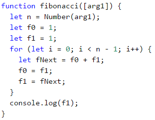

#### Тестване в Judge системата

Тествайте решението си тук: [https://judge.softuni.bg/Contests/Practice/Index/937#12](https://judge.softuni.bg/Contests/Practice/Index/937#12).

### Задача: пирамида от числа

Да се отпечатат **числата 1 … n в пирамида** като в примерите по долу. На първия ред печатаме едно число, на втория ред печатаме две числа, на третия ред печатаме три числа и т.н. докато числата свършат. На последния ред печатаме толкова числа, колкото останат докато стигнем до **n**.

#### Примерен вход и изход

|Вход |Изход                 |Вход |Изход          |Вход      |Изход                         |
|-----|----------------------|-----|---------------|----------|------------------------------|
|7    |1<br>2 3<br>4 5 6<br>7|5    |1<br>2 3<br>4 5|10        |1<br>2 3<br>4 5 6<br>7 8 9 10 |

#### Насоки и подсказки

Можем да решим задачата с **два вложени цикъла** (по редове и колони) с печатане в тях и излизане при достигане на последното число. Ето идеята, разписана по-подробно:

* Декларираме променлива **`n`**, на която присвояваме целочислена стойност, подадена на функцията.
* Декларираме променлива **`num`** с начална стойност 1. Тя ще пази броя на отпечатаните числа. При всяка итерация ще я **увеличаваме** с **1** и ще я добавяме към текущия ред.
* Декларираме променлива **`result`**, която ще е текущият ред и към която ще добавяме стойността на текущата клетка.
* Създаваме **външен** **`for`** цикъл, който ще отговаря за **редовете** в таблицата. Наименуваме променливата на цикъла **`row`** и ѝ задаваме начална стойност 1. За условие слагаме **`row < n`**. Размерът на стъпката е 1.
* В тялото на цикъла създаваме **вътрешен** **`for`** цикъл, който ще отговаря за **колоните** в таблицата. Наименуваме променливата на цикъла **`col`** и ѝ задаваме начална стойност 1. За условие слагаме **`col < row`** (**`row`** = брой цифри на ред). Размерът на стъпката е 1.
* В тялото на вложения цикъл:
   * Проверяваме дали **`col > 1`**, ако да – добавяме разстояние към променливата **`result`**. Ако не направим тази проверка, а директно добавяме разстоянието, ще имаме ненужно такова в началото на всеки ред.
   * **Запазваме** числото **`num`** в текущата клетка на таблицата и го **увеличаваме с 1**.
   * Правим проверка за **`num > n`**. Ако **`num`** е по-голямо от **`n`**, **прекъсваме** въртенето на **вътрешния цикъл**.
* Отпечатваме стойността на променливата **`result`**, след което й задаваме нова празна стойност. По този начин ще преминем на следващия ред.
* Отново проверяваме дали **`num > n`**. Ако е по-голямо, **прекъсваме** изпълнението на **програмата ни** чрез `break`. 

Ето и примерна имплементация:

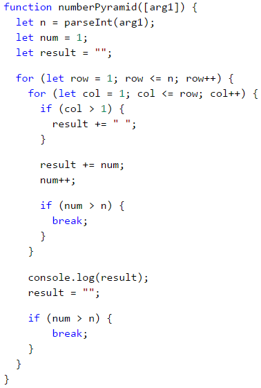

#### Тестване в Judge системата

Тествайте решението си тук: [https://judge.softuni.bg/Contests/Practice/Index/937#13](https://judge.softuni.bg/Contests/Practice/Index/937#13).


### Задача: таблица с числа

Да се отпечатат числата 1 … n в таблица като в примерите по-долу.

#### Примерен вход и изход

|Вход |Изход|Вход|Изход|
|--------|-----|-------|-----|
|3|1 2 3<br>2 3 2<br>3 2 1|4|1 2 3 4<br>2 3 4 3<br>3 4 3 2<br>4 3 2 1|

#### Насоки и подсказки

Можем да решим задачата с **два вложени цикъла** и малко изчисления в тях:

* Взимаме размера на таблицата от целочислената променлива **`n`**, която е подадена на функцията.
* Декларираме променлива **`result`**, която ще е текущият ред и към която ще добавяме стойността на текущата клетка.
* Създаваме **`for`** цикъл, който ще отговаря за редовете в таблицата. Наименуваме променливата на цикъла **`row`** и ѝ задаваме начална **стойност 0**. За условие слагаме **`row < n`**. Размерът на стъпката е 1.
* В **тялото на цикъла** създаваме вложен **`for`** цикъл, който ще отговаря за колоните в таблицата. Наименуваме променливата на цикъла **`col`** и ѝ задаваме начална **стойност 0**. За условие слагаме **`col < n`**. Размерът на стъпката е 1.
* В **тялото на вложения цикъл**:
   * Създаваме променлива **`num`**, на която присвояваме резултата от **текущият ред + текущата колона + 1** (+1, тъй като започваме броенето от 0).
   * Правим проверка за **`num > n`**. Ако **`num`** е **по-голямо** от **`n`**, присвояваме нова стойност на **`num`** равна на **два пъти **`n`** - текущата стойност за **`num`**. Това правим с цел да не превишаваме **`n`** в никоя от клетките на таблицата.
    * Добавяме числото от текущата клетка в променливата **`result`**.
* Отпечатваме стойността на **result**, след което й задаваме нова празна стойност. По този начин ще преминем на следващия ред.

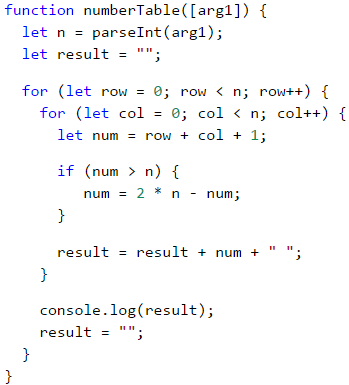

#### Тестване в Judge системата

Тествайте решението си тук: [https://judge.softuni.bg/Contests/Practice/Index/937#14](https://judge.softuni.bg/Contests/Practice/Index/937#14).

## Какво научихме от тази глава?

Можем да използваме **`for`** цикли със **стъпка**:

```javascript
for (let i = 1; i <= n; i+=3) {
   console.log(i);
}
```

Циклите **`while`** / **`do-while`** се повтарят докато е в сила дадено **условие**:

```javascript
let num = 1;
while (num <= n) {
   console.log(num++);
}
```

Ако се наложи да **прекъснем** изпълнението на цикъл, го правим с оператора **`break`**:

```javascript
let n = 0;
while (true) {
   n = parseInt(arg1);
   if (n % 2 === 0) {
      break; // even number -> exit from the loop
   }
   console.log("The number is not even.");
}
console.log(`Even number entered: ${num}`);
```

