# Глава 10. Функции

**JavaScript**  е известен като **функционален език** за програмиране. Самото наименование подсказва, че **функциите** са изключително важна част от езика.  

В настоящата глава ще се запознаем с **функциите** и ще научим какво **представляват** те, както и кои са **базовите концепции** при работа с тях. Ще научим защо е **добра практика** да ги използваме, как да ги **декларираме** и **извикваме**. Ще се запознаем с **параметри** и **връщана стойност от функция**, както и как да използваме тази връщана стойност. Накрая на главата, ще разгледаме **утвърдените практики** при използване на функциите.

## Какво е "функция"?

До момента установихме, че при **писане** на код на програма, която решава дадена задача, ни **улеснява** това, че **разделяме** задачата на **части**. Всяка част отговаря за **дадено действие** и по този начин не само ни е **по-лесно** да решим задачата, но и значително се подобрява както **четимостта** на кода, така и проследяването за грешки.

Всяко едно парче код, което изпълнява дадена функционалност и което сме отделили логически се нарича **функция**. Точно това представляват **функциите – парчета код, които са именувани** от нас по определен начин и които могат да бъдат **извикани** толкова пъти, колкото имаме нужда и ще бъдат изпълнени съответния брой пъти.

Една **функция** може да бъде **извиканa** толкова пъти, колкото ние преценим, че ни е нужно за решаване на даден проблем. Това ни **спестява** повторението на един и същи код няколко пъти, както и **намалява** възможността да пропуснем грешка при евентуална корекция на въпросния код.

### Прости функции

**Простите** функции отговарят за изпълнението на дадено **действие**, което **спомага** за решаване на определен проблем. Такива действия могат да бъдат разпечатване на даден низ на конзолата, извършване на някаква проверка, изпълнение на цикъл и други.

Нека разгледаме следния **пример за проста функция**:

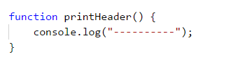

Тази **функция** има задачата да отпечата заглавие, което представлява поредица от символа **`-`**. Поради тази причина името ѝ е **`printHeader`**. Кръглите скоби **`( `** и **`)` винаги** следват името, независимо как сме именували функцията. По-късно ще разгледаме как трябва да именуваме функциите, с които работим, а за момента ще отбележим само, че е важно **името на функцията да описва действието**, което тя извършва.

**Тялото** на функцията съдържа **програмния код**, който се намира между къдравите скоби **`{`** и **`}`**. Между тях поставяме кода, който решава проблема, описан от името на функцията.

### Защо да използваме функции?

До тук установихме, че функциите спомагат за **разделянето на обемна задача на по-малки части**, което води до **по-лесно решаване** на въпросното задание. Това прави програмата ни не само по-добре структурирана и **лесно четима**, но и по-разбираема.

Чрез функциите **избягваме повторението** на програмен код. **Повтарящият** се код е **лоша** практика, тъй като силно **затруднява поддръжката** на програмата и води до грешки. Ако дадена част от кода ни присъства в програмата няколко пъти и се наложи да променим нещо, то промените трябва да бъдат направени във всяко едно повторение на въпросния код. Вероятността да пропуснем място, на което трябва да нанесем корекция, е много голяма, което би довело до некоректно поведение на програмата. Това е причината, поради която е **добра практика**, ако използваме даден фрагмент код **повече от веднъж** в програмата си, да го **дефинираме като отделена функция**. 

Функциите ни предоставят **възможността** да използваме даден **код няколко пъти**. С решаването на все повече и повече задачи ще установите, че използването на вече декларирани функции спестява много време и усилия. 

## Деклариране на функции

В езика JavaScript можем да **декларираме** функции буквално навсякъде, по същият начин, по който можем да декларираме и променливи навсякъде. Декларирането представлява **регистрирането на функцията** в програмата, за да бъде разпозната в останалата част от нея. 

JavaScript не е **силно типизиран** език (strongly typed). Затова и когато **декларираме функция** тя няма тип (string, number, array и т.н.), какъвто имат методите и функциите в другите езици за програмиране.

Има 2 основни начина, по които могат да се декларирате функции в JavaScript - **декларативно - function declaration** и **експресивно - function expression**.

### Декларативно (function declaration)

Със следващия пример ще разгледаме задължителните елементи в декларацията на една функция **декларативно (function declaration)**.


* **Ключовата думичка function**. Започваме с използването на **ключовата думичка** ***function***, чрез която заявяваме, че предстои декларация на функция. Наричаме я ключова, защото тя е запазена в езика JavaScript или с други думи казано - не можем да имаме променлива, която да именуваме по този начин.
* **Име на функцията**. Името на функцията е **определено от нас**, като не забравяме, че трябва да **описва задачата**, която се изпълнявана от кода в тялото на функцията. В примера името е **`getSquare`**, което ни указва, че задачата на тази функция е да изчисли лицето на квадрат.
* **Списък с параметри**. Декларира се между скобите **`(`** и **`)`**, които изписваме след името му. Тук изброяваме поредицата от **параметри**, които функцията ще използва. Може да присъства **само един** параметър, **няколко** такива или да е **празен** списък. Ако няма параметри, то ще запишем само скобите **`()`**. В конкретния пример декларираме параметъра **`n`**.
* **Тяло на функцията**. Декларира се между скобите **`{`** и **`}`**, които изписваме веднага след затварящата **`)`**. В **тялото на функцията** описваме **чрез код** всички операции, които искаме функцията да извърши. В тялото на функцията описваме **алгоритъма**, по който функцията решава даден проблем. Реализираме **логиката** на функцията. В показания пример изчисляваме лицето на квадрат, а именно **`n * n`**. 

При деклариране на функции е важно да спазваме **последователността** на основните елементи - първо **ключовата думичка function**, след това **име на функцията**, **списък от параметри**, ограден с кръгли скоби **`()`** и накрая **тяло на функцията**, оградено с фигурни скоби **`{}`**.

### Експресивно (function expression)

Със следващия пример ще разгледаме задължителните елементи в декларацията на една функция **експресивно (function expression)**. То доста наподобява **декларативното**, което вече разгледахме и може да се каже, че е **комбинация** от **деклариране на променлива** и **деклариране на функция декларативно (function declaration)**.

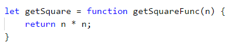

* **Ключовата думичка `let`**. Започваме с използването на **ключовата думичка** **`let`**, чрез която заявяваме, че предстои декларация на променлива.
* **Име на променливата**. Името на променливата е **определено от нас**. В примера името е **`getSquare`**, което ни указва, че задачата на тази функция е да изчисли лицето на квадрат.
* **Декларация на функция**. Използвайки същата структура, която вече научихме при **function declaration** - първо **ключовата думичка function**, след това **име на функцията**, **списък от параметри**, ограден с кръгли скоби **`()`** и накрая **тяло на функцията**, оградено с фигурни скоби **`{}`**. Особеното в случая е, че **името на функцията** не е задължителен елемент, но е препоръчително да свикнете да го добавяте. В примерът програмата ще работи без проблеми, дори и да пропуснем да изпишем името **`getSquareFunc`**. Ако пропуснем името, функцията се нарича **анонимна**.

Когато декларираме дадена променлива в тялото на една функция (чрез ключовата думичка **`let`** или **`const`**), я наричаме **локална** променлива за функцията. Областта, в която съществува и може да бъде използвана тази променлива, започва от реда, на който сме я декларирали и стига до затварящата къдрава скоба `}` на тялото на функцията. Тази област се нарича **област на видимост** на променливата (variable scope). 

### Декларативно или експресивно

Разликата между деклариране на функция чрез **декларация** или **експресия** е сравнително проста. Всички функции, декларирани чрез **function declaration**, се зареждат в паметта на програмата преди да започне нейното изпълнение, докато програмата разбира за функции, декларирани с **function expression** едва когато започне да се изпълнява и стигне до реда, на който е декларирана функцията. 

На практика това означава, че можете да **извикате функция**, декларирана с **function declaration** дори и в някои от предните редове - преди нейната декларация, докато ако опитате да направите това с **function expression**, програмата ще ви **даде грешка**, че не разпознава тази функция по време на изпълнението.

## Извикване на функции

Извикването на функции представлява **стартирането на изпълнението на кода**, който се намира в **тялото на функцията**. Това става като изпишем **името** на функцията, последвано от кръглите скоби **`()`** и знака **`;`** за край на реда. Ето един пример:

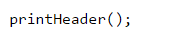

Дадена функция може да бъде извикана от **няколко места** в нашата програма. Единият начин е да бъде извикана от **главната област на програмата** (global scope).

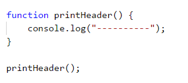

Функция може да бъде извикана и от **тялото на друга функция**, която **не** е главната област на програмата ни.

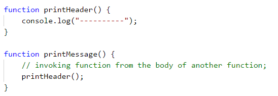

Съществува вариант функцията да бъде извикана от **собственото си тяло**. Това се нарича **рекурсия** и можете да намерите повече информация за нея в [Wikipedia](https://bg.wikipedia.org/wiki/%D0%A0%D0%B5%D0%BA%D1%83%D1%80%D1%81%D0%B8%D1%8F) или да потърсите сами в Интернет.

### Пример: празна касова бележка

Да се напише функция, която печата празна касова бележка. Функцията трябва да извиква други три функции: една за принтиране на заглавието, една за основната част на бележката и една за долната част.

|Част от касовата бележка|Текст|
|---|---|
|Горна част|CASH RECEIPT<br>------------------------------|
|Средна част|Charged to\_\_\_\_\_\_\_\_\_\_\_\_\_\_\_\_\_\_\_\_<br>Received by\_\_\_\_\_\_\_\_\_\_\_\_\_\_\_\_\_\_\_|
|Долна част|------------------------------<br>(c) SoftUni|

#### Примерен вход и изход

|Вход|Изход|
|---|---|
|(няма)|CASH RECEIPT<br>------------------------------<br>Charged to\_\_\_\_\_\_\_\_\_\_\_\_\_\_\_\_\_\_\_\_<br>Received by\_\_\_\_\_\_\_\_\_\_\_\_\_\_\_\_\_\_\_<br>------------------------------<br>(c) SoftUni|

#### Насоки и подсказки

Първата ни стъпка е да създадем функция за **принтиране на заглавната част** от касовата бележка (header). Нека ѝ дадем смислено име, което описва кратко и ясно задачата ѝ, например **`printReceiptHeader`**. В тялото ѝ ще напишем следния код:

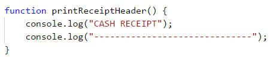

Съвсем аналогично ще създадем още две функции  **за разпечатване на средната част** на бележката (тяло) **`printReceiptBody`** и **за разпечатване на долната част** на бележката (footer) **`printReceiptFooter`**.

След това ще създадем и **още една функция**, която ще извиква трите функции, които написахме до момента една след друга:

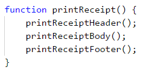

Накрая ще **извикаме** функцията **`printReceipt`** от global scope-a на нашата програма:

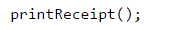

#### Тестване в Judge системата

Програмата с общо четири функции, които се извикват една от друга, е готова и можем **да я изпълним и тестваме**, след което да я пратим за проверка в Judge системата: [https://judge.softuni.bg/Contests/Practice/Index/943#0](https://judge.softuni.bg/Contests/Practice/Index/943#0).

## Функции с параметри

Много често в практиката, за да бъде решен даден проблем, функцията, с чиято помощ постигаме това, се нуждае от **допълнителна информация**, която зависи от задачата ѝ. Именно тази информация представляват **параметрите на функцията** и нейното поведение зависи от тях. 

### Използване на параметри във функции

Ако функцията ни изисква **входни данни**, то те се подават в скобите **`()`**, като последователността на **фактическите параметри** трябва да съвпада с последователността на подадените при декларирането на функцията. Както отбелязахме по-горе, **параметрите освен нула на брой, могат също така да са един или няколко**. При декларацията им ги разделяме със запетая.

**Декларираме** функцията **`printNumbers(...)`** и **списъка** с **параметри**, от които тя се нуждае, за да работи коректно, след което пишем кода, който ще изпълнява:

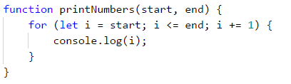

След това **извикваме** функцията, като ѝ **подаваме конкретни стойности**:

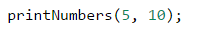

При **декларирането на параметри** трябва да внимаване всеки един параметър да има **име**. Важно е при извикване на функцията, да подаваме **стойности** за параметрите по **реда**, в който са **декларирани** самите те. В примера, който разгледахме на променливата **`start`** ще бъде присвоена стойността на първият подаден параметър - в нашият случай числото 5. На променливата **`end`** ще бъде присвоена стойността на вторият параметър, който сме подали - в случая числото 10.

Важно е да се отбележи, че в езикът **JavaScript** декларирането на функция с даден **брой параметри**, не ни задължава да извикваме функцията със **същият брой параметри**. Можем да извикаме функция като и подадем както **повече**, така и **по - малко** параметри, като това няма да доведе до грешка.

Нека разгледаме следния пример:

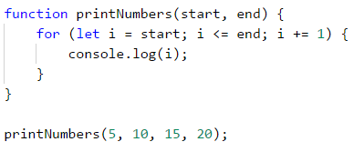

В случая извикваме функцията **`printNumbers(...)`** като и подаваме 4, вместо **декларираните** 2 параметъра. Всички излишни параметри ще бъдат **игнорирани**. Т.е. числата 15 и 20, няма да стигнат до функцията, защото нямаме **деклариран параметър**, който да ги приеме.

Нека разгледаме още един пример:

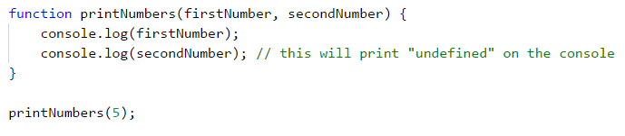

В случая извикваме функцията **`printNumbers(...)`** като и подаваме 1, вместо **декларираните** 2 параметъра. Всички параметри, за които **не е подадена стойност**, ще получат автоматично стойност **`undefined`**. В нашият случай променливата **`secondNumber`** ще има стойност **`undefined`**.

### Пример: знак на цяло число

Да се създаде функция, която печата знака на цяло число n.

#### Примерен вход и изход

|Вход|Изход|
|---|---|
|2|The number 2 is positive.|
|-5|The number -5 is negative.|
|0|The number 0 is zero.|

#### Насоки и подсказки

Първата ни стъпка е **декларирането** на функция и даването ѝ на описателно име, например **`printSign`**. Тази функция ще има само един параметър:

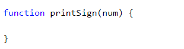

Следващата ни стъпка е **имплементирането** на логиката, по която програмата ни ще проверява какъв точно е знакът на числото. От примерите виждаме, че има три случая - числото е по-голямо от нула, равно на нула или по-малко от нула, което означава, че ще направим три проверки в тялото на функцията. 

Следващата ни стъпка е да извикаме функцията, която създадохме:

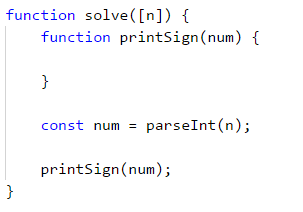

#### Тестване в Judge системата

Тествайте решението си тук: [https://judge.softuni.bg/Contests/Practice/Index/943#1](https://judge.softuni.bg/Contests/Practice/Index/943#1).


### Незадължителни параметри

Езикът **JavaScript** поддържа използването на **незадължителни** параметри. Те позволяват **пропускането** на параметри при извикването на функцията. Декларирането им става чрез **осигуряване на стойност по подразбиране** в описанието на съответния параметър.

Следващият пример онагледява употребата на незадължителните параметри:

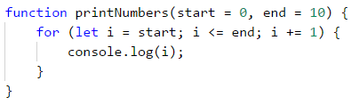

Показаната функция **`printNumbers(...)`** може да бъде извикана по няколко начина:

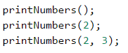

При липсата на **подадена стойност** на параметър, той ще **приеме стойността**, с която сме го **декларирали** при декларацията на функцията.

### Пример: принтиране на триъгълник

Да се създаде функция, която принтира триъгълник, както е показано в примерите.

#### Примерен вход и изход

|Вход|Изход|Вход|Изход|
|---|---|---|---|
|3|1<br>1 2<br>1 2 3<br>1 2<br>1|4|1<br>1 2<br>1 2 3<br>1 2 3 4 <br>1 2 3<br>1 2<br>1|

#### Насоки и подсказки

Избираме смислено име за функцията, което описва целта ѝ, например **`printLine`**, и я имплементираме:


От задачите за рисуване на конзолата си спомняме, че е добра практика **да разделяме фигурата на няколко части**. За наше улеснение ще разделим триъгълника на три части - горна, средна линия и долна.

Следващата ни стъпка е с цикъл да разпечатаме **горната половина** от триъгълника:

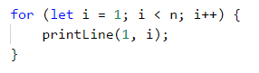

След това разпечатваме **средната линия**:

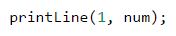

Накрая разпечатваме **долната част** от триъгълника, като този път стъпката на цикъла намалява.

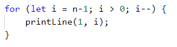

#### Тестване в Judge системата

Тествайте решението си тук: [https://judge.softuni.bg/Contests/Practice/Index/943#2](https://judge.softuni.bg/Contests/Practice/Index/943#2).


### Пример: рисуване на запълнен квадрат

Да се нарисува на конзолата запълнен квадрат със страна n, както е показно в примерите.

#### Примерен вход и изход

|Вход|Изход|Вход|Изход|
|---|---|---|---|
|4|<code>--------</code><br><code>-\\/\\/\\/-</code><br><code>-\\/\\/\\/-</code><br><code>--------</code>|5|<code>----------</code><br><code>-\\/\\/\\/\\/-</code><br><code>-\\/\\/\\/\\/-</code><br><code>-\\/\\/\\/\\/-</code><br><code>----------</code>|

#### Насоки и подсказки

Създаваме функция, която ще принтира първия и последен ред, тъй като те са еднакви. Нека не забравяме, че трябва да му дадем **описателно име** и да му зададем като **параметър** дължината на страната. Ще използваме вградения метод **`repeat(...)`**: 

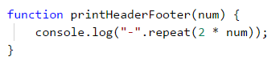

Следващата ни стъпка е да създадем функция, която ще рисува на конзолата средните редове. Отново задаваме описателно име, например **`printMiddleRow`**:

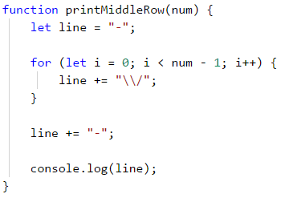

Накрая извикваме създадените функции за да нарисуваме целия квадрат:

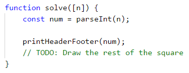

#### Тестване в Judge системата

Тествайте решението си тук: [https://judge.softuni.bg/Contests/Practice/Index/943#3](https://judge.softuni.bg/Contests/Practice/Index/943#3).


## Връщане на резултат от функция

До момента разгледахме функции, които извършват дадено действие, например отпечатване на даден текст, число или фигура на конзолата. Освен този тип функции, съществуват и такива, които могат да **връщат** някакъв **резултат** от своето изпълнение - например резултатът от умножението на две числа. Именно тези функции ще разгледаме в следващите редове.

### Оператор return

За да получим резултат от функцията, на помощ идва операторът **`return`**. Той трябва да бъде **използван в тялото** на функцията и указва на програмата да **спре изпълнението** на функцията и да **върне** на извиквача определена **стойност**. Тази стойност се определя от израза след въпросния оператор **`return`**.

В примера по-долу имаме **функция**, която получава име и фамилия като **параметри**, съединява ги и **връща** като резултат пълното име.

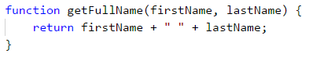

**Има случаи**, в които **`return`** може да бъде извикван от няколко места във функцията, но само ако има **определени** входни условия.

В примера по-долу имаме функция, която сравнява две числа и **връща** резултат съответно **`-1`**, **`0`** или **`1`** според това дали първият аргумент е по-малък, равен или по-голям от втория аргумент, подаден на функцията. Функцията използва ключовата дума **`return`** на три различни места, за да върне три различни стойности според логиката на сравненията на числата:

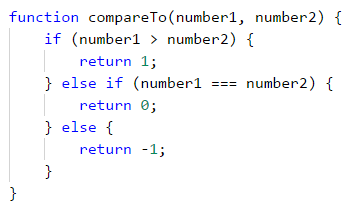

#### Кодът след return е недостъпен

В случай, че **return** операторът не се намира в условна конструкция като **`if`**, след него, в текущия блок, **не** трябва да има други редове код, тъй като тогава Visual Studio Code ще покаже предупреждение, съобщавайки ни, че е засякъл код, който **не може да бъде достъпен**:

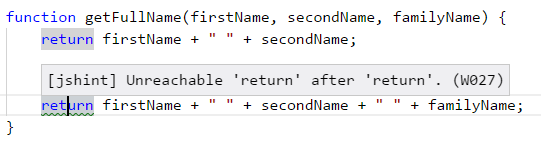

Операторът **`return`** може да бъде използван и без да бъде специфицирана **конкретна стойност**, която да бъде върната. В този случай, просто ще бъде **прекратено** изпълнението на кода във функцията и ще бъде върната стойност по подразбиране **`undefined`**.

<table><tr><td>
</td><td>В програмирането не може да има два пъти оператор <code><b>return</b></code> един след друг, защото изпълнението на първия няма да позволи да се изпълни вторият. Понякога програмистите се шегуват с фразата “<b><i>пиши</i> <code>return; return;</code> <i>и да си ходим</i></b>”, за да обяснят, че логиката на програмата е объркана.</td></tr>
</table>

### Употреба на върнатата от функцията стойност

След като дадена функция е изпълнена и върне стойност, то тази стойност може да се използва по **няколко** начина.

Първият е да **присвоим резултата като стойност на променлива**:

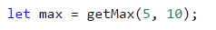

Вторият е резултатът да бъде използван **в израз**:

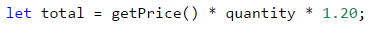

Третият е да **подадем** резултата от работата на функцията към **друга функция**:

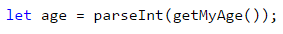

### Пример: пресмятане на лицето на триъгълник

Да се напише функция, която изчислява лицето на триъгълник по дадени основа и височина и връща стойността му.

#### Примерен вход и изход

|Вход|Изход|
|---|---|
|3<br>4|6|

#### Насоки и подсказки

**Създаваме** функция, с коректно име.

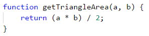

Следващата ни стъпка е да **извикаме новата** функция и да **запишем върнатата стойност в подходяща променлива**.

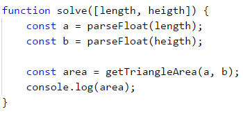

#### Тестване в Judge системата

Тествайте решението си тук: [https://judge.softuni.bg/Contests/Practice/Index/943#4](https://judge.softuni.bg/Contests/Practice/Index/943#4).


### Пример: степен на число

Да се напише функция, която изчислява и връща резултата от повдигането на число на дадена степен.

#### Примерен вход и изход

|Вход|Изход|Вход|Изход|
|---|---|---|---|
|2<br>8|256|3<br>4|81|

#### Насоки и подсказки

Първата ни стъпка отново ще е да създадем функция, която ще приема два параметъра (числото и степента) и ще връща като резултат числото повдигнато на съответната степен.

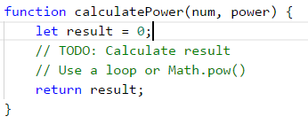

След като сме направили нужните изчисления, ни остава да извикаме декларираната функция.

#### Тестване в Judge системата

Тествайте решението си тук: [https://judge.softuni.bg/Contests/Practice/Index/943#5](https://judge.softuni.bg/Contests/Practice/Index/943#5).


### Функции, връщащи няколко стойности

В практиката се срещат случаи, в които се нуждаем дадена функция да върне повече от един елемент като резултат. В езикът **JavaScript** има 2 начина по които може да бъде постигнато това - чрез **деструкция** и чрез **връщане на обект**.

#### Деструкция

Когато желаем функция да върне **повече от една стойност**, използваме ключовата думичка **`return`**, след което изброяваме всички стойности, които желаем да върнем, като ги ограждаме в квадратни скоби - **`[`**, **`]`**:

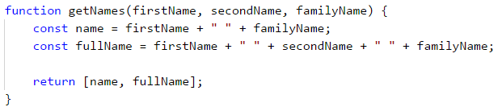

След това за да получим върнатите стойности, отново на помощ идват квадратните скоби. Изброяваме параметри, които да получат тези стойности, като присвояването ще стане по реда, по който стойностите са върнати:

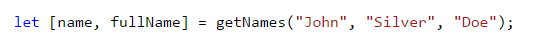

В горният пример променливата **`name`** ще получи стойността "**John Doe**", която е първата върната стойност от функцията **`getNames`**, а **`fullName`** ще получи "**John Silver Doe**", която е втората върната стойност.

#### Обекти

Този подход е много подобен на предния, като разликата е, че не просто **изброяваме** стойностите, които искаме да върнем, но и им даваме **имена**. **Обектите** са изключително важна и основна част от езика **JavaScript**. За сега е достатъчно да знаете, че се декларират с фигурните скоби **`{`** **`}`**, като между тях изброяваме **името** на стойността (нарича се **ключ**), последвано от знака две точки - **`:`** и самата стойност. Разделяме отделните двойки **ключ-стойност** със символа **`,`**.

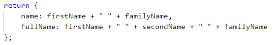

В този пример връщаме обект, който държи 2 стойности - **`name`** и **`fullName`**. 

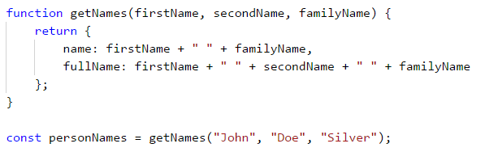

Тук променливата **`personNames`** ще получи всички върнати стойности. Като **`name`** и **`fullName`** са част от тези стойности и могат да бъдат достъпени със символа **`.`**:

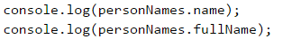

## Варианти на функции

В много езици за програмиране една и съща функция може да е декларирана в **няколко варианта** с еднакво име и различни параметри. Това е известно с термина "**method overloading**". За добро или лошо **JavaScript** не поддържа тази възможност.

Когато декларирате **две или повече функции с еднакви имена**, програмата ще използва **последно декларираната** такава. Декларирайки втора функция със същото име, вие реално премахвате старата функция и записвате на нейно място новата.

## Вложени функции

Нека разгледаме следния пример:

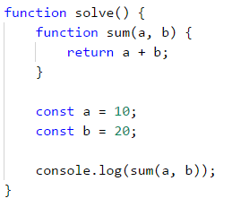

### Какво е локална функция?

Виждаме, че в този код, в нашата функция **`solve()`** има **другa** декларирана функция **`sum()`**. Такава **вложенa** функция се нарича **локална** функция. Локалните функции могат да се декларират във всяка една друга функция.

### Защо да използваме локални функции?

С времето и практиката ще открием, че когато пишем код, често се нуждаем от функции, които бихме използвали само един път, или пък нужната ни функция става твърде дълга. По-нагоре споменахме, че когато една функция съдържа в себе си прекалено много редове код, то той става труден за поддръжка и четене. В тези случаи на помощ идват локалните функции - те предоставят възможност в дадена функция да се декларира друга функция, която ще бъде използвана например само един път. Това спомага кода ни да е по-добре подреден и по-лесно четим, което от своя страна спомага за по-бърза корекция на евентуална грешка в кода и намалява възможността за грешки при промени в програмната логика.

### Деклариране на локални функции

Нека отново разгледаме примера от по-горе.


В този пример, функцията **`sum()`** е локална функция, тъй като е вложена във функцията **`solve()`**, т.е. **`sum()`** е локална за **`solve()`**. Това означава, че функцията **`sum()`** може да бъде използван **само** във функцията **`solve()`**, тъй като е **декларирана в нея**.

Локалните функции имат достъп до променливи, които са декларирани на същото или по - горно ниво от тях. Следващият пример демонстрира как се случва това:

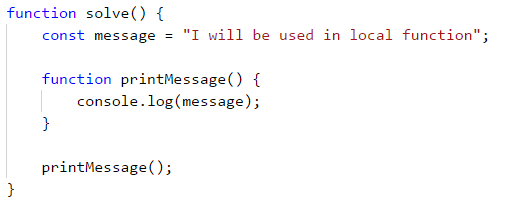

Тази особеност на вложените функции ги прави много удобни помощници при решаването на дадена задача. Те спестяват време и код, които иначе бихме вложили, за да предаваме на вложените функции параметри и променливи, които се използват във функциите, в които са вложени.


## Именуване на функции. Добри практики при работа с функции

В тази част ще се запознаем с някои **утвърдени практики** при работа с функции, свързани с именуването, подредбата на кода и неговата структура.

### Именуване на функции

Когато именуваме дадена функция е препоръчително да използваме **смислени имена**. Тъй като всяка функция **отговаря** за някаква част от нашия проблем, то при именуването ѝ трябва да вземем предвид **действието, което тя извършва**, т.е. добра практика е **името да описва целта**.

Задължително е името да започва с **малка буква** и трябва да е съставено от глагол или от двойка: глагол + съществително име. Форматирането на името става, спазвайки **Lower Camel Case** конвенцията, т.е. **всяка дума, с изключение на първата, започва с главна буква**. Кръглите скоби **`( `** и **`)`** винаги следват името на функцията.

Всяка функция трябва да изпълнява самостоятелна задача, а името на функцията трябва да описва каква е нейната роля.

Няколко примера за **коректно** именуване на функции:
* **`findStudent`**
*	**`loadReport`**
*	**`sine`**

Няколко примера за **лошо** именуване на функции:
*	**`method1`**
*	**`doSomething`**
*	**`handleStuff`**
*	**`sampleMethod`**
*	**`dirtyHack`**
*	**`FindStudent`**
*	**`LoadReport`**

Ако не можем да измислим подходящо име, то най-вероятно функцията решава повече от една задача или няма ясно дефинирана цел и тогава трябва да помислим как да я разделим на няколко отделни функции.

### Именуване на параметрите на функциите

При именуването на **параметрите** на функцията важат почти същите правила, както и при самите функции. Разликите тук са, че за имената на параметрите е добре да използваме съществително име или двойка от прилагателно и съществително име. Трябва да отбележим, че е добра практика името на параметъра да **указва** каква е **мерната единица**, която се използва при работа с него.

Няколко примера за **коректно** именуване на параметри на функции:
*   **`firstName`**
*	**`report`**
*	**`speedKmH`**
*	**`usersList`**
*	**`fontSizeInPixels`**
*	**`font`**

Няколко примера за **некоректно** именуване на параметри:
*	**`p`**
*	**`p1`**
*	**`p2`**
*   **`populate`**
*   **`LastName`**
*   **`last_name`**

### Добри практики при работа с функции

Нека отново припомним, че една функция трябва да изпълнява **само една** точно определена **задача**. Ако това не може да бъде постигнато, тогава трябва да помислим как да **разделим** функцията на няколко отделни такива. Както казахме, името на функцията трябва точно и ясно да описва нейната цел. Друга добра практика в програмирането е да **избягваме** функции, по-дълги от екрана ни (приблизително). Ако все пак кода стане много обемен, то е препоръчително функцията да се **раздели** на няколко по-кратки, както в примера по-долу.

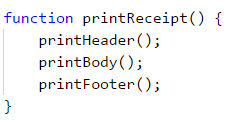

### Структура и форматиране на кода

При писането на функции трябва да внимаваме да спазваме коректна **индентация** (отместване по-навътре на блокове от кода).

Пример за **правилно** форматиран JavaScript код:

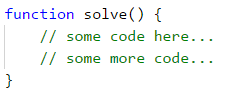

Пример за **некоректно** форматиран JavaScript код:

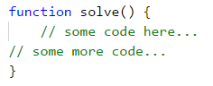

Когато заглавният ред на функцията е **твърде дълъг**, се препоръчва той да се раздели на няколко реда, като всеки ред след първия се отмества с две табулации надясно (за по-добра четимост):

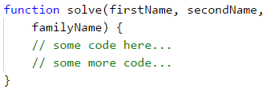

Друга добра практика при писане на код е да **оставяме празен ред** между функциите, след циклите и условните конструкции. Също така, опитвайте да **избягвате** да пишете **дълги редове и сложни изрази**. С времето ще установите, че това подобрява четимостта на кода и спестява време. 

Препоръчваме винаги да се **използват къдрави скоби за тялото на проверки и цикли**. Скобите не само подобряват четимостта, но и намалят възможността да бъде допусната грешка и програмата ни да се държи некоректно.

## Какво научихме от тази глава?

В тази глава се запознахме с базовите концепции при работа с функции:
* Научихме, че **целта** на функциите е да **разделят** големи програми с много редове код на по-малки и кратки задачи.
* Запознахме се със **структурата** на функциите, как да ги **декларираме** и **извикваме** по тяхното име.
* Разгледахме примери за функции с **параметри** и как да ги използваме в нашата програма.
* Научихме какво представляват **сигнатурата** и **връщаната стойност** на функцията, както и каква е ролята на оператора **`return`**.
* Запознахме се с **добрите практики** при работа с функции, как да именуваме функциите и техните параметри, как да форматираме кода и други.


## Упражнения

За да затвърдим работата с функции, ще решим няколко задачи. В тях се изисква да напишете функция с определена функционалност и след това да я извикате като ѝ подадете данни, точно както е показано в примерния вход и изход.


### Задача: "Hello, Име!"

Да се напише функция, която получава като параметър име и принтира на конзолата "*Hello, \<name\>!*".

#### Примерен вход и изход

|Вход|Изход|
|---|---|
|Peter|Hello, Peter!|

#### Насоки и подсказки

Дефинирайте функция **`printName(name)`** и я имплементирайте. Да се напише функция **`solve(...)`**, която получава като входни данни име на човек и извиква **`printName`** функцията като подава прочетеното име.

#### Тестване в Judge системата

Тествайте решението си тук: [https://judge.softuni.bg/Contests/Practice/Index/943#7](https://judge.softuni.bg/Contests/Practice/Index/943#7).


### Задача: по-малко число

Да се създаде функция **`getMin(a, b)`**, която връща по-малкото от две числа. Да се напише функция **`solve(...)`**, която получава като входни данни три числа и печата най-малкото от тях. Да се използва функцията **`getMin(…)`**, която е вече създадена.

#### Примерен вход и изход

|Вход|Изход|Вход|Изход|
|---|---|---|---|
|1<br>2<br>3|1|-100<br>-101<br>-102|-102|

#### Насоки и подсказки

Дефинирайте функция **`getMin(int a, int b)`** и я имплементирайте, след което я извикайте от функцията **`solve(...)`**, както е показано по-долу. За да намерите минимума на три числа, намерете първо минимума на първите две от тях и след това минимума на резултата и третото число:

```javascript
function solve([num1, num2, num3]) {
    let min = getMin(getMin(num1, num2), num3);
}
```

#### Тестване в Judge системата

Тествайте решението си тук: [https://judge.softuni.bg/Contests/Practice/Index/943#8](https://judge.softuni.bg/Contests/Practice/Index/943#8).


### Задача: повтаряне на низ

Да се напише функция **`repeatString(str, count)`**, която получава като параметри стрингова променлива **`str`** и цяло число **`n`** и връща низа, повторен **`n`** пъти. След това резултатът да се отпечата на конзолата.

#### Примерен вход и изход

|Вход|Изход|Вход|Изход|
|---|---|---|---|
|str<br>2|strstr|roki<br>6|rokirokirokirokirokiroki|

#### Насоки и подсказки

Допишете функцията по-долу като добавите входния низ към резултата в цикъла:

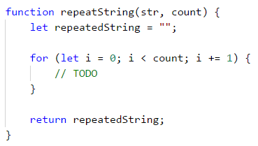

#### Тестване в Judge системата

Тествайте решението си тук: [https://judge.softuni.bg/Contests/Practice/Index/943#9](https://judge.softuni.bg/Contests/Practice/Index/943#9).


### Задача: n-та цифра

Да се напише функция **`findNthDigit(number, index)`**, която получава число и индекс N като параметри и печата N-тата цифра на числото (като се брои от дясно на ляво, започвайки от 1). След това, резултатът да се отпечата на конзолата.

#### Примерен вход и изход

|Вход|Изход|Вход|Изход|Вход|Изход|
|---|---|---|---|---|---|
|83746<br>2|4|93847837<br>6|8|2435<br>4|2|

#### Насоки и подсказки

За да изпълним алгоритъма, ще използваме **`while`** цикъл, докато дадено число не стане 0. На всяка итерация на **`while`** цикъла ще проверяваме дали настоящият индекс на цифрата не отговаря на индекса, който търсим. Ако отговаря, ще върнем като резултат цифрата на индекса (**`number % 10`**). Ако не отговаря, ще премахнем последната цифра на числото (**`number = number / 10`**). Трябва да следим коя цифра проверяваме по индекс (от дясно на ляво, започвайки от 1). Когато намерим цифрата, ще върнем индекса. 

#### Тестване в Judge системата

Тествайте решението си тук: [https://judge.softuni.bg/Contests/Practice/Index/943#10](https://judge.softuni.bg/Contests/Practice/Index/943#10).


### Задача: число към бройна система

Да се напише функция **`integerToBase(number, toBase)`**, която получава като параметри цяло число и основа на бройна система и връща входното число, конвертирано към посочената бройна система. След това, резултатът да се отпечата на конзолата. Входното число винаги ще е в бройна система 10, а параметърът за основа ще е между 2 и 10.

#### Примерен вход и изход

|Вход|Изход|Вход|Изход|Вход|Изход|
|---|----|---|---|---|---|
|3<br>2|11|4<br>4|10|9<br>7|12|

#### Насоки и подсказки

За да решим задачата, ще декларираме стрингова променлива, в която ще пазим резултата. След това трябва да изпълним следните изчисления, нужни за конвертиране на числото.
* Изчисляваме **остатъка** от числото, разделено на основата.
* **Вмъкваме остатъка** от числото в началото на низа, представящ резултата.
* **Разделяме** числото на основата.
* **Повтаряме** алгоритъма, докато входното число не стане 0.

Допишете липсващата логика във функцията по-долу:

```javascript
function integerToBase(number, toBase) {
    string result = "";
    while (number !== 0) {
        // implement the missing conversion logic
    }
    return result;
}
```

#### Тестване в Judge системата 

Тествайте решението си тук: [https://judge.softuni.bg/Contests/Practice/Index/943#11](https://judge.softuni.bg/Contests/Practice/Index/943#11).


### Задача: известия

Да се напише функция **`solve(...)`**, която приема като първи параметър цяло число **`n`** - брой на съобщения и допълнителен брой параметри, които са самите части на **съобщенията**. За всяко съобщение може да се получи различен брой параметри. Първият параметър за всяко съобщение е **`messageType`**, който може да бъде **`success`**, **`warning`** или **`error`**:
   - Когато **`messageType`** е **`success`**, следващите 2 получени параметъра са **`operation`** и **`message`**
   - Когато **`messageType`** е **`warning`** следващият параметър е **`message`**.
   - Когато **`messageType`** е **`error`** следващите 3 получени параметъра са **`operation`** + **`message`** + **`errorCode`** (всяко е отделен параметър).

На конзолата да се отпечата **всяко прочетено съобщение**, форматирано в зависимост от неговия **`messageType`**. Като след заглавния ред за всяко съобщение да се отпечатат толкова на брой символа **`=`**, **колкото е дълъг** съответният **заглавен ред** и да се сложи по един **празен ред** след всяко съобщение (за по-детайлно разбиране погледнете примерите). 

Задачата да се реши с дефиниране на четири функции: **`showSuccessMessage(...)`**, **`showWarningMessage(...)`**, **`showErrorMessage(...)`** и **`processMessage(...)`**, като само последната функция да се извиква от главната **`solve(...)`** функция:

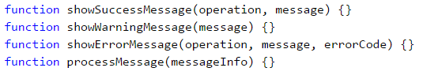

#### Примерен вход и изход

|Вход|Изход|
|---|---|
|4<br>error<br>credit card purchase<br>Invalid customer address<br>500<br>warning<br>Email not confirmed<br>success<br>user registration<br>User registered successfully<br>warning<br>Customer has not email assigned|<code>Error: Failed to execute credit card purchase.</code><br><code>==============================================</code><br><code>Reason: Invalid customer address.</code><br><code>Error code: 500.</code><br><br><code>Warning: Email not confirmed.</code><br><code>=============================</code><br><br><code>Successfully executed user registration.</code><br><code>========================================</code><br><code>User registered successfully.</code><br><br><code>Warning: Customer has not email assigned.</code><br><code>=========================================</code>|

#### Насоки и подсказки

Дефинирайте и имплементирайте четирите функции. След това извикайте **`processMessage(...)`** от главната **`solve(...)`** функция.

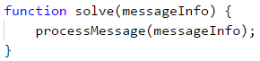

В **`processMessage(...)`** извадете първо броят на съобщенията и след това ги обработете едно по едно спрямо техният тип и извикайте съответната функция за печатане.

#### Тестване в Judge системата

Тествайте решението си тук: [https://judge.softuni.bg/Contests/Practice/Index/943#12](https://judge.softuni.bg/Contests/Practice/Index/943#12).


### Задача: числа към думи

Да се напише функция **`letterize(number)`**, която получава цяло число и го разпечатва с думи на английски език според условията по-долу:
* Да се отпечатат с думи стотиците, десетиците и единиците (и евентуални минус) според правилата на английския език.
* Ако числото е по-голямо от **999**, трябва да се принтира "**too large**".
* Ако числото е по-малко от **-999**, трябва да се принтира "**too small**".
* Ако числото е **отрицателно**, трябва да се принтира "**minus**" преди него.
* Ако числото не е съставено от три цифри, не трябва да се принтира.

#### Примерен вход и изход

|Вход|Изход|Вход|Изход|
|---|---|---|---|
|3<br>999<br>-420<br>1020|nine-hundred and ninety nine<br>minus four-hundred and twenty<br>too large|2<br>15<br>350|fifteen<br>three-hundred and fifty|

|Вход|Изход|Вход|Изход|
|---|---|---|---|
|4<br>311<br>418<br>509<br>-9945|three-hundred and eleven<br>four-hundred and eighteen<br>five-hundred and nine<br>too small|3<br>500<br>123<br>9|five-hundred<br>one-hundred and twenty three<br>nine|

#### Насоки и подсказки

Можем първо да отпечатаме **стотиците** като текст - (числото / 100) % 10, след тях **десетиците** - (числото / 10) % 10 и накрая **единиците** - (числото % 10).

Първият специален случай е когато числото е точно **закръглено на 100** (напр. 100, 200, 300 и т.н.). В този случай отпечатваме "one-hundred", "two-hundred", "three-hundred" и т.н.

Вторият специален случай е когато числото, формирано от последните две цифри на входното число, е **по-малко от 10** (напр. 101, 305, 609 и т.н.). В този случай отпечатваме "one-hundred and one", "three-hundred and five", "six-hundred and nine" и т.н.

Третият специален случай е когато числото, формирано от последните две цифри на входното число, е **по-голямо от 10 и по-малко от 20** (напр. 111, 814, 919 и т.н.). В този случай отпечатваме "one-hundred and eleven", "eight-hundred and fourteen", "nine-hundred and nineteen" и т.н.

#### Тестване в Judge системата

Тествайте решението си тук: [https://judge.softuni.bg/Contests/Practice/Index/943#13](https://judge.softuni.bg/Contests/Practice/Index/943#13).


### Задача: криптиране на низ

Да се напише функция **`еncrypt(char letter)`**, която криптира дадена буква по следния начин:
* Вземат се първата и последна цифра от ASCII кода на буквата и се залепят една за друга в низ, който ще представя резултата. 
* Към началото на стойността на низа, който представя резултата, се залепя символа, който отговаря на следното условие:
  * ASCII кода на буквата + последната цифра от ASCII кода на буквата.
* След това към края на стойността на низа, който представя резултата, се залепя символа, който отговаря на следното условие:
  * ASCII кода на буквата - първата цифра от ASCII кода на буквата.
* Функцията трябва да върне като резултат криптирания низ.

Пример:
* j &rarr; **p16i**
  * ASCII кодът на **j** e **106** &rarr; Първа цифра - **1**, последна цифра - **6**.
  * Залепяме първата и последната цифра &rarr; **16**.
  * Към **началото** на стойността на низа, който представя резултата, залепяме символа, който се получава от сбора на ASCII кода + последната цифра &rarr; 106 + 6 &rarr; 112 &rarr; **p**.
  * Към **края** на стойността на низа, който представя резултата, залепяме символа, който се получава от разликата на ASCII кода - първата цифра &rarr; 106 - 1 &rarr; 105 &rarr; **i**.
  
Използвайки метода, описан по-горе, да се дефинира функция **`solve(...)`**, която получава **поредица от символи**, **криптира ги** и отпечатва резултата на един ред. Приемаме, че входните данни винаги ще бъдат валидни. **`solve(...)`** функцията трябва да получава входните данни, подадени от потребителя – цяло число **`n`**, последвано от по един символ за всеки следващ **`n`** елемент. Да се криптират символите и да се добавят към криптирания низ. Накрая като резултат трябва да се отпечата **криптиран низ от символи** като в следващия пример.

**Пример**:
* S, o, f, t, U, n, i &rarr; V83Kp11nh12ez16sZ85Mn10mn15h

#### Примерен вход и изход

|Вход|Изход|
|---|---|
|7<br>S<br>o<br>f<br>t<br>U<br>n<br>i|V83Kp11nh12ez16sZ85Mn10mn15h|

|Вход|Изход| 
|---|---|
|7<br>B<br>i<br>r<br>a<br>H<br>a<br>x| H66<n15hv14qh97XJ72Ah97xx10w |

#### Насоки и подсказки
На променливата **`result`**, в която ще се пази стойността на резултата, ще присвоим първоначална стойност **`""`**. Трябва да се завърти цикъл **`n`** пъти, като на всяка итерация към променливата, в която пазим стойността на резултата, ще прибавяме криптирания символ. 

За да намерим първата и последната цифри от ASCII кода, ще използваме алгоритъма, който използвахме за решаване на задача "N-та цифра", а за да създадем низа, ще процедираме както в задачата "Число към бройна система".
 
#### Тестване в Judge системата

Тествайте решението си тук: [https://judge.softuni.bg/Contests/Practice/Index/943#14](https://judge.softuni.bg/Contests/Practice/Index/943#14).
