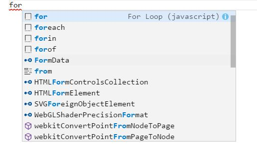
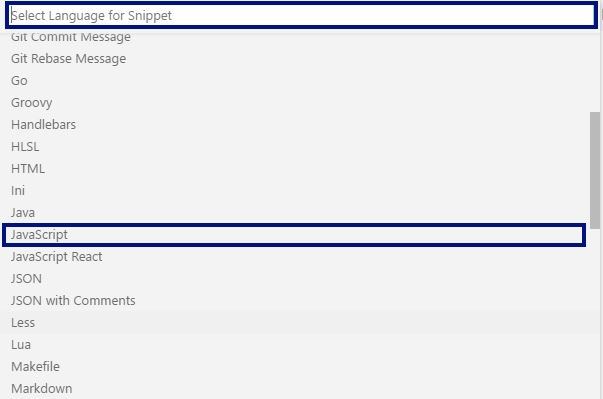
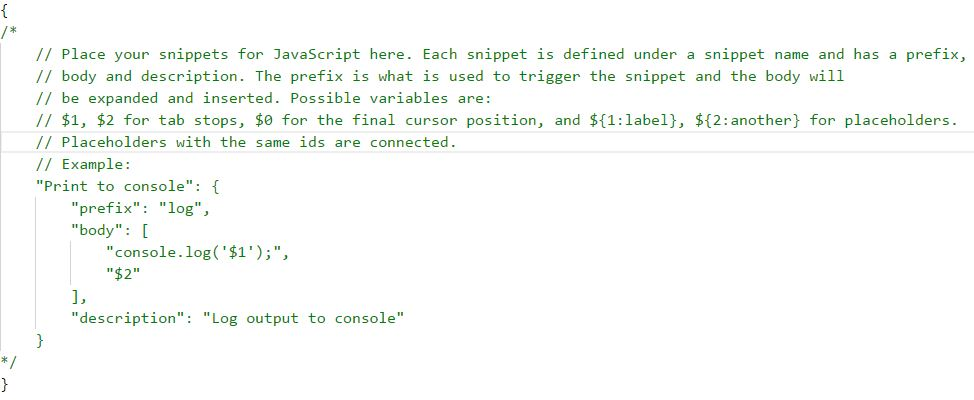
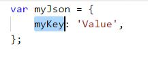

# Глава 11. Хитрости и хакове

В настоящата глава ще разгледаме някои хитрости, хакове и техники, които ще улеснят работата ни с езика JavaScript в среда за разработка Visual Studio Code. По-специално ще се запознаем:

* Как правилно да **форматираме код**
* С конвенции за **именуване на елементи от код**
* С някои **бързи клавиши** (keyboard shortcuts)
* С някои **шаблони с код** (code snippets)
* С техники за **дебъгване на код**

## Форматиране на кода

Правилното форматиране на нашия код ще го направи **по-четим и разбираем**, в случай че се наложи някой друг да работи с него. Това е важно, защото в практиката ще ни се наложи да работим в екип с други хора и е от голямо значение дали пишем кода си така, че колегите ни да могат **бързо да се ориентират** в него.

Има определени правила за правилно форматиране на кода, които събрани в едно се наричат **конвенции**. Конвенциите са група от правила, общоприети от програмистите на даден език, и се ползват масово. Тези конвенции помагат за изграждането на норми в дадени езици - как е най-добре да се пише и какви са добрите практики. Приема се, че ако един програмист ги спазва, то кодът му е лесно четим и разбираем.


Езикът JavaScript е създаден от **Брендън Айх** като част от развитието на един от първите браузери **Netscape** и първоначалната му идея е била да допълва езика Java, затова и синтактично двата езика много си приличат и още повече те ползват подобни конвенции за писане и форматиране на кода. Трябва да знаете, че дори да не спазвате наложените конвенциите, кодът ви ще работи (стига да е написан правилно), но просто няма да бъде лесно разбираем. Това, разбира се, не е фатално на основно ниво, но колкото по-бързо свикнете да пишете качествен код, толкова по-добре.

Правилата, които се ползват при писане на JavaScipt могат да бъдат намерени на много места. Официалните правила или т.н. **JavaScript код конвенция** е описана в статията "JavaScript Style Guide and Coding Conventions" в w3schools (https://www.w3schools.com/js/js_conventions.asp) и в тази книга ще се ръководим основно от нея.


За форматиране на кода се препоръчва **къдравите скоби `{}`** да се отварят на същия ред и да се затварят точно под конструкцията, към която се отнасят, както е в примера по-долу.

```javascript
if (someCondition) {
    console.log("Inside the if statement");
}
```

Вижда се, че командата **`console.log(…)`** в примера е **4 празни полета навътре (един таб)**, което също се препоръчва в документацията. Също така, ако дадена конструкция с къдрави скоби е един таб навътре, то **къдравите скоби `{}`** трябва да са в **началото на конструкцията**, както е в примера по-долу:

```javascript
if (someCondition){

   if (anotherCondition){
       console.log("Inside the if statement");
   }
}
```

Ето това е пример за **лошо форматиран код** спрямо общоприетите конвенции за писане на код на езика JavaScript:
   
```javascript
if(someCondition)
{
console.log("Inside the if statement");}
```

Първото, което се забелязва са **къдравите скоби `{}`**. Първата (отваряща) скоба трябва да е **точно до `if` условието**, a втората (затваряща) скоба - **под командата `console.log(…)`, на отделен празен ред**. В допълнение, командата вътре в **`if`** конструкцията трябва да бъде **4 празни полета навътре (един таб)**. Веднага след ключовата дума **`if`** и преди условието на проверката се оставя **интервал**.

Същото правило важи и за **`for` цикли и всякакви други конструкции с къдрави скоби `{}`**. Ето още няколко примера:

Правилно:
```javascript
for (let i = 0; i < 5; i++){
    console.log(i);
}
```
Грешно:
```javascript
for(let i=0;i<5;i++)
{
console.log(i);
}
```

За ваше удобство има **бързи клавиши във Visual Studio Code**, за които ще обясним по-късно в настоящата глава, но засега ни интересуват следните комбинации за форматиране на **кода в целия документ**:
* За Windows [**Shift + Alt + F**]
* За Mac [**Shift + Option + F**]
* За Ubuntu [**Ctrl + Shift + I**]

Нека използваме **грешния пример** от преди малко:

```javascript
for(let i=0;i<5;i++)
{
console.log(i);
}
```
Ако натиснем [**Shift + Alt + F**], което е нашата комбинация за форматиране на **целия документ**, ще получим код, форматиран според **общоприетите конвенции за JavaScript**. Прието променливите да **започват** винаги **с малка буква** и да **съдържат малки букви**, като **всяка следваща дума** в тях **започва с главна буква** (това именуване е още познато като **`camelCase`** конвенция).
* Трябва да се внимава за главни и малки букви, тъй като JavaScript прави разлика между тях. Например **`age`** и **`Age`** са различни променливи.
* Имената на променливите не могат да съвпадат със служебна дума (keyword) от езика JavaScript, например **`let`** е невалидно име на променлива.

<table><tr><td></td>
<td>Въпреки че използването на символа <code><b>_</b></code> в имената на променливите е разрешено, в JavaScript това не се препоръчва и се счита за лош стил на именуване.</td>
</tr></table>

Ето няколко примера за **добре именувани** променливи:

* **`firstName`**
* **`age`**
* **`startIndex`**
* **`lastNegativeNumberIndex`**

Ето няколко примера за **лошо именувани променливи**, макар и имената да са коректни от гледна точка на езика JavaScript:

* **`_firstName`** (започва с '\_')
* **`last_name`** (съдържа '\_')
* **`AGE`** (изписана е с главни букви)
* **`Start_Index`** (започва с главна буква и съдържа '\_')
* **`lastNegativeNumber_Index`** (съдържа '\_')

Първоначално всички тези правила може да ни се струват безсмислени и ненужни, но с течение на времето и натрупването на опит ще видите нуждата от норми за писане на качествен код, за да може да се работи по-лесно и по-бързо в екип. Ще разберете, че е изключително досадна работата с код, който е написан без да се спазват никакви правила за качествен код.

## Бързи клавиши във Visual Studio Code

В предната секция споменахме за някои от комбинациите, които се отнасят за форматиране на код. Едната комбинация [**Shitf + Alt + F**] беше за **форматиране на целия код в даден файл**, а другите правиха същтото нещо но на различна операционна система. Тези комбинации се наричат **бързи клавиши** и сега ще дадем по-подробна информация за тях.

Бързи клавиши са **комбинации**, които ни предоставят възможността да извършваме някои действия **по-лесно и по-бързо**, като всяка среда за разработка на софтуер си има своите бързи клавиши, въпреки че повечето се повтарят. Сега ще разгледаме някои от **бързите клавиши** във **Visual Studio Code**. Изброените клавишни комбинации работят със сигурност и са изпробвани на Windows. Идеята е да ви покажем, че това съществува и се ползва лесно и при нужда винаги можете да намерите, това което ви трябва за всяка една операционна система.

| Комбинация | Действие |
| --- | --- |
|  [**CTRL + F**] | Комбинацията **отваря търсачка**, с която можем да **търсим в нашия код**. |
|  [**CTRL + /**] | **Закоментира** част от кода и съответно **откоментирва** закоментиран код |
|  [**CTRL + Z**] | **Връща една промяна назад** (т.нар. Undo). |
|  [**CTRL + Y**] | Комбинацията има противоположно действие на [**CTRL + Z**] (т.нар. Redo). |
|  [**Shitf + Alt + F**] | **Форматира кода** според конвенциите по подразбиране. |
|  [**CTRL + Backspace**] | **Изтрива** думата вляво от курсора. |
|  [**CTRL + Del**] | **Изтрива** думата вдясно от курсора. |
|  [**CTRL + K S**] | **Запазва** всички файлове в проекта. |
|  [**CTRL + S**] | **Запазва** текущия файл. |

Повече за **бързите клавиши във Visual Studio Code** може да намерите тук: [https://code.visualstudio.com/shortcuts/keyboard-shortcuts-windows.pdf](https://code.visualstudio.com/shortcuts/keyboard-shortcuts-windows.pdf). 
Ако пък вече се чувствате достатъчно уверени в уменията си с бързите клавиши, отворете **Visual Studio Code** натисните [**CTRL + K + S**] (обърнете внимание, че е различно от [**CTRL + K S**], при което **Ctrl** и **K** се натискат едновременно, а **S** след това), при което ще се отвори прозорец в самата среда за разработка, който съдържа пълен списък с всички възможни клавишни комбинации в света на **Visual Studio Code**. Не се колебай, приложи наученото, сега!

Още повече дори от там ще можете да **промените** нещо, ако не ви харесва и знаете кое работи по-добре при вас.

TODO:remove this
https://code.visualstudio.com/docs/extensions/themes-snippets-colorizers
https://code.visualstudio.com/docs/editor/userdefinedsnippets
## Шаблони с код (code snippets)

Във **Visual StudioCode** съществуват т.нар. **шаблони с код** (code snippets), при изписването на които се изписва по шаблон някакъв блок с код. Тази полезна опция не е включена по подразбиране обаче. Вие сами трябва да я активирате от [**File -> Preferences -> Settings**] (или просто **[Ctrl + Comma]**), при което ви отваря прозорец наречен **User Settings**. Това са вашите лични настройки, които много лесно можете да промените. Просто добавете този ред:

    "editor.tabCompletion": true

между отварящата и затварящата къдрави скоби.

 След като направите това, при изписването на кратък код “**`for`**” и натискане на **[Tab]** + **[Tab]** се генерира кодът **цялостен for цикъл** в тялото на нашата програма, на мястото на краткия код. Това се нарича “разгъване на шаблон за кратък код”. Подобно работи и шаблона “**`if`**” + **[Tab]** + **[Tab]**. На фигурата по-долу е показано действието на шаблона “**`for`**”:



### Да си направим собствен шаблон за код

В тази секция ще покажем как сами да си **направим собствен шаблон**. Ще разгледаме **как се прави code snippet** за **`console.log()`**. Като за начало ще си създадем нов празен проект и ще отидем на [**File -> Preferences -> User Snippets**], след което ще се отвори прозорец, от който да си изберете за кой език за програмиране ще създавате шаблон, както е показано на снимката:

 

Избирате JavaScript от падащото меню и ще ви се отвори прозорец наименован  **javascript.json**. Това разширение **json** е един спрециален формат на записване на данни, който напоследък навлиза главоломно при начините за пренос и запазване на данни. Освен това, **json** форматът може да се ползва и нашите програми, което ще видим малко по късно. Файлът ще изглежда така:

 

Примерът, който виждате по подразбиране генерира код за писане по конзолата чрез ключовия префикс **log**.
Този код е само примерен и всъщност този шаблон е вграден, но ако не беше би изглеждал като примера. Просто трябваше да не е закоментиран.
В този пример виждате доста непознати неща, но няма страшно, по-нататък ще се запознаем и с тях. Сега се фокусираме върху частта **`"Print to console":`** и кода между **`отварящата и затварящата къдрави скоби`**. 
Това, което виждате вътре в скобите представлява съдържанието на един шаблон. Всеки шаблон трябва да съдържа **`prefix`**, който представлява краткия текст, който след като натиснеш **[Tab]** + **[Tab]** ще създава кода на шаблона във вашата програма.
Второто нещо, което трябва да има вашият шаблон е **`body`**, това е най-сложната част от шаблона. Това всъщност е кодът, който ще се генерира, като в него може да имате **променливи**, които се създават с **`$1`**, като на мястото на единичката може да бъде друг текст. Като в примера 
**`"console.log('$1');"`**
 Можете да имате **Tabstops**, които просто поставят курсора на определени места в кода и между тях може да се навигира с табулация. Те се създават автоматично чрез създаване на променлива. 
 
  Може да имате и **Placeholders**, те представляват вид **Tabstops**, но могат да съдържат и някаква стойност например:   **`${1:myVal}`**.
Съществуват и по сложни конфигурации, но като за начало тези могат да ви свърщат отлична работа.
Последната част от шаблона е **`description`**, което просто дава допълнилно пояснение за това, което прави той.
Сега нека да пробваме да направим собствен шаблон. Сложете курсора извън закоментирания текс и пример и въведете следния код:

 

Вече когато напишем **`json`** в отворен JavaScript файл във Visual Studio Code, **нашият нов snippet** се появява:

 

За тези от вас, които се интерисуват повече от темата, доста от големите **frameworks** като **Angular, React и др.** имат собствени шаблони, които могат да се инсталират от прозореца за **екстеншъни**. 

 
## Техники за дебъгване на кода

Дебъгването играе важна роля в процеса на създаване на софтуер, която ни позволява **постъпково да проследим изпълнението** на нашата програма. С помощта на тази техника можем да **следим стойностите на локалните променливи**, тъй като те се променят по време на изпълнение на програмата, и да **отстраним** евентуални **грешки** (бъгове). Процесът на дебъгване включва:

* **Забелязване** на проблемите (бъговете).
* **Намиране** на кода, който причинява проблемите.
* **Коригиране** на кода, причиняващ проблемите, така че програмата да работи правилно.
* **Тестване**, за да се убедим, че програмата работи правилно след нанесените корекции.

Visual Studio ни предоставя **вграден дебъгер** (debugger), чрез който можем да поставяме **точки на прекъсване** (или breakpolets), на избрани от нас места. При среща на **стопер** (breakpolet), програмата **спира изпълнението** си и позволява **постъпково изпълнение** на останалите редове. Дебъгването ни дава възможност да **вникнем в детайлите на програмата** и да видим къде точно възникват грешките и каква е причината за това.

За да демонстрираме работа с дебъгера ще използваме следната програма:

```javascript
static void Main(string[] args)
{
    for (let i = 0; i < 100; i++)
    {
        console.log(i);
    }
}
```

Ще сложим **стопер** (breakpolet) на функцията **`console.log(…)`**. За целта трябва да преместим курсора на реда, който печата на конзолата, и да натиснем [**F9**]. Появява се **стопер**, където програмата ще **спре** изпълнението си:

 

За да стартираме **програмата в режим на дебъгване**, избираме [**Debug**] -> [**Start Debugging**] или натискаме [**F5**]:

 

След стартиране на програмата виждаме, че тя **спира изпълнението си** на ред 11, където сложихме стопера (breakpolet). Кодът на текущия ред се **оцветява с жълт цвят** и можем да го **изпълняваме постъпково**. За да преминем на **следващ ред** използваме клавиш [**F10**]. **Забелязваме, че кодът на текущия ред все още не е изпълнен**. **Изпълнява се, когато преминем на следващия ред**:

 

От прозореца **Locals** можем да наблюдаваме **промените по локалните променливи**. За да отворите прозореца изберете [**Debug**] -> [**Windows**] -> [**Locals**].

 

## Справочник с хитрости

В тази секция ще припомним накратко **хитрости и техники** от програмирането с езика JavaScript, разглеждани вече в тази книга, които ще са ви много полезни, ако ходите на изпит по програмиране за начинаещи:

### Вкарване на променливи в стринг (string)

```javascript
var text = "some text";
console.log("{0}", text);
// Tова ще отпечата на конзолата "some text"
```

В случая използваме **placeholder** - **`{x}`**, където **x** е число (по-голямо или равно на 0), отговарящо на позицията, на която трябва да поставим променливата. Следователно, ако подаваме две променливи ще имаме един placeholder, който ще е **`{0}`** и той ще съдържа стойността на **първата променлива** и още един - **`{1}`**, който ще съдържа стойността на **втората променлива**. Примерно:

```javascript
var text = "some text";
var number = 5;
console.log("{0} {1} {0}", text, number);
// Tова ще отпечата "some text 5 some text"
```

В този пример забелязваме, че можем да подаваме **не само текстови променливи**. Също така можем да използваме дадена променлива **няколко пъти** и за целта в placeholder-а слагаме числото, което **отговаря на позицията на променливата**. В случая на нулева позиция стои променливата **`text`**, а на първа позиция е променливата **`number`**. Номерацията е объркваща отначало, но трябва да запомните, че в програмирането **броенето започва от 0**.

### Форматиране с 2 цифри след десетичния знак

```javascript
var number = 5.432432;
console.log(Math.Round(number, 2));
// Това ще отпечата на конзолата "5.43"
```

**`Math.Round(…)`** приема 2 параметъра:

* първият е **числото, което искаме да закръглим**
* вторият е числото, което определя **с колко символа след десетичния знак ще закръглим** (това число винаги трябва да бъде цяло число)

Ако искаме да закръглим до **2 цифри след десетичния знак** и третата цифра е по-малкa от 5, както в примера по-горе, то закръглянето е надолу, но ако третата цифра е 5 или по-голяма - закръглянето е нагоре, както е в примера по-долу:

```javascript
var number = 5.439;
console.log(Math.Round(number, 2));
// Tова ще отпечата на конзолата "5.44"
```

### Други методи за закръгляне

В случай, че искаме винаги да закръгляме надолу можем вместо **`Math.Round(…)`** да използваме друг метод - **`Math.Floor(…)`**, който винаги закръгля надолу, но също така винаги закръгля до цяло число. Например, ако имаме числото 5.99 и използваме **`Math.Floor(5.99)`**, ще получим числото **5**.

Можем и да направим точно обратното - винаги да закръгляме нагоре, използвайки метода **`Math.Ceiling(…)`**. Отново, ако имаме число примерно 5.11 и използваме **`Math.Ceiling(5.11)`**, ще получим 6. Ето и няколко примера:

```javascript
var numberToFloor = 5.99;
console.log(Math.Floor(numberToFloor));
// Tова ще отпечата на конзолата 5

var numberToCeiling = 5.11;
console.log(Math.Ceiling(numberToCiling));
// Tова ще отпечата на конзолата 6
```

### Закръгляне чрез placeholder

```cs
var num = 5.432424;
console.log("{0:f2}", num);
```

В случая след числото добавяме **`:f2`**, което ще ограничи числото до 2 цифри след десетичния знак и ще работи като **`Math.Round(…)`**. Трябва да имаме предвид, че числото след буквата **`f`** означава до колко цифри след десетичния знак да е закръглено числото (т.е. може да е примерно **`f3`** или **`f5`**).

### Как се пише условна конструкция?

Условната **`if` конструкция** се състои от следните елементи:

* Ключова дума **`if`**
* **Булев израз** (условие)
* **Тяло** на условната конструкция
* Незадължително: **`else` клауза**

```javascript
if (условие)
{
    // тяло
}
else (условие)
{
    // тяло
}
```

За улеснение може да използваме code snippet за **`if` конструкция**:
 * **`if` + [Tab] + [Tab]**

### Как се пише for-цикъл?

За **`for` цикъл** ни трябват няколко неща:

* Инициализационен блок, в който се декларира променливата-брояч (**`var i`**) и се задава нейна начална стойност.
* Условие за повторение (**`i <= 10`**).
* Обновяване на брояча (**`i++`**).
* Тяло на цикъла.

```javascript
for (var i = 0; i < 5; i++;)
{
    // тяло
}
```

За улеснение може да използваме code snippet за **`for` цикъл**:
 * **`for` + [Tab] + [Tab]**

## Какво научихме от тази глава?

В **настоящата** глава се запознахме как **правилно** да **форматираме** и именуваме елементите на нашия **код**, някои **бързи клавиши** (shortcuts) за работа във Visual Studio, **шаблони с код** (code snippets) и разгледахме как се **дебъгва код**.
